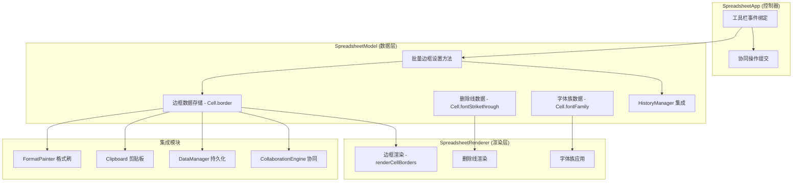
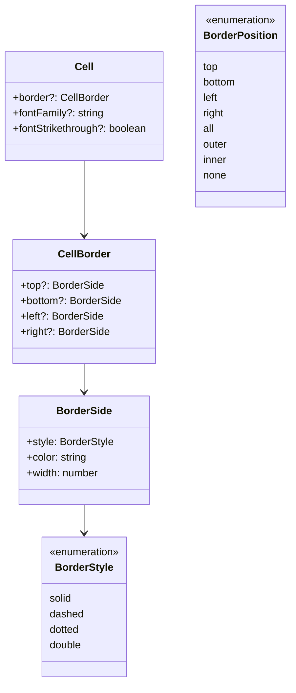

# 设计文档：单元格边框与样式（完整实现）

## 概述

本设计为 Canvas Excel（ice-excel）电子表格应用实现完整的单元格边框与样式功能。核心包括：

1. **单元格边框系统**：支持上/下/左/右/全部/外框/内框/清除八种边框位置操作，四种线型（实线/虚线/点线/双线），自定义颜色和宽度
2. **字体族选择**：提供预设中英文字体下拉选择
3. **删除线样式**：文本删除线切换

所有新增样式属性与现有的撤销/重做、格式刷、剪贴板、协同编辑、JSON 导入/导出、LocalStorage 持久化模块完整集成。

设计遵循现有 MVC 架构：
- **Model 层**（`SpreadsheetModel`）：新增边框批量设置方法、字体族/删除线设置方法
- **View 层**（`SpreadsheetRenderer`）：Canvas 边框渲染、删除线绘制、字体族应用
- **Controller 层**（`SpreadsheetApp`）：工具栏事件绑定、协同操作提交

## 架构



## 组件与接口

### 1. 类型定义扩展（`src/types.ts`）

新增边框相关类型定义，扩展 Cell、CopiedFormat、ClipboardCellData 接口。

```typescript
// 边框线型
export type BorderStyle = 'solid' | 'dashed' | 'dotted' | 'double';

// 边框应用位置
export type BorderPosition = 'top' | 'bottom' | 'left' | 'right' | 'all' | 'outer' | 'inner' | 'none';

// 单条边框样式
export interface BorderSide {
  style: BorderStyle;
  color: string;
  width: number;
}

// 单元格边框配置
export interface CellBorder {
  top?: BorderSide;
  bottom?: BorderSide;
  left?: BorderSide;
  right?: BorderSide;
}
```

Cell 接口扩展：
```typescript
export interface Cell {
  // ... 现有字段 ...
  border?: CellBorder;           // 边框配置
  fontFamily?: string;           // 字体族
  fontStrikethrough?: boolean;   // 删除线
}
```

CopiedFormat 接口扩展（`src/format-painter.ts`）：
```typescript
export interface CopiedFormat {
  // ... 现有字段 ...
  border?: CellBorder;
  fontFamily?: string;
  fontStrikethrough?: boolean;
}
```

ClipboardCellData 接口扩展（`src/types.ts`）：
```typescript
export interface ClipboardCellData {
  // ... 现有字段 ...
  border?: CellBorder;
  fontFamily?: string;
  fontStrikethrough?: boolean;
}
```

### 2. SpreadsheetModel 新增方法

```typescript
// 批量设置边框
public setRangeBorder(
  startRow: number, startCol: number,
  endRow: number, endCol: number,
  position: BorderPosition,
  borderSide: BorderSide | undefined
): void;

// 批量设置字体族
public setRangeFontFamily(
  startRow: number, startCol: number,
  endRow: number, endCol: number,
  fontFamily: string
): void;

// 批量设置删除线
public setRangeFontStrikethrough(
  startRow: number, startCol: number,
  endRow: number, endCol: number,
  strikethrough: boolean
): void;
```

`setRangeBorder` 方法根据 `position` 参数决定边框应用逻辑：
- `all`：区域内每个单元格设置四条边框
- `outer`：仅设置区域最外圈对应方向的边框
- `inner`：仅设置区域内部相邻单元格的共享边
- `top`/`bottom`/`left`/`right`：每个单元格设置对应单条边框
- `none`：清除所有边框（`border` 设为 `undefined`）

合并单元格处理：遍历时检查 `cell.isMerged && cell.mergeParent`，跳过被合并的子单元格，将边框应用到合并区域的父单元格。

### 3. SpreadsheetRenderer 边框渲染

在 `render()` 方法中，于 `renderCells()` 之后、`renderGrid()` 之后添加 `renderCellBorders()` 调用，确保自定义边框绘制在默认网格线之上。

```typescript
private renderCellBorders(): void;
```

渲染逻辑：
1. 遍历视口内可见单元格
2. 对每个有 `border` 属性的单元格，按 top → bottom → left → right 顺序绘制
3. 根据 `BorderStyle` 设置 Canvas `setLineDash()`：
   - `solid`：`setLineDash([])`
   - `dashed`：`setLineDash([6, 3])`
   - `dotted`：`setLineDash([2, 2])`
   - `double`：绘制两条平行线，间距 2px，每条线宽 1px
4. 使用 `BorderSide.color` 设置 `strokeStyle`，`BorderSide.width` 设置 `lineWidth`
5. 相邻单元格共享边冲突解决：宽度大者优先；宽度相同时行号/列号较大者优先
6. 仅渲染视口范围内可见单元格的边框
7. 冻结窗格区域在 `renderFrozenPanes()` 中同样渲染边框

删除线渲染：在 `renderCells()` 中现有下划线绘制逻辑之后，检查 `fontStrikethrough`，在文本垂直中心绘制水平线。

字体族应用：在 `renderCells()` 中构建 `ctx.font` 字符串时，使用 `cell.fontFamily || config.fontFamily` 替换字体族部分。

### 4. 工具栏 UI（`index.html` + `src/app.ts`）

#### 边框操作面板
在工具栏第一行添加"边框"按钮，点击展开下拉面板：
- 八个边框位置选项（带 SVG 图标）
- 四种线型选择（可视化图标）
- 颜色选择器（`<input type="color">`）
- 默认值：黑色 `#000000`、实线 `solid`、宽度 1px

#### 字体族下拉
在工具栏第一行添加字体族下拉选择器，预设字体：
- 宋体（SimSun）、微软雅黑（Microsoft YaHei）、黑体（SimHei）、楷体（KaiTi）
- Arial、Times New Roman、Courier New

#### 删除线按钮
在工具栏第一行添加删除线切换按钮（标记为 "S" 带中划线），点击切换 `fontStrikethrough`。

### 5. HistoryManager 集成

新增操作类型：
```typescript
export type ActionType =
  | ... // 现有类型
  | 'setBorder'
  | 'setFontFamily'
  | 'setStrikethrough';
```

每个批量操作记录操作前后的完整状态，支持精确撤销/重做。

### 6. 协同编辑集成（`src/collaboration/types.ts`）

新增操作类型和接口：
```typescript
export type OperationType =
  | ... // 现有类型
  | 'setBorder'
  | 'setFontFamily'
  | 'setStrikethrough';

export interface SetBorderOp extends BaseOperation {
  type: 'setBorder';
  row: number;
  col: number;
  border: CellBorder | undefined;
}

export interface SetFontFamilyOp extends BaseOperation {
  type: 'setFontFamily';
  row: number;
  col: number;
  fontFamily: string;
}

export interface SetStrikethroughOp extends BaseOperation {
  type: 'setStrikethrough';
  row: number;
  col: number;
  strikethrough: boolean;
}
```

### 7. DataManager / 序列化集成

`exportToJSON()` 中的单元格导出条件增加 `cell.border`、`cell.fontFamily`、`cell.fontStrikethrough` 检查。序列化时将这三个属性写入 JSON。

`importFromJSON()` 中解析并恢复这三个属性到 Cell 对象。

`saveToLocalStorage()` / `loadFromLocalStorage()` 通过 `exportToJSON()` / `importFromJSON()` 自动包含新属性。

## 数据模型

### Cell 接口完整扩展

```typescript
export interface Cell {
  // === 现有字段（不变）===
  content: string;
  formulaContent?: string;
  rowSpan: number;
  colSpan: number;
  isMerged: boolean;
  mergeParent?: { row: number; col: number };
  fontColor?: string;
  bgColor?: string;
  fontSize?: number;
  fontBold?: boolean;
  fontItalic?: boolean;
  fontUnderline?: boolean;
  fontAlign?: 'left' | 'center' | 'right';
  verticalAlign?: 'top' | 'middle' | 'bottom';
  dataType?: DataType;
  rawValue?: number;
  format?: CellFormat;
  isAutoFormat?: boolean;
  richText?: RichTextSegment[];
  wrapText?: boolean;
  validation?: ValidationRule;
  sparkline?: SparklineConfig;
  hyperlink?: HyperlinkData;
  isArrayFormula?: boolean;
  arrayFormulaOrigin?: CellPosition;

  // === 新增字段 ===
  border?: CellBorder;           // 边框配置
  fontFamily?: string;           // 字体族名称
  fontStrikethrough?: boolean;   // 删除线
}
```

### 边框数据结构关系



### 序列化格式示例

```json
{
  "row": 0,
  "col": 0,
  "content": "Hello",
  "border": {
    "top": { "style": "solid", "color": "#000000", "width": 1 },
    "bottom": { "style": "dashed", "color": "#ff0000", "width": 2 }
  },
  "fontFamily": "Microsoft YaHei",
  "fontStrikethrough": true
}
```

