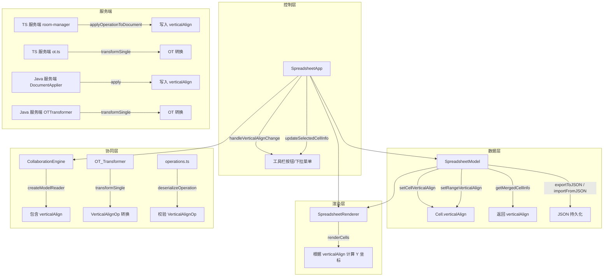
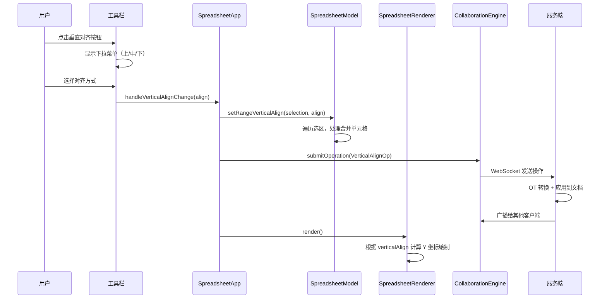

# 技术设计文档：单元格垂直对齐（cell-vertical-align）

## 概述

为 ice-excel 电子表格应用新增单元格垂直对齐（`verticalAlign`）功能。该功能允许用户通过工具栏按钮设置单元格内容的垂直对齐方式：上对齐（top）、居中对齐（middle）、下对齐（bottom）。

垂直对齐是独立于已有横向对齐（`fontAlign`）的新维度，两者互不影响、可同时生效。实现遵循 `newCellFunc` SKILL 的全链路模式，涵盖类型定义、数据模型、Canvas 渲染、工具栏 UI、协同操作校验、OT 转换、协同引擎、TypeScript 服务端和 Java 服务端。

### 设计决策

1. **属性命名**：使用 `verticalAlign` 作为属性名，与 CSS 标准命名一致，便于理解
2. **默认值**：未设置时默认为 `'middle'`（居中对齐），与当前渲染行为一致（`currentY + totalHeight / 2`）
3. **实现模式**：完全参照 `fontAlign` 的实现模式，保持代码风格一致性
4. **独立性**：`verticalAlign` 与 `fontAlign` 完全独立，不修改任何已有横向对齐代码

## 架构

### 整体架构

功能遵循项目现有的 MVC 架构模式，在每一层新增垂直对齐支持：



### 数据流



## 组件与接口

### 1. 类型定义层

#### 1.1 Cell 接口扩展（`src/types.ts`）

```typescript
export interface Cell {
  // ...已有字段
  verticalAlign?: 'top' | 'middle' | 'bottom'; // 新增：垂直对齐方式
}
```

#### 1.2 客户端协同操作类型（`src/collaboration/types.ts`）

```typescript
// OperationType 新增
export type OperationType = /* ...已有类型 */ | 'verticalAlign';

// 新增操作接口
export interface VerticalAlignOp extends BaseOperation {
  type: 'verticalAlign';
  row: number;
  col: number;
  align: 'top' | 'middle' | 'bottom';
}

// CollabOperation 联合类型新增
export type CollabOperation = /* ...已有类型 */ | VerticalAlignOp;
```

#### 1.3 客户端重新导出（`src/types.ts`）

在 `export type { ... } from './collaboration/types'` 中添加 `VerticalAlignOp`。

#### 1.4 TypeScript 服务端类型（`server/src/types.ts`）

与客户端完全一致：Cell 接口添加 `verticalAlign`，新增 `VerticalAlignOp` 接口，更新 `OperationType` 和 `CollabOperation`。

### 2. 数据模型层（`src/model.ts`）

#### 2.1 setCellVerticalAlign

```typescript
public setCellVerticalAlign(row: number, col: number, align: 'top' | 'middle' | 'bottom'): void
```

- 验证位置有效性
- 合并单元格：设置父单元格的 `verticalAlign`
- 普通单元格：直接设置
- 标记 `isDirty = true`

#### 2.2 setRangeVerticalAlign

```typescript
public setRangeVerticalAlign(
  startRow: number, startCol: number,
  endRow: number, endCol: number,
  align: 'top' | 'middle' | 'bottom'
): void
```

- 遍历选区范围
- 使用 `processedCells` Set 去重（处理合并单元格重复）
- 合并单元格设置父单元格

#### 2.3 getMergedCellInfo 更新

返回类型和两个分支（合并子单元格 / 普通单元格）均添加 `verticalAlign` 字段。

#### 2.4 导入导出更新

- `exportToJSON`：导出条件和字段中添加 `verticalAlign`
- `importFromJSON`：解构和赋值中添加 `verticalAlign`

### 3. 渲染层（`src/renderer.ts`）

在 `renderCells()` 方法中，根据 `cellInfo.verticalAlign` 计算文本 Y 坐标：

```typescript
const verticalAlign = cellInfo.verticalAlign || 'middle';
let textY: number;
switch (verticalAlign) {
  case 'top':
    textY = currentY + fontSize / 2 + cellPadding;
    break;
  case 'bottom':
    textY = currentY + totalHeight - fontSize / 2 - cellPadding;
    break;
  default: // middle
    textY = currentY + totalHeight / 2;
}
```

替换原有的 `currentY + totalHeight / 2` 硬编码。下划线绘制的 Y 坐标也需同步调整。

**关键约束**：不修改 `fontAlign`（横向对齐）的任何逻辑，`textX` 计算保持不变。

### 4. 控制层（`src/app.ts`）

#### 4.1 initVerticalAlignPicker

初始化垂直对齐下拉菜单，绑定按钮点击事件，生成三个选项（上对齐、居中对齐、下对齐）。

#### 4.2 handleVerticalAlignChange

```typescript
private handleVerticalAlignChange(align: 'top' | 'middle' | 'bottom'): void
```

- 更新工具栏按钮显示
- 调用 `model.setRangeVerticalAlign()`
- 协同模式下遍历选区提交 `VerticalAlignOp`
- 触发 `renderer.render()`

#### 4.3 updateSelectedCellInfo 更新

选中单元格时，同步更新垂直对齐按钮显示为当前单元格的 `verticalAlign` 值。

### 5. 协同操作校验（`src/collaboration/operations.ts`）

- `VALID_OPERATION_TYPES` 添加 `'verticalAlign'`
- `deserializeOperation` switch 添加 `'verticalAlign'` case
- 新增 `validateVerticalAlignOp` 校验函数：
  - `row`：必须为 number
  - `col`：必须为 number
  - `align`：必须为 `'top'` | `'middle'` | `'bottom'` 之一

### 6. OT 转换

#### 6.1 客户端 OT（`src/collaboration/ot.ts`）

新增转换函数：
- `transformVerticalAlignVsRowInsert`：调整 row
- `transformVerticalAlignVsRowDelete`：调整 row，行被删除时返回 null

更新 `transformSingle`：
- `opB === 'rowInsert'` 分支添加 `'verticalAlign'` case
- `opB === 'rowDelete'` 分支添加 `'verticalAlign'` case
- `opB === 'cellMerge'` 分支添加 `'verticalAlign'` case（合并范围内重定向到父单元格）

更新 `invertOperation`：
- 添加 `'verticalAlign'` case，返回当前单元格的 `verticalAlign` 值（默认 `'middle'`）

更新 `ModelReader` 接口：
- `getCell` 返回值添加 `verticalAlign?: string`

#### 6.2 TypeScript 服务端 OT（`server/src/ot.ts`）

与客户端 OT 完全一致的转换逻辑（不含 `invertOperation` 和 `ModelReader`）。

### 7. 协同引擎（`src/collaboration/collaboration-engine.ts`）

更新 `createModelReader` 中 `getCell` 返回值，包含 `verticalAlign: cell.verticalAlign`。

### 8. 入口文件（`src/main.ts`）

`applyOperationToModel` switch 添加：
```typescript
case 'verticalAlign':
  model.setCellVerticalAlign(op.row, op.col, op.align);
  break;
```

### 9. TypeScript 服务端操作应用（`server/src/room-manager.ts`）

`applyOperationToDocument` switch 添加：
```typescript
case 'verticalAlign': {
  if (op.row < cells.length && op.col < cells[0].length) {
    cells[op.row][op.col].verticalAlign = op.align;
  }
  break;
}
```

### 10. Java 服务端

#### 10.1 VerticalAlignOp.java（新建）

参照 `FontAlignOp.java`，包含 `row`（int）、`col`（int）、`align`（String）字段，`getType()` 返回 `"verticalAlign"`。

#### 10.2 CollabOperation.java

`@JsonSubTypes` 注解添加：
```java
@JsonSubTypes.Type(value = VerticalAlignOp.class, name = "verticalAlign")
```

#### 10.3 Cell.java

添加 `verticalAlign`（String）字段、getter/setter，更新 `equals()` 和 `hashCode()`。

#### 10.4 OTTransformer.java

新增 `transformVerticalAlignVsRowInsert` 和 `transformVerticalAlignVsRowDelete` 方法。
`transformSingle` 中 `RowInsertOp`、`RowDeleteOp`、`CellMergeOp` 三个分支添加 `VerticalAlignOp` 处理。

#### 10.5 DocumentApplier.java

`apply` 方法添加 `VerticalAlignOp` 分支，新增 `applyVerticalAlign` 方法。

### 11. UI（`index.html` + `src/style.css`）

- 工具栏添加垂直对齐按钮和下拉容器
- CSS 样式参照现有下拉菜单（如字体大小选择器）
- 文本使用简体中文：上对齐、居中对齐、下对齐
- 点击外部区域关闭下拉菜单

## 数据模型

### Cell 接口

```typescript
export interface Cell {
  content: string;
  rowSpan: number;
  colSpan: number;
  isMerged: boolean;
  mergeParent?: { row: number; col: number };
  fontColor?: string;
  bgColor?: string;
  fontSize?: number;
  fontBold?: boolean;
  fontItalic?: boolean;
  fontUnderline?: boolean;
  fontAlign?: 'left' | 'center' | 'right';     // 已有：横向对齐
  verticalAlign?: 'top' | 'middle' | 'bottom';  // 新增：垂直对齐
}
```

### VerticalAlignOp 接口

```typescript
export interface VerticalAlignOp extends BaseOperation {
  type: 'verticalAlign';
  row: number;       // 目标单元格行号
  col: number;       // 目标单元格列号
  align: 'top' | 'middle' | 'bottom';  // 垂直对齐方式
}
```

### JSON 持久化格式

导出 JSON 中每个单元格对象可包含 `verticalAlign` 字段：

```json
{
  "content": "示例文本",
  "rowSpan": 1,
  "colSpan": 1,
  "isMerged": false,
  "fontAlign": "center",
  "verticalAlign": "top"
}
```

### 修改文件清单

| 文件 | 修改内容 |
|------|---------|
| `src/types.ts` | Cell 接口添加 `verticalAlign` + 重新导出 `VerticalAlignOp` |
| `src/collaboration/types.ts` | 新增 `VerticalAlignOp` 接口，更新 `OperationType` 和 `CollabOperation` |
| `server/src/types.ts` | Cell + `VerticalAlignOp`（与客户端一致） |
| `src/model.ts` | `setCellVerticalAlign` + `setRangeVerticalAlign` + `getMergedCellInfo` + 导入导出 |
| `src/renderer.ts` | `renderCells` 中根据 `verticalAlign` 计算 Y 坐标 |
| `src/app.ts` | 初始化下拉菜单 + `handleVerticalAlignChange` + `updateSelectedCellInfo` |
| `src/collaboration/operations.ts` | 校验 + 反序列化 |
| `src/collaboration/ot.ts` | OT 转换 + `invertOperation` + `ModelReader` |
| `server/src/ot.ts` | TypeScript 服务端 OT 转换 |
| `src/collaboration/collaboration-engine.ts` | `createModelReader` |
| `server/src/room-manager.ts` | `applyOperationToDocument` |
| `src/main.ts` | `applyOperationToModel` |
| `index.html` | 工具栏 UI |
| `src/style.css` | 下拉菜单样式 |
| `javaServer/.../model/VerticalAlignOp.java` | **新建**操作模型类 |
| `javaServer/.../model/CollabOperation.java` | `@JsonSubTypes` 注册 |
| `javaServer/.../model/Cell.java` | 添加 `verticalAlign` 字段 |
| `javaServer/.../service/OTTransformer.java` | OT 转换 |
| `javaServer/.../service/DocumentApplier.java` | 操作应用 |
