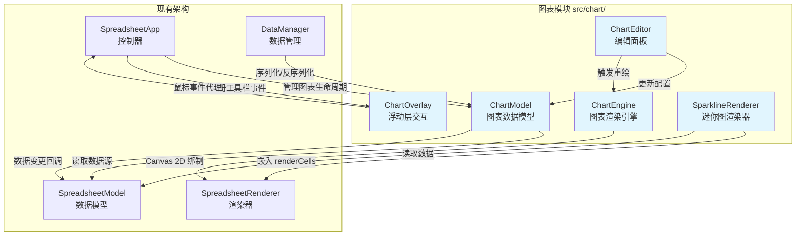
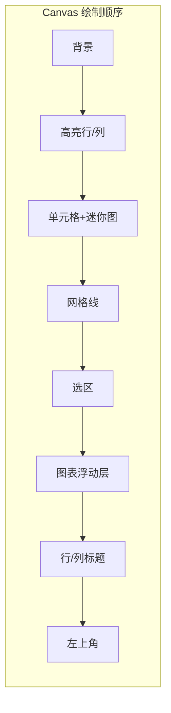
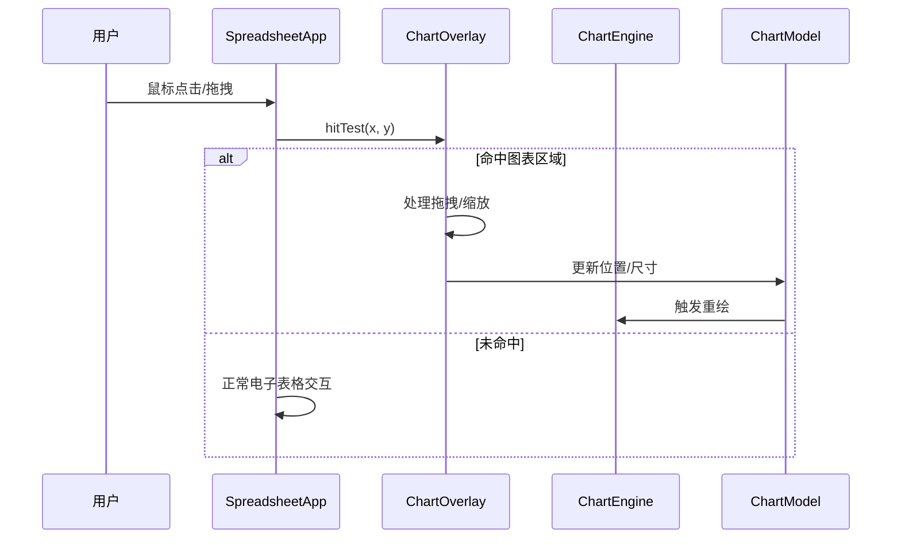

# 技术设计文档：图表与数据可视化

## 概述

本设计为 Canvas Excel 添加图表与数据可视化功能。核心思路是在现有 MVC 架构上新增一组图表模块（`src/chart/`），遵循项目零运行时依赖的约束，所有图表通过 Canvas 2D API 原生渲染。

图表作为浮动层叠加在电子表格上方，与单元格数据通过 DataRange 引用建立联动关系。迷你图（Sparkline）则嵌入单元格渲染流程，在 `renderCells` 阶段绘制。

主要新增模块：
- `ChartModel` — 图表数据模型，管理图表配置和数据源引用
- `ChartEngine` — 图表渲染引擎，将配置转换为 Canvas 绘制指令
- `ChartOverlay` — 图表浮动层，处理图表定位、拖拽、缩放交互
- `ChartEditor` — 图表编辑面板，提供配置 UI
- `SparklineRenderer` — 迷你图渲染器，在单元格内绘制小型图表

## 架构

### 系统架构图



### 渲染层次



图表浮动层在选区之后、标题之前绘制，确保图表覆盖在单元格内容上方，但不遮挡行列标题。

### 事件处理流程



## 组件与接口

### 1. ChartModel — 图表数据模型

职责：管理所有图表实例的配置数据，监听数据源变化，维护图表与单元格数据的联动关系。

```typescript
// src/chart/chart-model.ts

interface ChartInstance {
  config: ChartConfig;
  status: 'active' | 'noData' | 'invalidSource';
}

class ChartModel {
  private charts: Map<string, ChartInstance>;
  private model: SpreadsheetModel;
  private changeCallbacks: Array<(chartId: string) => void>;

  // 创建图表，返回图表 ID
  createChart(type: ChartType, dataRange: DataRange, position: Position, size: Size): string;

  // 删除图表
  deleteChart(chartId: string): void;

  // 更新图表配置
  updateChart(chartId: string, config: Partial<ChartConfig>): void;

  // 获取图表配置
  getChart(chartId: string): ChartConfig | null;

  // 获取所有图表
  getAllCharts(): ChartConfig[];

  // 解析数据范围内的数值数据，返回系列数据
  resolveChartData(chartId: string): ChartData;

  // 注册数据变更回调（由 SpreadsheetModel 的变更事件触发）
  onDataChange(callback: (chartId: string) => void): void;

  // 处理行列插入/删除时的数据范围调整
  adjustDataRanges(operation: 'rowInsert' | 'rowDelete' | 'colInsert' | 'colDelete', index: number, count: number): void;

  // 序列化所有图表配置
  serialize(): ChartConfigJSON[];

  // 从 JSON 恢复图表
  deserialize(data: ChartConfigJSON[]): void;
}
```

### 2. ChartEngine — 图表渲染引擎

职责：将图表配置和数据转换为 Canvas 2D 绘制指令。每种图表类型有独立的绘制方法。

```typescript
// src/chart/chart-engine.ts

class ChartEngine {
  private ctx: CanvasRenderingContext2D;
  private themeColors: ThemeColors;

  // 渲染单个图表
  render(config: ChartConfig, data: ChartData, x: number, y: number, width: number, height: number): void;

  // 设置主题颜色
  setThemeColors(colors: ThemeColors): void;

  // 各图表类型的绘制方法（内部调用）
  private renderBarChart(data: ChartData, area: ChartArea): void;
  private renderLineChart(data: ChartData, area: ChartArea): void;
  private renderPieChart(data: ChartData, area: ChartArea): void;
  private renderScatterChart(data: ChartData, area: ChartArea): void;
  private renderAreaChart(data: ChartData, area: ChartArea): void;

  // 公共绘制辅助方法
  private renderAxes(area: ChartArea, config: AxesConfig): void;
  private renderGridLines(area: ChartArea, config: AxesConfig): void;
  private renderLegend(area: ChartArea, series: SeriesInfo[], config: LegendConfig): void;
  private renderTitle(area: ChartArea, config: TitleConfig): void;
  private renderDataLabels(area: ChartArea, points: DataPoint[], config: DataLabelConfig): void;
}
```

### 3. ChartOverlay — 图表浮动层

职责：管理图表在电子表格上方的定位、选中状态、拖拽移动和缩放交互。

```typescript
// src/chart/chart-overlay.ts

type ResizeHandle = 'nw' | 'n' | 'ne' | 'e' | 'se' | 's' | 'sw' | 'w';

class ChartOverlay {
  private chartModel: ChartModel;
  private chartEngine: ChartEngine;
  private selectedChartId: string | null;
  private isDragging: boolean;
  private isResizing: boolean;
  private resizeHandle: ResizeHandle | null;

  // 命中测试：判断坐标是否在某个图表区域内
  hitTest(x: number, y: number): { chartId: string; handle: ResizeHandle | null } | null;

  // 处理鼠标按下
  handleMouseDown(x: number, y: number): boolean;

  // 处理鼠标移动
  handleMouseMove(x: number, y: number): string | null; // 返回光标样式

  // 处理鼠标释放
  handleMouseUp(): void;

  // 选中图表
  selectChart(chartId: string): void;

  // 取消选中
  deselectChart(): void;

  // 删除选中的图表
  deleteSelectedChart(): void;

  // 渲染所有图表（在主渲染流程中调用）
  renderAll(ctx: CanvasRenderingContext2D, viewport: Viewport, scrollX: number, scrollY: number): void;

  // 显示图表类型选择面板
  showTypeSelector(x: number, y: number, dataRange: DataRange): void;
}
```

### 4. ChartEditor — 图表编辑面板

职责：提供图表属性配置的 DOM 面板，允许用户修改标题、图例、坐标轴、数据标签等。

```typescript
// src/chart/chart-editor.ts

class ChartEditor {
  private panel: HTMLDivElement;
  private chartModel: ChartModel;
  private currentChartId: string | null;
  private debounceTimer: ReturnType<typeof setTimeout> | null;

  // 打开编辑面板
  open(chartId: string): void;

  // 关闭编辑面板
  close(): void;

  // 应用配置变更（200ms 防抖后触发重绘）
  private applyChange(field: string, value: unknown): void;

  // 构建面板 DOM 结构
  private buildPanel(): void;

  // 更新面板显示（反映当前图表配置）
  private updatePanelValues(config: ChartConfig): void;
}
```

### 5. SparklineRenderer — 迷你图渲染器

职责：在单元格渲染阶段绘制迷你图，嵌入 `SpreadsheetRenderer.renderCells()` 流程。

```typescript
// src/chart/sparkline-renderer.ts

class SparklineRenderer {
  // 渲染迷你图到指定单元格区域
  static render(
    ctx: CanvasRenderingContext2D,
    config: SparklineConfig,
    data: number[],
    x: number, y: number,
    width: number, height: number,
    themeColors: ThemeColors
  ): void;

  // 各类型迷你图绘制
  private static renderLineSparkline(ctx: CanvasRenderingContext2D, data: number[], area: SparklineArea): void;
  private static renderBarSparkline(ctx: CanvasRenderingContext2D, data: number[], area: SparklineArea): void;
  private static renderWinLossSparkline(ctx: CanvasRenderingContext2D, data: number[], area: SparklineArea): void;
}
```

### 模块间交互关系

| 调用方 | 被调用方 | 交互方式 |
|--------|----------|----------|
| SpreadsheetApp | ChartOverlay | 鼠标事件代理，工具栏按钮事件 |
| SpreadsheetApp | ChartModel | 创建/删除图表 |
| ChartOverlay | ChartEngine | 调用 render() 绘制图表 |
| ChartOverlay | ChartModel | 读取/更新图表位置和尺寸 |
| ChartEditor | ChartModel | 读取/更新图表配置 |
| ChartModel | SpreadsheetModel | 通过回调监听数据变更，读取单元格数据 |
| SpreadsheetRenderer | SparklineRenderer | 在 renderCells 中调用静态方法 |
| DataManager | ChartModel | 导出/导入时序列化图表配置 |

## 数据模型

### 核心类型定义

```typescript
// src/chart/types.ts

// 图表类型
type ChartType = 'bar' | 'line' | 'pie' | 'scatter' | 'area';

// 迷你图类型
type SparklineType = 'line' | 'bar' | 'winLoss';

// 数据范围（引用电子表格单元格区域）
interface DataRange {
  startRow: number;
  startCol: number;
  endRow: number;
  endCol: number;
}

// 图表位置（像素坐标，相对于电子表格数据区域左上角）
interface Position {
  x: number;
  y: number;
}

// 图表尺寸
interface Size {
  width: number;   // 最小 200
  height: number;  // 最小 150
}

// 标题配置
interface TitleConfig {
  text: string;
  fontSize: number;    // 12-24
  position: 'top' | 'bottom';
  visible: boolean;
}

// 图例配置
interface LegendConfig {
  visible: boolean;
  position: 'top' | 'bottom' | 'left' | 'right';
}

// 坐标轴配置
interface AxisConfig {
  title: string;
  autoRange: boolean;
  min?: number;
  max?: number;
  showGridLines: boolean;
}

// 坐标轴组合配置
interface AxesConfig {
  xAxis: AxisConfig;
  yAxis: AxisConfig;
}

// 数据标签配置
interface DataLabelConfig {
  visible: boolean;
  content: 'value' | 'percentage' | 'category';
}

// 完整图表配置
interface ChartConfig {
  id: string;
  type: ChartType;
  dataRange: DataRange;
  position: Position;
  size: Size;
  title: TitleConfig;
  legend: LegendConfig;
  axes: AxesConfig;
  dataLabels: DataLabelConfig;
}

// 解析后的图表数据
interface ChartData {
  categories: string[];           // 类别标签（X 轴）
  series: SeriesData[];           // 数据系列
  hasData: boolean;               // 是否包含有效数据
}

interface SeriesData {
  name: string;                   // 系列名称
  values: number[];               // 数值数组
  color: string;                  // 系列颜色
}

// 迷你图配置（存储在 Cell 对象中）
interface SparklineConfig {
  type: SparklineType;
  dataRange: DataRange;
  color?: string;                 // 自定义颜色，默认使用主题色
  highlightMax?: boolean;         // 高亮最大值（折线图）
  highlightMin?: boolean;         // 高亮最小值（折线图）
}

// 图表绘制区域（内部使用）
interface ChartArea {
  x: number;
  y: number;
  width: number;
  height: number;
  plotX: number;      // 绘图区域 X（去除标题、图例、轴标签后）
  plotY: number;
  plotWidth: number;
  plotHeight: number;
}
```

### Cell 类型扩展

在现有 `Cell` 接口中新增 `sparkline` 字段：

```typescript
// 在 src/types.ts 的 Cell 接口中添加
interface Cell {
  // ... 现有字段 ...
  sparkline?: SparklineConfig;    // 迷你图配置
}
```

### SpreadsheetData 类型扩展

在现有 `SpreadsheetData` 接口中新增 `charts` 字段：

```typescript
// 在 src/types.ts 的 SpreadsheetData 接口中添加
interface SpreadsheetData {
  cells: Cell[][];
  rowHeights: number[];
  colWidths: number[];
  charts?: ChartConfig[];         // 图表配置列表
}
```

### 序列化格式

图表配置在 JSON 导出中的结构：

```json
{
  "version": "1.0",
  "data": {
    "cells": [...],
    "rowHeights": {...},
    "colWidths": {...},
    "conditionalFormats": [...],
    "charts": [
      {
        "id": "chart-1",
        "type": "bar",
        "dataRange": { "startRow": 0, "startCol": 0, "endRow": 5, "endCol": 3 },
        "position": { "x": 500, "y": 100 },
        "size": { "width": 400, "height": 300 },
        "title": { "text": "销售数据", "fontSize": 16, "position": "top", "visible": true },
        "legend": { "visible": true, "position": "bottom" },
        "axes": {
          "xAxis": { "title": "", "autoRange": true, "showGridLines": false },
          "yAxis": { "title": "", "autoRange": true, "showGridLines": true }
        },
        "dataLabels": { "visible": false, "content": "value" }
      }
    ]
  }
}
```

### 默认配色方案

图表系列使用预定义的颜色数组，从 `themeColors` 扩展：

```typescript
// 亮色主题默认图表配色
const CHART_COLORS_LIGHT = [
  '#4285F4', '#EA4335', '#FBBC04', '#34A853',
  '#FF6D01', '#46BDC6', '#7B61FF', '#F538A0'
];

// 暗色主题默认图表配色
const CHART_COLORS_DARK = [
  '#8AB4F8', '#F28B82', '#FDD663', '#81C995',
  '#FCAD70', '#78D9EC', '#AF8FFF', '#FF8BCB'
];
```

## 正确性属性（Correctness Properties）

*属性（Property）是指在系统所有有效执行中都应成立的特征或行为——本质上是对系统应做什么的形式化陈述。属性是人类可读规格说明与机器可验证正确性保证之间的桥梁。*

### Property 1: ChartConfig 序列化往返一致性

*For any* 有效的 ChartConfig 对象，将其序列化为 JSON 字符串后再反序列化，应产生与原始对象等价的 ChartConfig。

**Validates: Requirements 1.3, 7.1, 7.3, 7.5**

### Property 2: SparklineConfig 序列化往返一致性

*For any* 有效的 SparklineConfig 对象，将其序列化为 JSON 字符串后再反序列化，应产生与原始对象等价的 SparklineConfig。

**Validates: Requirements 6.7, 6.8**

### Property 3: 非数值数据区域拒绝创建图表

*For any* 不包含任何数值数据的单元格区域，调用图表创建方法应返回失败结果，且 ChartModel 中不应新增任何图表实例。

**Validates: Requirements 1.4**

### Property 4: 数据区域标题解析

*For any* 包含至少 2 行 2 列数值数据的数据区域，resolveChartData 应将第一行内容作为系列名称、第一列内容作为类别标签，且系列数据不包含标题行和标题列的值。

**Validates: Requirements 1.5**

### Property 5: 单行/单列数据生成单系列图表

*For any* 仅包含一行或一列数值数据的数据区域，resolveChartData 返回的 series 数组长度应为 1。

**Validates: Requirements 1.6**

### Property 6: 饼图扇区角度比例正确性

*For any* 包含正数值的数据系列，饼图各扇区角度之和应等于 2π，且每个扇区角度应等于 `(该值 / 总和) × 2π`。

**Validates: Requirements 2.5**

### Property 7: 多系列图表颜色唯一性

*For any* 包含多个数据系列的图表数据，每个系列分配的颜色应互不相同。

**Validates: Requirements 2.3, 2.4**

### Property 8: 图表类型切换保留数据范围

*For any* 已创建的图表和任意目标图表类型，切换图表类型后，图表的 dataRange 应与切换前完全相同。

**Validates: Requirements 3.8**

### Property 9: 图表配置值约束

*For any* 图表配置更新操作，标题字体大小应被限制在 12-24px 范围内，图例位置应为 top/bottom/left/right 之一，数据标签内容应为 value/percentage/category 之一。

**Validates: Requirements 3.2, 3.3**

### Property 10: 图表缩放最小尺寸不变量

*For any* 图表缩放操作，结果尺寸的宽度不应小于 200 像素，高度不应小于 150 像素。

**Validates: Requirements 4.3**

### Property 11: 图表位置边界约束

*For any* 图表位置更新（拖拽或创建），图表的位置应被限制在可视区域边界内，即 `position.x >= 0`、`position.y >= 0`、`position.x + size.width <= viewportWidth`、`position.y + size.height <= viewportHeight`。

**Validates: Requirements 4.7**

### Property 12: 删除图表从模型中移除

*For any* 已创建的图表，执行删除操作后，ChartModel.getChart(chartId) 应返回 null，且 getAllCharts() 的长度应减少 1。

**Validates: Requirements 4.5**

### Property 13: 数据变更传播到图表

*For any* 图表及其数据源范围内的单元格，修改该单元格的数值后，resolveChartData 返回的数据应反映新值。

**Validates: Requirements 5.1, 5.3**

### Property 14: 行列操作后数据范围自动调整

*For any* 图表数据范围和在该范围之前插入的行/列操作，调整后的数据范围应向下/向右偏移相应数量；对于在范围之后的插入操作，数据范围应保持不变。

**Validates: Requirements 5.2**

### Property 15: 空数据范围显示无数据状态

*For any* 图表，当其数据源范围内所有单元格均为空时，图表状态应为 'noData'。

**Validates: Requirements 5.5**

### Property 16: 无效数据范围显示失效状态

*For any* 图表，当删除行/列导致其数据范围超出表格边界时，图表状态应为 'invalidSource'。

**Validates: Requirements 5.6**

### Property 17: 无效图表 JSON 优雅处理

*For any* 格式无效的图表 JSON 数据（如缺少必要字段、类型错误），反序列化操作应跳过无效条目而不抛出异常，且不影响其余有效数据的加载。

**Validates: Requirements 7.6**

### Property 18: 序列化 ChartConfig 包含所有必要字段

*For any* 有效的 ChartConfig 对象，其序列化后的 JSON 应包含以下所有字段：id、type、dataRange、position、size、title、legend、axes、dataLabels。

**Validates: Requirements 7.4**

## Java 后端协同支持

图表操作需要通过 WebSocket 协同同步到其他客户端。Java 后端需要新增图表相关的操作类型、文档应用逻辑和 OT 变换逻辑。

### 新增协同操作类型

```java
// 图表创建操作
public class ChartCreateOp extends CollabOperation {
    private ChartConfigData chartConfig; // 完整图表配置
    public String getType() { return "chartCreate"; }
}

// 图表更新操作（位置、尺寸、配置变更）
public class ChartUpdateOp extends CollabOperation {
    private String chartId;
    private ChartConfigData chartConfig; // 更新后的完整配置
    public String getType() { return "chartUpdate"; }
}

// 图表删除操作
public class ChartDeleteOp extends CollabOperation {
    private String chartId;
    public String getType() { return "chartDelete"; }
}

// 设置迷你图操作
public class SetSparklineOp extends CollabOperation {
    private int row;
    private int col;
    private SparklineConfigData sparkline; // null 表示删除迷你图
    public String getType() { return "setSparkline"; }
}
```

### 新增模型类

```java
// 图表配置数据（与 TypeScript ChartConfig 对应）
public class ChartConfigData {
    private String id;
    private String type;        // bar, line, pie, scatter, area
    private DataRange dataRange;
    private Position position;
    private Size size;
    private TitleConfig title;
    private LegendConfig legend;
    private AxesConfig axes;
    private DataLabelConfig dataLabels;
}

// 迷你图配置数据（与 TypeScript SparklineConfig 对应）
public class SparklineConfigData {
    private String type;        // line, bar, winLoss
    private DataRange dataRange;
    private String color;
    private Boolean highlightMax;
    private Boolean highlightMin;
}

// 数据范围
public class DataRange {
    private int startRow;
    private int startCol;
    private int endRow;
    private int endCol;
}

// 图表位置
public class Position {
    private double x;
    private double y;
}

// 图表尺寸
public class Size {
    private double width;
    private double height;
}

// 标题配置、图例配置、坐标轴配置、数据标签配置
// （与 TypeScript 类型一一对应的 POJO 类）
```

### Cell 模型扩展

```java
// 在 Cell.java 中新增字段
private SparklineConfigData sparkline;
```

### SpreadsheetData 模型扩展

```java
// 在 SpreadsheetData.java 中新增字段
private List<ChartConfigData> charts;
```

### DocumentApplier 扩展

在 `DocumentApplier.apply()` 中新增图表操作的处理分支：

- `ChartCreateOp`：将图表配置添加到 `SpreadsheetData.charts` 列表
- `ChartUpdateOp`：根据 chartId 查找并替换图表配置
- `ChartDeleteOp`：根据 chartId 从列表中移除图表配置
- `SetSparklineOp`：设置目标单元格的 sparkline 字段

### OTTransformer 扩展

图表操作的 OT 变换规则：

| 操作 A | 操作 B | 变换规则 |
|--------|--------|----------|
| ChartCreateOp | RowInsert/RowDelete/ColInsert/ColDelete | 调整 chartConfig.dataRange 的行列索引 |
| ChartUpdateOp | RowInsert/RowDelete/ColInsert/ColDelete | 调整 chartConfig.dataRange 的行列索引 |
| ChartDeleteOp | 任意操作 | 不变（删除操作不受行列变化影响） |
| SetSparklineOp | RowInsert/RowDelete | 调整 row 索引 |
| SetSparklineOp | ColInsert/ColDelete | 调整 col 索引和 sparkline.dataRange |
| ChartCreateOp | ChartDeleteOp（同 chartId） | 冲突：创建操作被取消 |
| ChartUpdateOp | ChartDeleteOp（同 chartId） | 冲突：更新操作被取消 |

### CollabOperation 注册

在 `CollabOperation.java` 的 `@JsonSubTypes` 注解中新增：

```java
@JsonSubTypes.Type(value = ChartCreateOp.class, name = "chartCreate"),
@JsonSubTypes.Type(value = ChartUpdateOp.class, name = "chartUpdate"),
@JsonSubTypes.Type(value = ChartDeleteOp.class, name = "chartDelete"),
@JsonSubTypes.Type(value = SetSparklineOp.class, name = "setSparkline")
```

## 错误处理

| 错误场景 | 处理方式 |
|----------|----------|
| 数据区域无数值数据 | 显示提示信息，阻止图表创建 |
| 图表数据源范围全部为空 | 图表显示"暂无数据"占位提示 |
| 数据源范围因行列删除而失效 | 图表标记为"数据源失效"，显示警告图标 |
| 导入 JSON 中 charts 字段格式无效 | 忽略无效图表配置，console.warn 记录警告，不影响其余数据加载 |
| 图表缩放低于最小尺寸 | 自动钳制到最小尺寸 200×150 |
| 图表拖拽超出可视区域 | 自动钳制到可视区域边界内 |
| 标题字体大小超出范围 | 自动钳制到 12-24px 范围 |
| SparklineConfig 数据范围无效 | 跳过迷你图渲染，单元格正常显示 |

## 测试策略

### 测试框架

- 单元测试与属性测试：Vitest
- 属性测试库：fast-check（`@fast-check/vitest`）
- E2E 测试：Playwright（已有配置）

### 属性测试（Property-Based Testing）

每个正确性属性对应一个属性测试，使用 fast-check 生成随机输入，每个测试至少运行 100 次迭代。

测试标签格式：`Feature: chart-visualization, Property {number}: {property_text}`

属性测试重点覆盖：
- 序列化往返一致性（Property 1, 2）— 使用 fast-check 生成随机 ChartConfig/SparklineConfig 对象
- 数据解析逻辑（Property 3, 4, 5）— 生成随机单元格数据矩阵
- 数学计算正确性（Property 6）— 生成随机正数数组验证角度计算
- 配置约束不变量（Property 9, 10, 11）— 生成随机配置值验证钳制逻辑
- 数据范围调整（Property 14）— 生成随机范围和行列操作验证偏移计算
- 错误处理（Property 17）— 生成随机无效 JSON 验证优雅降级

### 单元测试

单元测试覆盖具体示例和边界情况：
- 各图表类型的创建和默认配置
- 图表编辑面板的打开/关闭
- 工具栏按钮的启用/禁用状态
- 迷你图的创建和类型选择
- 图表选中/取消选中状态切换
- 散点图数据映射（X/Y 轴对应前两列）
- 主题切换后图表配色更新

### E2E 测试

使用 Playwright 进行端到端测试：
- 完整的图表创建流程（选择数据 → 插入图表 → 验证渲染）
- 图表拖拽和缩放交互
- 图表编辑面板操作
- 数据修改后图表自动更新
- 导出/导入后图表恢复

### 测试文件组织

```
src/__tests__/
├── chart-model.test.ts          # ChartModel 单元测试 + 属性测试
├── chart-engine.test.ts         # ChartEngine 单元测试
├── chart-overlay.test.ts        # ChartOverlay 交互测试
├── sparkline-renderer.test.ts   # SparklineRenderer 单元测试 + 属性测试
├── chart-serialization.test.ts  # 序列化往返属性测试
└── chart-data-linkage.test.ts   # 数据联动属性测试
```
