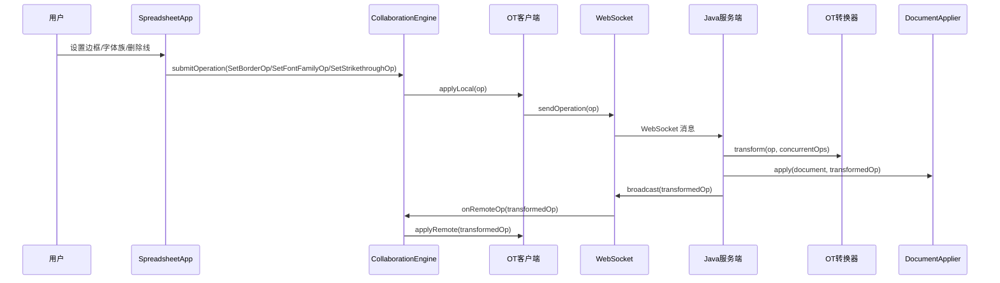

# 设计文档：全操作协同支持（setBorder / setFontFamily / setStrikethrough）

## 概述

本设计文档描述如何为 ice-excel 电子表格应用补齐 3 种缺失操作类型（`setBorder`、`setFontFamily`、`setStrikethrough`）的前后端完整协同支持。

这 3 种操作均属于"单元格样式操作"（CellStyleOp），即作用于单个单元格 `(row, col)` 的样式变更。它们与现有的 `fontColor`、`bgColor`、`fontSize` 等操作共享相同的 OT 转换模式：
- 与行列插入/删除操作并发时，调整行列索引
- 与合并/拆分操作并发时，重定向到主单元格
- 同类型同单元格并发时，先到达服务端的操作优先

设计原则：
- **模式复用**：严格遵循现有样式操作（如 `FontBoldOp`）的实现模式，保持代码一致性
- **前后端对称**：前端 TypeScript OT 转换器和后端 Java OT 转换器的转换规则完全对称
- **最小改动**：仅在必要的位置添加新操作类型的处理分支，不重构现有代码

## 架构

整体架构不变，仍然采用现有的协同编辑架构。本次改动仅在以下层面扩展：

```mermaid
graph LR
    subgraph 前端扩展
        OT_TS[ot.ts<br/>新增 3 种操作的<br/>transform/invert]
        OPS_TS[operations.ts<br/>新增序列化/反序列化]
        TYPES_TS[types.ts<br/>已有类型定义]
    end

    subgraph 后端扩展
        MODEL[model/<br/>新增 3 个 Op 类<br/>+ CellBorder/BorderSide<br/>+ Cell 字段扩展]
        OT_JAVA[OTTransformer.java<br/>新增 3 种操作的<br/>transform 分支]
        DA_JAVA[DocumentApplier.java<br/>新增 3 种操作的<br/>apply 方法]
        COLLAB[CollabOperation.java<br/>@JsonSubTypes 注册]
    end

    TYPES_TS --> OT_TS
    TYPES_TS --> OPS_TS
    MODEL --> OT_JAVA
    MODEL --> DA_JAVA
    MODEL --> COLLAB
```

改动范围：
- **后端 model 层**：新增 `SetBorderOp.java`、`SetFontFamilyOp.java`、`SetStrikethroughOp.java`、`CellBorder.java`、`BorderSide.java`，扩展 `Cell.java` 和 `CollabOperation.java`
- **后端 service 层**：扩展 `OTTransformer.java` 和 `DocumentApplier.java`
- **前端 collaboration 层**：扩展 `ot.ts`（transformSingle + invertOperation）和 `operations.ts`（序列化/反序列化）

## 组件与接口

### High-Level Design

#### 1. 新操作类型的统一处理模式

3 种新操作均为"单元格样式操作"，共享以下处理流程：



#### 2. OT 转换规则分类

新操作与现有操作的 OT 转换关系：

| 并发操作 B \ 操作 A | SetBorderOp | SetFontFamilyOp | SetStrikethroughOp |
|---|---|---|---|
| RowInsert | 调整 row | 调整 row | 调整 row |
| RowDelete | 调整 row 或 null | 调整 row 或 null | 调整 row 或 null |
| ColInsert | 调整 col | 调整 col | 调整 col |
| ColDelete | 调整 col 或 null | 调整 col 或 null | 调整 col 或 null |
| CellMerge | 重定向到主单元格 | 重定向到主单元格 | 重定向到主单元格 |
| CellSplit | 重定向到目标单元格 | 重定向到目标单元格 | 重定向到目标单元格 |
| 同类型同单元格 | 先到达优先 | 先到达优先 | 先到达优先 |
| 其他操作 | 不变（cloneOp） | 不变（cloneOp） | 不变（cloneOp） |

### Low-Level Design

#### 1. Java 服务端新增数据模型

##### 1.1 BorderSide.java

```java
package com.iceexcel.server.model;

/**
 * 单边边框配置，包含线型、颜色和宽度
 */
public class BorderSide {
    private String style;  // 线型：solid, dashed, dotted, double
    private String color;  // 颜色：CSS 颜色值
    private int width;     // 宽度：像素值

    // 无参构造器 + 全参构造器 + getter/setter + equals/hashCode
}
```

##### 1.2 CellBorder.java

```java
package com.iceexcel.server.model;

import com.fasterxml.jackson.annotation.JsonInclude;

/**
 * 单元格边框配置，包含四个方向的边框
 */
@JsonInclude(JsonInclude.Include.NON_NULL)
public class CellBorder {
    private BorderSide top;
    private BorderSide bottom;
    private BorderSide left;
    private BorderSide right;

    // 无参构造器 + 全参构造器 + getter/setter + equals/hashCode
}
```

##### 1.3 SetBorderOp.java

遵循 `FontBoldOp` 的实现模式：

```java
package com.iceexcel.server.model;

/**
 * 设置单元格边框操作
 */
public class SetBorderOp extends CollabOperation {
    private int row;
    private int col;
    private CellBorder border;  // 可为 null，表示清除边框

    @Override
    public String getType() { return "setBorder"; }

    // 无参构造器 + 全参构造器 + getter/setter + equals/hashCode
}
```

##### 1.4 SetFontFamilyOp.java

```java
package com.iceexcel.server.model;

/**
 * 设置单元格字体族操作
 */
public class SetFontFamilyOp extends CollabOperation {
    private int row;
    private int col;
    private String fontFamily;

    @Override
    public String getType() { return "setFontFamily"; }

    // 无参构造器 + 全参构造器 + getter/setter + equals/hashCode
}
```

##### 1.5 SetStrikethroughOp.java

```java
package com.iceexcel.server.model;

/**
 * 设置单元格删除线操作
 */
public class SetStrikethroughOp extends CollabOperation {
    private int row;
    private int col;
    private boolean strikethrough;

    @Override
    public String getType() { return "setStrikethrough"; }

    // 无参构造器 + 全参构造器 + getter/setter + equals/hashCode
}
```

#### 2. CollabOperation.java @JsonSubTypes 扩展

在现有 `@JsonSubTypes` 注解中新增三行：

```java
@JsonSubTypes.Type(value = SetBorderOp.class, name = "setBorder"),
@JsonSubTypes.Type(value = SetFontFamilyOp.class, name = "setFontFamily"),
@JsonSubTypes.Type(value = SetStrikethroughOp.class, name = "setStrikethrough")
```

#### 3. Cell.java 扩展

新增三个字段：

```java
// === 边框、字体族、删除线字段 ===
private CellBorder border;          // 边框配置，可为 null
private String fontFamily;          // 字体族名称，可为 null
private Boolean fontStrikethrough;  // 删除线开关，可为 null
```

在 `equals()` 和 `hashCode()` 中加入这三个字段的比较。

#### 4. DocumentApplier.java 扩展

新增三个 apply 方法，遵循现有 `applyFontBold` 等方法的模式：

```java
private static void applySetBorder(List<List<Cell>> cells, SetBorderOp op) {
    // 确保行列存在（自动扩展）
    ensureCellExists(cells, op.getRow(), op.getCol());
    cells.get(op.getRow()).get(op.getCol()).setBorder(op.getBorder());
}

private static void applySetFontFamily(List<List<Cell>> cells, SetFontFamilyOp op) {
    ensureCellExists(cells, op.getRow(), op.getCol());
    cells.get(op.getRow()).get(op.getCol()).setFontFamily(op.getFontFamily());
}

private static void applySetStrikethrough(List<List<Cell>> cells, SetStrikethroughOp op) {
    ensureCellExists(cells, op.getRow(), op.getCol());
    cells.get(op.getRow()).get(op.getCol()).setFontStrikethrough(op.isStrikethrough());
}
```

在 `apply(SpreadsheetData, CollabOperation)` 方法的 `if-else` 链中添加对应分支。

#### 5. Java OTTransformer.java 扩展

##### 5.1 新增转换辅助函数

遵循现有 `transformFontBoldVsRowInsert` 等函数的模式，为每种新操作类型新增 6 个转换函数：

```java
// SetBorderOp vs RowInsert/RowDelete/ColInsert/ColDelete
private static SetBorderOp transformSetBorderVsRowInsert(SetBorderOp op, RowInsertOp insertOp) {
    SetBorderOp result = cloneOp(op);
    result.setRow(adjustRowForInsert(op.getRow(), insertOp));
    return result;
}

private static SetBorderOp transformSetBorderVsRowDelete(SetBorderOp op, RowDeleteOp deleteOp) {
    Integer newRow = adjustRowForDelete(op.getRow(), deleteOp);
    if (newRow == null) return null;  // 行被删除，操作消除
    SetBorderOp result = cloneOp(op);
    result.setRow(newRow);
    return result;
}

private static SetBorderOp transformSetBorderVsColInsert(SetBorderOp op, ColInsertOp insertOp) {
    SetBorderOp result = cloneOp(op);
    result.setCol(adjustColForInsert(op.getCol(), insertOp));
    return result;
}

private static SetBorderOp transformSetBorderVsColDelete(SetBorderOp op, ColDeleteOp deleteOp) {
    Integer newCol = adjustColForDelete(op.getCol(), deleteOp);
    if (newCol == null) return null;  // 列被删除，操作消除
    SetBorderOp result = cloneOp(op);
    result.setCol(newCol);
    return result;
}

// SetFontFamilyOp 和 SetStrikethroughOp 的转换函数结构完全相同
// （省略，实现模式与 SetBorderOp 一致）
```

##### 5.2 transformSingle 函数扩展

在 `transformSingle` 方法的每个 `opB instanceof` 分支中，添加对三种新操作类型的处理：

```java
// 在 opB instanceof ColInsertOp 分支中添加：
if (opA instanceof SetBorderOp) return transformSetBorderVsColInsert((SetBorderOp) opA, insertOp);
if (opA instanceof SetFontFamilyOp) return transformSetFontFamilyVsColInsert((SetFontFamilyOp) opA, insertOp);
if (opA instanceof SetStrikethroughOp) return transformSetStrikethroughVsColInsert((SetStrikethroughOp) opA, insertOp);

// 在 opB instanceof ColDeleteOp 分支中添加：
if (opA instanceof SetBorderOp) return transformSetBorderVsColDelete((SetBorderOp) opA, deleteOp);
if (opA instanceof SetFontFamilyOp) return transformSetFontFamilyVsColDelete((SetFontFamilyOp) opA, deleteOp);
if (opA instanceof SetStrikethroughOp) return transformSetStrikethroughVsColDelete((SetStrikethroughOp) opA, deleteOp);

// RowInsert、RowDelete 分支同理
```

##### 5.3 CellMerge/CellSplit 分支扩展

```java
// 在 opB instanceof CellMergeOp 分支中添加：
if (opA instanceof SetBorderOp) {
    SetBorderOp borderOp = (SetBorderOp) opA;
    if (isInMergeRange(borderOp.getRow(), borderOp.getCol(), mergeOp)) {
        SetBorderOp result = cloneOp(borderOp);
        result.setRow(mergeOp.getStartRow());
        result.setCol(mergeOp.getStartCol());
        return result;
    }
    return cloneOp(opA);
}
// SetFontFamilyOp、SetStrikethroughOp 同理

// 在 opB instanceof CellSplitOp 分支中，将三种新操作加入 transformStyleOpVsCellSplit 的处理范围
```

##### 5.4 同类型冲突解决

```java
// 在 transformSingle 末尾添加同类型冲突处理：
// 两个 SetBorderOp 操作同一单元格 → 先到达的优先（后到达的返回 null）
if (opA instanceof SetBorderOp && opB instanceof SetBorderOp) {
    SetBorderOp a = (SetBorderOp) opA;
    SetBorderOp b = (SetBorderOp) opB;
    if (a.getRow() == b.getRow() && a.getCol() == b.getCol()) {
        return null;  // opA 被消除（opB 先到达服务端）
    }
    return cloneOp(opA);
}
// SetFontFamilyOp、SetStrikethroughOp 同理
```

#### 6. 前端 ot.ts 扩展

##### 6.1 新增转换辅助函数

遵循现有 `transformFontBoldVsRowInsert` 等函数的模式：

```typescript
// SetBorderOp vs RowInsert
const transformSetBorderVsRowInsert = (
  op: SetBorderOp, insertOp: RowInsertOp
): SetBorderOp => {
  const result = cloneOp(op);
  result.row = adjustRowForInsert(op.row, insertOp);
  return result;
};

// SetBorderOp vs RowDelete
const transformSetBorderVsRowDelete = (
  op: SetBorderOp, deleteOp: RowDeleteOp
): SetBorderOp | null => {
  const newRow = adjustRowForDelete(op.row, deleteOp);
  if (newRow === null) return null;
  const result = cloneOp(op);
  result.row = newRow;
  return result;
};

// SetBorderOp vs ColInsert / ColDelete 同理
// SetFontFamilyOp、SetStrikethroughOp 的转换函数结构完全相同
```

##### 6.2 transformSingle 函数扩展

在每个 `opB.type` 分支的 `switch (opA.type)` 中添加 case：

```typescript
// 在 opB.type === 'colInsert' 分支中添加：
case 'setBorder':
  return transformSetBorderVsColInsert(opA, opB);
case 'setFontFamily':
  return transformSetFontFamilyVsColInsert(opA, opB);
case 'setStrikethrough':
  return transformSetStrikethroughVsColInsert(opA, opB);

// ColDelete、RowInsert、RowDelete 分支同理
```

在 `opB.type === 'cellMerge'` 分支中添加：

```typescript
case 'setBorder': {
  const result = cloneOp(opA);
  if (opA.row >= opB.startRow && opA.row <= opB.endRow &&
      opA.col >= opB.startCol && opA.col <= opB.endCol) {
    result.row = opB.startRow;
    result.col = opB.startCol;
  }
  return result;
}
case 'setFontFamily': // 同上模式
case 'setStrikethrough': // 同上模式
```

在 `opB.type === 'cellSplit'` 分支中，将三种新操作加入 `transformStyleOpVsCellSplit` 的 fall-through case。

##### 6.3 同类型冲突解决

在 `transformSingle` 末尾添加：

```typescript
// 同类型同单元格冲突：后到达的操作被消除
if (opA.type === 'setBorder' && opB.type === 'setBorder') {
  if (opA.row === opB.row && opA.col === opB.col) return null;
  return cloneOp(opA);
}
if (opA.type === 'setFontFamily' && opB.type === 'setFontFamily') {
  if (opA.row === opB.row && opA.col === opB.col) return null;
  return cloneOp(opA);
}
if (opA.type === 'setStrikethrough' && opB.type === 'setStrikethrough') {
  if (opA.row === opB.row && opA.col === opB.col) return null;
  return cloneOp(opA);
}
```

##### 6.4 invertOperation 函数扩展

```typescript
case 'setBorder': {
  // 反向操作：恢复原始边框值
  const cell = model.getCell(op.row, op.col);
  return {
    ...op,
    border: cell?.border ?? undefined,
    timestamp: Date.now(),
  };
}

case 'setFontFamily': {
  // 反向操作：恢复原始字体族
  const cell = model.getCell(op.row, op.col);
  return {
    ...op,
    fontFamily: cell?.fontFamily ?? '',
    timestamp: Date.now(),
  };
}

case 'setStrikethrough': {
  // 反向操作：恢复原始删除线状态
  const cell = model.getCell(op.row, op.col);
  return {
    ...op,
    strikethrough: cell?.fontStrikethrough ?? false,
    timestamp: Date.now(),
  };
}
```

##### 6.5 ModelReader 接口扩展

```typescript
export interface ModelReader {
  getCell(row: number, col: number): {
    content: string;
    rowSpan: number;
    colSpan: number;
    fontColor?: string;
    bgColor?: string;
    fontSize?: number;
    fontBold?: boolean;
    fontItalic?: boolean;
    fontUnderline?: boolean;
    fontAlign?: string;
    verticalAlign?: string;
    // 新增字段
    border?: CellBorder;
    fontFamily?: string;
    fontStrikethrough?: boolean;
  } | null;
  getRowHeight(row: number): number;
  getColWidth(col: number): number;
}
```

#### 7. 前端 operations.ts 扩展

##### 7.1 VALID_OPERATION_TYPES 集合扩展

```typescript
const VALID_OPERATION_TYPES: ReadonlySet<OperationType> = new Set([
  // ... 现有类型 ...
  'setBorder',
  'setFontFamily',
  'setStrikethrough',
]);
```

##### 7.2 deserializeOperation 函数扩展

在 `switch (type)` 中添加三个 case：

```typescript
case 'setBorder':
  validateSetBorderOp(obj);
  return obj as unknown as SetBorderOp;

case 'setFontFamily':
  validateSetFontFamilyOp(obj);
  return obj as unknown as SetFontFamilyOp;

case 'setStrikethrough':
  validateSetStrikethroughOp(obj);
  return obj as unknown as SetStrikethroughOp;
```

##### 7.3 新增校验函数

```typescript
const validateSetBorderOp = (obj: Record<string, unknown>): void => {
  if (typeof obj.row !== 'number') throw new Error('setBorder: 缺少 row');
  if (typeof obj.col !== 'number') throw new Error('setBorder: 缺少 col');
  // border 可以为 null/undefined（表示清除边框）
};

const validateSetFontFamilyOp = (obj: Record<string, unknown>): void => {
  if (typeof obj.row !== 'number') throw new Error('setFontFamily: 缺少 row');
  if (typeof obj.col !== 'number') throw new Error('setFontFamily: 缺少 col');
  if (typeof obj.fontFamily !== 'string') throw new Error('setFontFamily: 缺少 fontFamily');
};

const validateSetStrikethroughOp = (obj: Record<string, unknown>): void => {
  if (typeof obj.row !== 'number') throw new Error('setStrikethrough: 缺少 row');
  if (typeof obj.col !== 'number') throw new Error('setStrikethrough: 缺少 col');
  if (typeof obj.strikethrough !== 'boolean') throw new Error('setStrikethrough: 缺少 strikethrough');
};
```

## 数据模型

### 新增操作的 JSON 格式

#### SetBorderOp

```json
{
  "type": "setBorder",
  "userId": "user-1",
  "timestamp": 1700000000000,
  "revision": 5,
  "sheetId": "sheet-1",
  "row": 2,
  "col": 3,
  "border": {
    "top": { "style": "solid", "color": "#000000", "width": 1 },
    "bottom": { "style": "dashed", "color": "#FF0000", "width": 2 },
    "left": null,
    "right": null
  }
}
```

#### SetFontFamilyOp

```json
{
  "type": "setFontFamily",
  "userId": "user-1",
  "timestamp": 1700000000000,
  "revision": 5,
  "sheetId": "sheet-1",
  "row": 2,
  "col": 3,
  "fontFamily": "Courier New"
}
```

#### SetStrikethroughOp

```json
{
  "type": "setStrikethrough",
  "userId": "user-1",
  "timestamp": 1700000000000,
  "revision": 5,
  "sheetId": "sheet-1",
  "row": 2,
  "col": 3,
  "strikethrough": true
}
```

### Cell 数据模型扩展

```json
{
  "content": "Hello",
  "rowSpan": 1,
  "colSpan": 1,
  "isMerged": false,
  "fontColor": "#000000",
  "bgColor": null,
  "border": {
    "top": { "style": "solid", "color": "#000000", "width": 1 },
    "bottom": null,
    "left": null,
    "right": null
  },
  "fontFamily": "Arial",
  "fontStrikethrough": true
}
```

## 正确性属性

*正确性属性是指在系统所有有效执行中都应成立的特征或行为——本质上是关于系统应该做什么的形式化陈述。属性是人类可读规范与机器可验证正确性保证之间的桥梁。*

基于需求文档中的验收标准，以下属性通过属性基测试（Property-Based Testing）进行验证：

### Property 1: 新操作类型序列化往返一致性

*对于任意*有效的 `SetBorderOp`、`SetFontFamilyOp` 或 `SetStrikethroughOp` 对象（包括 border 为 null、部分方向为 null 的边界情况），在 Java 服务端执行 JSON 序列化后再反序列化，应产生与原始操作 `equals()` 等价的对象。

**验证需求: 1.7, 7.1, 7.2, 7.3, 7.4, 7.5**

### Property 2: 后端 OT 收敛性（新操作类型）

*对于任意*初始文档状态 S 和任意两个并发操作 A、B（其中至少一个为 SetBorderOp、SetFontFamilyOp 或 SetStrikethroughOp），设 `[a', b'] = transform(A, B)`，则 `apply(apply(S, A), b')` 应与 `apply(apply(S, B), a')` 产生相同的文档状态。

**验证需求: 4.1, 4.2, 4.3, 4.4, 4.5, 4.6, 4.7, 4.8, 4.10**

### Property 3: 前端 OT 收敛性（新操作类型）

*对于任意*初始文档状态 S 和任意两个并发操作 A、B（其中至少一个为 SetBorderOp、SetFontFamilyOp 或 SetStrikethroughOp），前端 `transform` 函数返回的 `[a', b']` 应满足：`apply(apply(S, A), b')` 与 `apply(apply(S, B), a')` 产生相同的文档状态。

**验证需求: 5.1, 5.2, 5.3, 5.4, 5.5, 5.6, 5.7, 5.8, 5.10, 5.13**

### Property 4: 同类型同单元格操作冲突消除

*对于任意*两个同类型（均为 SetBorderOp、均为 SetFontFamilyOp 或均为 SetStrikethroughOp）且目标为同一单元格的并发操作 A 和 B，`transformSingle(A, B)` 应返回 null（A 被消除），表示先到达服务端的操作 B 优先。

**验证需求: 4.9, 4.11, 4.12, 5.9, 5.11, 5.12**

### Property 5: 操作反转往返一致性

*对于任意*有效的 SetBorderOp、SetFontFamilyOp 或 SetStrikethroughOp 操作 op 和文档状态 S，执行 `apply(S, op)` 得到 S'，再执行 `apply(S', invertOperation(op, S))` 应恢复到原始状态 S 中目标单元格的对应属性值。

**验证需求: 6.1, 6.2, 6.3**

### Property 6: 文档应用器正确性

*对于任意*有效的 SetBorderOp、SetFontFamilyOp 或 SetStrikethroughOp 操作和文档状态，应用操作后目标单元格 `(row, col)` 的对应属性（border / fontFamily / fontStrikethrough）应等于操作中携带的值，且其他单元格不受影响。

**验证需求: 3.1, 3.2, 3.3, 3.4**

## 错误处理

### 反序列化错误
- **未知操作类型**：Java 服务端收到未注册的操作类型时，Jackson 会抛出 `InvalidTypeIdException`。WebSocket 处理器应捕获该异常，记录警告日志，并忽略该操作，不中断其他操作的处理（需求 9.3）
- **字段缺失**：前端 `deserializeOperation` 对必填字段进行校验，缺失时抛出明确的错误信息
- **border 为 null**：`SetBorderOp` 的 `border` 字段允许为 null，表示清除边框。前端校验函数不应对 border 字段做非空校验

### OT 转换错误
- **操作被消除**：当新操作的目标行/列被并发删除时，转换函数返回 null。调用方（OTServer/OTClient）已有处理 null 返回值的逻辑，无需额外处理
- **坐标越界**：文档应用器在应用操作前自动扩展文档行列（`ensureCellExists`），避免数组越界

### 前端 invertOperation 错误
- **单元格不存在**：当 `model.getCell(row, col)` 返回 null 时，反转操作使用默认值（border: undefined, fontFamily: '', strikethrough: false）

## 测试策略

### 属性基测试（Property-Based Testing）

#### Java 服务端

使用 `jqwik` 库进行属性基测试，每个属性测试至少运行 100 次迭代。

需要实现的生成器：
- `arbitrarySetBorderOp()`：生成随机的 SetBorderOp（包括 border 为 null、部分方向为 null 的情况）
- `arbitrarySetFontFamilyOp()`：生成随机的 SetFontFamilyOp
- `arbitrarySetStrikethroughOp()`：生成随机的 SetStrikethroughOp
- `arbitraryCellBorder()`：生成随机的 CellBorder（四个方向各自可为 null）
- `arbitraryBorderSide()`：生成随机的 BorderSide
- `arbitraryNewStyleOp()`：从三种新操作类型中随机选择一种生成
- `arbitraryStructuralOp()`：生成随机的行列插入/删除/合并/拆分操作（用于 OT 收敛性测试）
- `arbitrarySmallDocument()`：生成小规模文档状态（用于 apply + transform 测试）

每个属性测试必须用注释标注对应的设计属性：
```java
// Feature: collaborative-all-operations, Property 1: 新操作类型序列化往返一致性
// Feature: collaborative-all-operations, Property 2: 后端 OT 收敛性（新操作类型）
// Feature: collaborative-all-operations, Property 4: 同类型同单元格操作冲突消除
// Feature: collaborative-all-operations, Property 6: 文档应用器正确性
```

#### 前端

使用 `fast-check` 库进行属性基测试，每个属性测试至少运行 100 次迭代。

需要实现的生成器：
- `arbitrarySetBorderOp()`：生成随机的 SetBorderOp
- `arbitrarySetFontFamilyOp()`：生成随机的 SetFontFamilyOp
- `arbitrarySetStrikethroughOp()`：生成随机的 SetStrikethroughOp
- `arbitraryNewStyleOp()`：从三种新操作类型中随机选择一种
- `arbitraryStructuralOp()`：生成随机的行列插入/删除/合并/拆分操作
- `arbitrarySmallSpreadsheetState()`：生成小规模电子表格状态

每个属性测试必须用注释标注对应的设计属性：
```typescript
// Feature: collaborative-all-operations, Property 3: 前端 OT 收敛性（新操作类型）
// Feature: collaborative-all-operations, Property 4: 同类型同单元格操作冲突消除
// Feature: collaborative-all-operations, Property 5: 操作反转往返一致性
```

### 单元测试

单元测试聚焦于具体示例和边界情况：

#### Java 服务端
- SetBorderOp 序列化/反序列化：border 为 null、部分方向为 null、全部方向有值
- DocumentApplier：应用三种新操作到空文档、已有数据的文档
- OT 转换具体场景：SetBorderOp vs RowInsert（行在插入点之前/之后）、SetBorderOp vs RowDelete（行在删除范围内/外）

#### 前端
- operations.ts：三种新操作的序列化/反序列化校验
- ot.ts transformSingle：三种新操作与 RowInsert/RowDelete/ColInsert/ColDelete/CellMerge/CellSplit 的具体转换场景
- ot.ts invertOperation：三种新操作的反转（单元格存在/不存在）
- 同类型冲突：同单元格/不同单元格的 SetBorderOp 对

### 集成测试（E2E）

- 验证一个客户端设置边框后，另一个客户端能看到变化
- 验证一个客户端设置字体族后，另一个客户端能看到变化
- 验证一个客户端设置删除线后，另一个客户端能看到变化
- 验证新客户端加入房间后，能获取包含新属性的完整文档状态
