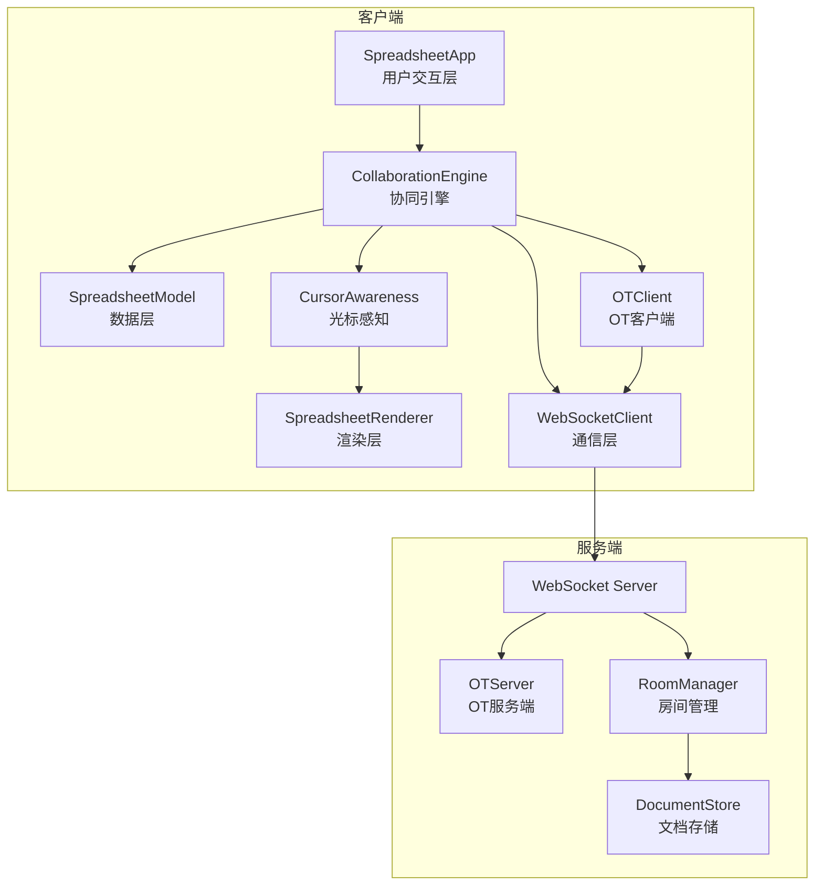
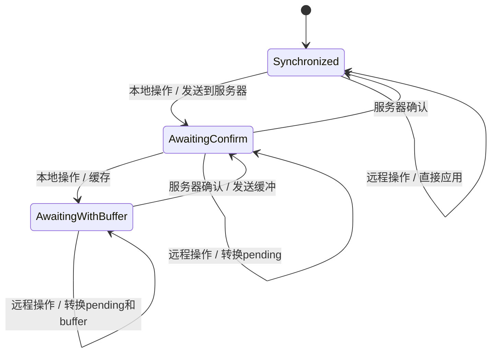

# 设计文档：多用户协同编辑

## 概述

为 ice-excel Canvas 电子表格应用添加多用户实时协同编辑能力。采用操作转换（OT）算法处理并发冲突，通过 WebSocket 实现实时通信，在 Canvas 渲染层叠加远程用户光标显示。

核心设计原则：
- 客户端优先（Optimistic UI）：本地操作立即应用，不等待服务器确认
- 最终一致性：通过 OT 算法保证所有客户端最终收敛到相同状态
- 最小侵入：尽量通过新增模块实现，减少对现有代码的修改

## 架构



整体采用分层架构：
- **交互层**：`SpreadsheetApp` 捕获用户操作，委托给 `CollaborationEngine`
- **协同层**：`CollaborationEngine` 协调 OT 客户端、WebSocket 通信和光标感知
- **数据层**：`SpreadsheetModel` 保持不变，作为本地数据源
- **渲染层**：`SpreadsheetRenderer` 扩展远程光标渲染能力
- **服务端**：独立的 Node.js WebSocket 服务，负责操作转换和广播

## 组件与接口

### 1. 操作定义模块（`src/collaboration/operations.ts`）

定义所有可协同的操作类型及其序列化/反序列化逻辑。

```typescript
// 操作类型枚举
type OperationType =
  | 'cellEdit'
  | 'cellMerge'
  | 'cellSplit'
  | 'rowInsert'
  | 'rowDelete'
  | 'rowResize'
  | 'colResize'
  | 'fontColor'
  | 'bgColor';

// 基础操作接口
interface Operation {
  type: OperationType;
  userId: string;
  timestamp: number;
  revision: number;
}

// 单元格编辑操作
interface CellEditOp extends Operation {
  type: 'cellEdit';
  row: number;
  col: number;
  content: string;
  previousContent: string;
}

// 合并单元格操作
interface CellMergeOp extends Operation {
  type: 'cellMerge';
  startRow: number;
  startCol: number;
  endRow: number;
  endCol: number;
}

// 拆分单元格操作
interface CellSplitOp extends Operation {
  type: 'cellSplit';
  row: number;
  col: number;
}

// 插入行操作
interface RowInsertOp extends Operation {
  type: 'rowInsert';
  rowIndex: number;
  count: number;
}

// 删除行操作
interface RowDeleteOp extends Operation {
  type: 'rowDelete';
  rowIndex: number;
  count: number;
}

// 调整行高操作
interface RowResizeOp extends Operation {
  type: 'rowResize';
  rowIndex: number;
  height: number;
}

// 调整列宽操作
interface ColResizeOp extends Operation {
  type: 'colResize';
  colIndex: number;
  width: number;
}

// 字体颜色操作
interface FontColorOp extends Operation {
  type: 'fontColor';
  row: number;
  col: number;
  color: string;
}

// 背景颜色操作
interface BgColorOp extends Operation {
  type: 'bgColor';
  row: number;
  col: number;
  color: string;
}

// 联合操作类型
type CollabOperation =
  | CellEditOp
  | CellMergeOp
  | CellSplitOp
  | RowInsertOp
  | RowDeleteOp
  | RowResizeOp
  | ColResizeOp
  | FontColorOp
  | BgColorOp;

// 序列化函数
function serializeOperation(op: CollabOperation): string;

// 反序列化函数
function deserializeOperation(json: string): CollabOperation;
```

### 2. OT 转换模块（`src/collaboration/ot.ts`）

实现操作转换核心算法。

```typescript
// OT 转换函数：返回转换后的操作对 [a', b']
// 满足：apply(apply(state, a), b') === apply(apply(state, b), a')
function transform(
  opA: CollabOperation,
  opB: CollabOperation
): [CollabOperation, CollabOperation];

// 对操作列表执行转换
function transformAgainst(
  op: CollabOperation,
  ops: CollabOperation[]
): CollabOperation;

// 生成反向操作（用于撤销）
function invertOperation(
  op: CollabOperation,
  model: SpreadsheetModel
): CollabOperation;
```

OT 转换规则概要：
- **CellEdit vs CellEdit**（同一单元格）：后到达的操作覆盖，但保留两者的 previousContent 链
- **CellEdit vs RowInsert**：如果编辑行 >= 插入行，编辑行索引 +count
- **CellEdit vs RowDelete**：如果编辑行在删除范围内，操作变为空操作；如果编辑行 > 删除范围，行索引 -count
- **RowInsert vs RowInsert**：按位置和用户 ID 排序决定优先级
- **CellMerge vs CellEdit**：如果编辑位置在合并范围内，编辑目标调整为合并后的父单元格
- 其他组合类似处理，核心是调整行列索引

### 3. OT 客户端（`src/collaboration/ot-client.ts`）

管理客户端的操作状态机，采用经典的三状态模型。

```typescript
// 客户端状态
type ClientState = 'synchronized' | 'awaitingConfirm' | 'awaitingWithBuffer';

interface OTClient {
  // 当前状态
  state: ClientState;
  // 当前修订号
  revision: number;
  // 等待确认的操作
  pending: CollabOperation | null;
  // 缓冲区中的操作
  buffer: CollabOperation | null;

  // 本地操作：用户执行了编辑
  applyLocal(op: CollabOperation): void;
  // 服务器确认：收到自己操作的确认
  serverAck(revision: number): void;
  // 远程操作：收到其他用户的操作
  applyRemote(op: CollabOperation): void;
}
```

状态转换：


### 4. WebSocket 通信模块（`src/collaboration/websocket-client.ts`）

```typescript
// WebSocket 消息类型
type MessageType =
  | 'join'        // 加入房间
  | 'leave'       // 离开房间
  | 'operation'   // 发送操作
  | 'ack'         // 操作确认
  | 'remote_op'   // 远程操作
  | 'sync'        // 全量同步
  | 'cursor'      // 光标更新
  | 'user_join'   // 用户加入通知
  | 'user_leave'  // 用户离开通知
  | 'state';      // 文档状态

interface WebSocketMessage {
  type: MessageType;
  payload: unknown;
}

interface WebSocketClient {
  // 连接到服务器
  connect(url: string, roomId: string, userId: string): void;
  // 断开连接
  disconnect(): void;
  // 发送操作
  sendOperation(op: CollabOperation): void;
  // 发送光标位置
  sendCursor(selection: Selection | null): void;
  // 注册消息处理器
  onMessage(type: MessageType, handler: (payload: unknown) => void): void;
  // 连接状态
  isConnected(): boolean;
  // 重连逻辑内置：指数退避，1s 起步，最大 30s，最多 5 次
}
```

### 5. 光标感知模块（`src/collaboration/cursor-awareness.ts`）

```typescript
// 远程用户信息
interface RemoteUser {
  userId: string;
  userName: string;
  color: string;
  selection: Selection | null;
  lastActive: number;
}

interface CursorAwareness {
  // 更新远程用户的选择
  updateRemoteCursor(userId: string, selection: Selection | null): void;
  // 添加远程用户
  addUser(user: RemoteUser): void;
  // 移除远程用户（2秒延迟后清除显示）
  removeUser(userId: string): void;
  // 获取所有远程用户
  getRemoteUsers(): RemoteUser[];
  // 在 Canvas 上渲染远程光标（由 Renderer 调用）
  renderCursors(
    ctx: CanvasRenderingContext2D,
    viewport: Viewport,
    model: SpreadsheetModel,
    config: RenderConfig
  ): void;
}
```

预定义用户颜色池：
```typescript
const USER_COLORS = [
  '#FF6B6B', '#4ECDC4', '#45B7D1', '#96CEB4',
  '#FFEAA7', '#DDA0DD', '#98D8C8', '#F7DC6F',
  '#BB8FCE', '#85C1E9', '#F8C471', '#82E0AA'
];
```

### 6. 协同引擎（`src/collaboration/collaboration-engine.ts`）

作为协同功能的总协调器。

```typescript
interface CollaborationEngine {
  // 初始化协同模式
  init(serverUrl: string, roomId: string, userName: string): void;
  // 关闭协同模式
  destroy(): void;
  // 提交本地操作（由 SpreadsheetApp 调用）
  submitOperation(op: CollabOperation): void;
  // 获取连接状态
  getConnectionStatus(): 'connected' | 'connecting' | 'disconnected';
  // 获取在线用户列表
  getOnlineUsers(): RemoteUser[];
  // 获取未确认操作数
  getPendingCount(): number;
  // 协同模式下的撤销
  undo(): CollabOperation | null;
  // 协同模式下的重做
  redo(): CollabOperation | null;
}
```

### 7. 服务端（`server/`）

```typescript
// 服务端房间管理
interface Room {
  roomId: string;
  // 当前文档状态
  document: SpreadsheetData;
  // 已确认操作历史
  operations: CollabOperation[];
  // 当前修订号
  revision: number;
  // 在线客户端
  clients: Map<string, WebSocket>;
}

// 服务端 OT 处理
interface OTServer {
  // 接收客户端操作，转换并广播
  receiveOperation(
    roomId: string,
    clientRevision: number,
    op: CollabOperation
  ): { revision: number; transformedOp: CollabOperation };
}
```

## 数据模型

### 协议消息格式

```typescript
// 加入房间请求
interface JoinMessage {
  type: 'join';
  payload: {
    roomId: string;
    userId: string;
    userName: string;
  };
}

// 加入房间响应（包含文档状态）
interface StateMessage {
  type: 'state';
  payload: {
    document: SpreadsheetData;
    revision: number;
    users: RemoteUser[];
  };
}

// 操作消息
interface OperationMessage {
  type: 'operation';
  payload: {
    revision: number;
    operation: CollabOperation;
  };
}

// 确认消息
interface AckMessage {
  type: 'ack';
  payload: {
    revision: number;
  };
}

// 远程操作消息
interface RemoteOpMessage {
  type: 'remote_op';
  payload: {
    revision: number;
    operation: CollabOperation;
    userId: string;
  };
}

// 光标消息
interface CursorMessage {
  type: 'cursor';
  payload: {
    userId: string;
    selection: Selection | null;
  };
}
```

### 客户端操作历史（协同模式）

```typescript
// 每个用户独立的操作历史栈
interface CollabHistoryManager {
  // 本用户的操作栈
  localUndoStack: CollabOperation[];
  localRedoStack: CollabOperation[];

  // 记录本地操作
  pushLocal(op: CollabOperation): void;
  // 撤销：弹出最近操作，生成反向操作
  undo(model: SpreadsheetModel): CollabOperation | null;
  // 重做：弹出重做栈，重新应用
  redo(model: SpreadsheetModel): CollabOperation | null;
}
```


## 正确性属性

*正确性属性是指在系统所有有效执行中都应成立的特征或行为——本质上是关于系统应该做什么的形式化陈述。属性是人类可读规范与机器可验证正确性保证之间的桥梁。*

基于需求文档中的验收标准，以下属性通过属性基测试（Property-Based Testing）进行验证：

### Property 1: 操作序列化往返一致性

*对于任意*有效的 `CollabOperation` 对象，执行 `deserializeOperation(serializeOperation(op))` 应产生与原始操作等价的对象。

**验证需求: 2.2, 2.3, 2.4**

### Property 2: OT 收敛性

*对于任意*初始文档状态 S 和任意两个并发操作 A、B，设 `[a', b'] = transform(A, B)`，则 `apply(apply(S, A), b')` 应与 `apply(apply(S, B), a')` 产生相同的文档状态。

**验证需求: 3.1, 3.2, 3.4**

### Property 3: OT 客户端状态机转换正确性

*对于任意*处于 `awaitingConfirm` 或 `awaitingWithBuffer` 状态的 OT 客户端，当收到远程操作时，客户端的 pending 操作应被正确转换，使得本地状态与服务器状态保持一致。

**验证需求: 3.3**

### Property 4: 服务端修订号单调递增与转换正确性

*对于任意*操作序列提交到服务器，服务器分配的修订号应严格递增；且对于基于过期修订号的操作，服务器应对其执行转换使其适配当前文档状态，转换后的操作应用到当前状态应产生正确结果。

**验证需求: 4.1, 4.2, 4.5**

### Property 5: 指数退避重连间隔

*对于任意*重连尝试次数 n（0 ≤ n < 5），重连等待时间应等于 `min(1000 * 2^n, 30000)` 毫秒。

**验证需求: 1.2**

### Property 6: 离线操作缓冲

*对于任意*在 WebSocket 断开期间提交的操作序列，所有操作应被完整保存在待发送队列中，且队列长度等于提交的操作数量。

**验证需求: 1.3**

### Property 7: 缓冲操作有序发送

*对于任意*待发送队列中的操作序列，重连后发送顺序应与操作提交顺序一致（FIFO）。

**验证需求: 1.4**

### Property 8: 用户颜色唯一性

*对于任意*同一房间内的用户集合（用户数不超过颜色池大小），每个用户分配的显示颜色应互不相同。

**验证需求: 5.4**

### Property 9: 重连同步操作应用

*对于任意*客户端断线期间服务器积累的操作序列，重连后按顺序应用这些操作应产生与服务器当前文档状态一致的结果。

**验证需求: 6.2**

### Property 10: 用户独立历史栈与撤销隔离

*对于任意*来自多个用户的交错操作序列，每个用户的撤销操作应仅影响该用户自己的最近操作，不影响其他用户的操作结果。

**验证需求: 8.1, 8.3**

### Property 11: 操作反转往返一致性

*对于任意*操作 op 和文档状态 S，执行 `apply(S, op)` 后再执行 `apply(S', invertOperation(op, ...))` 应恢复到原始状态 S。

**验证需求: 8.2**

## 错误处理

### 网络错误
- WebSocket 连接失败：触发指数退避重连机制（1s, 2s, 4s, 8s, 16s），5 次失败后显示错误提示
- 消息发送失败：操作缓存到本地队列，重连后重发
- 消息格式错误：记录错误日志，丢弃无效消息，不影响正常操作

### 状态同步错误
- 修订号不匹配：客户端请求从服务器获取缺失的操作进行补偿
- 修订号差距过大（>100）：放弃增量同步，请求完整文档快照
- OT 转换异常：记录错误日志，请求完整文档快照进行状态重置

### 服务端错误
- 房间不存在：创建新房间并初始化空文档
- 客户端异常断开：从房间移除用户，广播离开通知，2 秒后清除光标显示
- 服务器崩溃恢复：从持久化存储恢复房间状态和操作历史

### 并发冲突
- 合并单元格冲突：当两个用户同时对重叠区域执行合并操作时，先到达服务器的操作优先，后到达的操作通过 OT 转换为空操作
- 行删除冲突：当一个用户删除行而另一个用户编辑该行的单元格时，编辑操作通过 OT 转换为空操作

## 测试策略

### 属性基测试（Property-Based Testing）

使用 `fast-check` 库进行属性基测试，每个属性测试至少运行 100 次迭代。

需要实现的生成器（Generators）：
- `arbitraryOperation`：生成随机的 `CollabOperation` 对象（覆盖所有 9 种操作类型）
- `arbitraryCellEditOp`：生成随机的单元格编辑操作
- `arbitraryRowInsertOp`：生成随机的行插入操作
- `arbitraryRowDeleteOp`：生成随机的行删除操作
- `arbitrarySpreadsheetState`：生成随机的小规模电子表格状态（用于 OT 测试）
- `arbitraryOperationPair`：生成两个可能并发的操作对
- `arbitraryOperationSequence`：生成操作序列（用于服务端测试）

每个属性测试必须用注释标注对应的设计属性：
```typescript
// Feature: collaborative-editing, Property 1: 操作序列化往返一致性
// Feature: collaborative-editing, Property 2: OT 收敛性
// ...
```

### 单元测试

单元测试聚焦于具体示例和边界情况：
- OT 转换的具体场景（同行编辑、跨行插入删除等）
- WebSocket 重连的边界情况（最大重试次数、网络恢复）
- 操作序列化的边界值（空内容、特殊字符、超长字符串）
- 服务端房间管理（创建、加入、离开、空房间清理）

### 集成测试

- 模拟多客户端场景，验证端到端的操作同步
- 模拟网络延迟和断线场景，验证重连和补偿机制
- 验证光标感知在多用户场景下的正确显示
