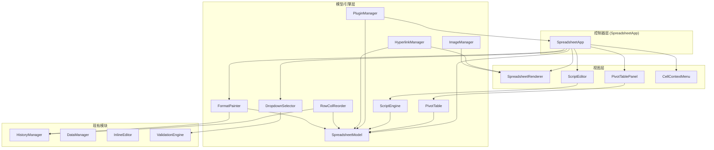

# 技术设计文档：扩展功能（Extension Features）

## 概述

本设计文档描述 Canvas Excel (ice-excel) 电子表格应用的九大扩展功能模块的技术实现方案。这些功能包括：数据透视表、宏/脚本支持、插件系统、超链接、图片插入、下拉选择器、右键菜单增强、格式刷、拖拽列/行重排序。

设计遵循现有 MVC 架构模式：
- **Model 层**：数据存储与业务逻辑（SpreadsheetModel 扩展 + 独立引擎类）
- **View 层**：Canvas 渲染（SpreadsheetRenderer 扩展）
- **Controller 层**：用户交互与模块协调（SpreadsheetApp 扩展）

所有新模块均为独立 TypeScript 文件，通过 SpreadsheetApp 协调集成，保持零运行时依赖。

## 架构

### 整体架构图



### 新增文件结构

```
src/
├── pivot-table/
│   ├── pivot-table.ts          # PivotTable 引擎（分组、聚合、汇总计算）
│   └── pivot-table-panel.ts    # PivotTablePanel 配置面板 UI
├── script/
│   ├── script-engine.ts        # ScriptEngine 脚本执行沙箱
│   └── script-editor.ts        # ScriptEditor 编辑器 UI
├── plugin/
│   ├── plugin-manager.ts       # PluginManager 插件生命周期管理
│   └── plugin-api.ts           # PluginAPI 受控接口
├── hyperlink-manager.ts        # HyperlinkManager 超链接管理
├── image-manager.ts            # ImageManager 图片浮动层管理
├── dropdown-selector.ts        # DropdownSelector 下拉选择器
├── cell-context-menu.ts        # CellContextMenu 单元格右键菜单
├── format-painter.ts           # FormatPainter 格式刷
└── row-col-reorder.ts          # RowColReorder 行列拖拽重排序
```

### 设计决策

| 决策 | 选择 | 理由 |
|------|------|------|
| 脚本沙箱方案 | `new Function()` + Proxy 代理 | 零依赖要求排除 Web Worker iframe 方案；Function 构造器配合 Proxy 可拦截全局访问 |
| 图片存储方案 | Base64 编码存入 JSON | 与现有 DataManager 的 JSON 导入/导出机制一致，无需额外文件服务 |
| 透视表结果展示 | 写入新工作表 | 避免覆盖源数据，利用现有 SheetManager 多工作表能力 |
| 插件 API 隔离 | Proxy 包装的受控 API 对象 | 限制插件只能通过白名单方法操作电子表格，防止直接访问内部状态 |
| 格式刷光标 | CSS cursor + Canvas 渲染配合 | Canvas 区域内通过 `canvas.style.cursor` 切换，保持与现有光标管理一致 |
| 行列重排序 | 数据层整行/整列交换 | 复用现有 `SpreadsheetModel` 的行列操作方法，通过 HistoryManager 支持撤销 |

## 组件与接口

### 1. 数据透视表模块

#### PivotTable（引擎）

```typescript
// src/pivot-table/pivot-table.ts

/** 聚合方式 */
type AggregateFunction = 'sum' | 'count' | 'average' | 'max' | 'min';

/** 透视表字段配置 */
interface PivotFieldConfig {
  fieldIndex: number;       // 源数据列索引
  fieldName: string;        // 字段名（表头文本）
}

/** 值字段配置 */
interface PivotValueConfig extends PivotFieldConfig {
  aggregateFunc: AggregateFunction;
}

/** 筛选字段配置 */
interface PivotFilterConfig extends PivotFieldConfig {
  selectedValues: Set<string>;  // 勾选的值
}

/** 透视表完整配置 */
interface PivotConfig {
  sourceRange: { startRow: number; startCol: number; endRow: number; endCol: number };
  rowFields: PivotFieldConfig[];
  colFields: PivotFieldConfig[];
  valueFields: PivotValueConfig[];
  filterFields: PivotFilterConfig[];
}

/** 透视表计算结果 */
interface PivotResult {
  headers: string[];          // 列标题
  rows: PivotResultRow[];     // 数据行（含小计行）
  grandTotal: (number | string)[];  // 总计行
}

interface PivotResultRow {
  labels: string[];           // 行标签
  values: (number | string)[];// 聚合值
  isSubtotal: boolean;        // 是否为小计行
}

class PivotTable {
  constructor(model: SpreadsheetModel);

  /** 根据配置计算透视表结果 */
  compute(config: PivotConfig): PivotResult;

  /** 验证源数据区域是否有效（非空且包含表头） */
  validateSourceRange(range: Selection): { valid: boolean; error?: string };

  /** 从源数据区域提取可用字段列表 */
  extractFields(range: Selection): PivotFieldConfig[];

  /** 执行聚合运算 */
  aggregate(values: number[], func: AggregateFunction): number;
}
```

#### PivotTablePanel（UI）

```typescript
// src/pivot-table/pivot-table-panel.ts

class PivotTablePanel {
  constructor(pivotTable: PivotTable, model: SpreadsheetModel);

  /** 显示配置面板 */
  show(sourceRange: Selection): void;

  /** 隐藏面板 */
  hide(): void;

  /** 将透视表结果写入目标工作表 */
  writeResultToSheet(result: PivotResult, sheetManager: SheetManager): void;
}
```

### 2. 宏/脚本模块

#### ScriptEngine（引擎）

```typescript
// src/script/script-engine.ts

/** 脚本 API 接口 */
interface ScriptAPI {
  getCellValue(row: number, col: number): string;
  setCellValue(row: number, col: number, value: string): void;
  getSelection(): { startRow: number; startCol: number; endRow: number; endCol: number } | null;
  setSelection(startRow: number, startCol: number, endRow: number, endCol: number): void;
  getRowCount(): number;
  getColCount(): number;
}

/** 脚本执行结果 */
interface ScriptResult {
  success: boolean;
  error?: { message: string; line?: number };
  output?: string;
  cellChanges: Array<{ row: number; col: number; oldValue: string; newValue: string }>;
}

/** 已保存的脚本 */
interface SavedScript {
  name: string;
  code: string;
  createdAt: string;
  updatedAt: string;
}

class ScriptEngine {
  constructor(model: SpreadsheetModel);

  /** 在沙箱中执行脚本，超时 10 秒 */
  execute(code: string): ScriptResult;

  /** 保存脚本到 localStorage */
  saveScript(name: string, code: string): void;

  /** 加载已保存的脚本列表 */
  loadScripts(): SavedScript[];

  /** 删除已保存的脚本 */
  deleteScript(name: string): void;
}
```

#### ScriptEditor（UI）

```typescript
// src/script/script-editor.ts

class ScriptEditor {
  constructor(scriptEngine: ScriptEngine);

  /** 打开脚本编辑器面板 */
  show(): void;

  /** 关闭面板 */
  hide(): void;

  /** 应用语法高亮到代码文本 */
  applySyntaxHighlight(code: string): string;
}
```

### 3. 插件系统

#### PluginManager

```typescript
// src/plugin/plugin-manager.ts

/** 插件状态 */
type PluginStatus = 'active' | 'failed' | 'unloaded';

/** 插件接口定义 */
interface Plugin {
  name: string;
  version: string;
  activate(api: PluginAPI): void;
  deactivate?(): void;
}

/** 插件信息 */
interface PluginInfo {
  name: string;
  version: string;
  status: PluginStatus;
}

class PluginManager {
  constructor(model: SpreadsheetModel, app: SpreadsheetApp);

  /** 注册插件 */
  registerPlugin(plugin: Plugin): void;

  /** 卸载插件 */
  unloadPlugin(name: string): void;

  /** 获取所有插件信息 */
  getPlugins(): PluginInfo[];
}
```

#### PluginAPI

```typescript
// src/plugin/plugin-api.ts

class PluginAPI {
  constructor(model: SpreadsheetModel, app: SpreadsheetApp, pluginName: string);

  /** 读取单元格值 */
  getCellValue(row: number, col: number): string;

  /** 写入单元格值 */
  setCellValue(row: number, col: number, value: string): void;

  /** 注册自定义公式函数 */
  registerFunction(name: string, fn: (...args: unknown[]) => unknown): void;

  /** 添加工具栏按钮 */
  addToolbarButton(config: { label: string; icon?: string; onClick: () => void }): string;

  /** 添加右键菜单项 */
  addContextMenuItem(config: { label: string; onClick: () => void }): string;

  /** 监听单元格变更事件 */
  onCellChange(callback: (row: number, col: number, oldValue: string, newValue: string) => void): void;

  /** 清理该插件注册的所有资源 */
  cleanup(): void;
}
```

### 4. 超链接管理器

```typescript
// src/hyperlink-manager.ts

/** 超链接数据 */
interface HyperlinkData {
  url: string;
  displayText?: string;  // 为空时使用 URL 作为显示文本
}

class HyperlinkManager {
  constructor(model: SpreadsheetModel, renderer: SpreadsheetRenderer);

  /** 显示插入/编辑超链接对话框 */
  showDialog(row: number, col: number): void;

  /** 设置单元格超链接 */
  setHyperlink(row: number, col: number, data: HyperlinkData): void;

  /** 获取单元格超链接 */
  getHyperlink(row: number, col: number): HyperlinkData | null;

  /** 移除单元格超链接 */
  removeHyperlink(row: number, col: number): void;

  /** 打开超链接（在新标签页） */
  openHyperlink(row: number, col: number): void;

  /** 规范化 URL（自动添加 https:// 前缀） */
  normalizeUrl(url: string): string;
}
```

### 5. 图片管理器

```typescript
// src/image-manager.ts

/** 浮动图片数据 */
interface FloatingImage {
  id: string;
  base64Data: string;       // Base64 编码的图片数据
  x: number;                // 画布上的 X 坐标
  y: number;                // 画布上的 Y 坐标
  width: number;            // 显示宽度
  height: number;           // 显示高度
  originalWidth: number;    // 原始宽度
  originalHeight: number;   // 原始高度
}

/** 图片控制点类型 */
type ImageHandle = 'nw' | 'ne' | 'sw' | 'se';

class ImageManager {
  constructor(renderer: SpreadsheetRenderer);

  /** 打开文件选择对话框并插入图片 */
  insertImage(anchorX: number, anchorY: number): void;

  /** 从 Base64 数据创建图片 */
  addImage(data: string, x: number, y: number, width: number, height: number): string;

  /** 删除图片 */
  deleteImage(id: string): void;

  /** 命中测试：检测点击位置是否在图片或控制点上 */
  hitTest(x: number, y: number): { imageId: string; handle: ImageHandle | null } | null;

  /** 处理鼠标拖拽（移动/缩放） */
  handleMouseDown(x: number, y: number): boolean;
  handleMouseMove(x: number, y: number): void;
  handleMouseUp(): void;

  /** 在 Canvas 上渲染所有图片 */
  renderAll(ctx: CanvasRenderingContext2D, scrollX: number, scrollY: number): void;

  /** 导出所有图片数据 */
  exportImages(): FloatingImage[];

  /** 导入图片数据 */
  importImages(images: FloatingImage[]): void;
}
```

### 6. 下拉选择器

```typescript
// src/dropdown-selector.ts

class DropdownSelector {
  constructor(model: SpreadsheetModel);

  /** 显示下拉列表 */
  show(row: number, col: number, options: string[], anchorRect: DOMRect): void;

  /** 隐藏下拉列表 */
  hide(): void;

  /** 是否正在显示 */
  isVisible(): boolean;

  /** 处理键盘事件（上/下/Enter/Escape） */
  handleKeyDown(event: KeyboardEvent): boolean;

  /** 设置选择回调 */
  onSelect(callback: (value: string) => void): void;
}
```

### 7. 单元格右键菜单

```typescript
// src/cell-context-menu.ts

/** 菜单项定义 */
interface CellMenuItem {
  label: string;
  action: () => void;
  disabled?: boolean;
  separator?: boolean;
}

class CellContextMenu {
  constructor(app: SpreadsheetApp);

  /** 显示菜单 */
  show(x: number, y: number, row: number, col: number): void;

  /** 隐藏菜单 */
  hide(): void;

  /** 注册额外菜单项（供插件系统使用） */
  registerExtraItem(item: CellMenuItem): string;

  /** 移除额外菜单项 */
  removeExtraItem(id: string): void;
}
```

### 8. 格式刷

```typescript
// src/format-painter.ts

/** 格式刷模式 */
type FormatPainterMode = 'off' | 'single' | 'locked';

/** 复制的格式数据 */
interface CopiedFormat {
  fontColor?: string;
  bgColor?: string;
  fontSize?: number;
  fontBold?: boolean;
  fontItalic?: boolean;
  fontUnderline?: boolean;
  fontAlign?: 'left' | 'center' | 'right';
  verticalAlign?: 'top' | 'middle' | 'bottom';
  format?: CellFormat;
}

class FormatPainter {
  constructor(model: SpreadsheetModel, historyManager: HistoryManager);

  /** 激活格式刷（单次模式） */
  activate(sourceRow: number, sourceCol: number): void;

  /** 激活锁定格式刷（连续模式） */
  activateLocked(sourceRow: number, sourceCol: number): void;

  /** 应用格式到目标区域 */
  applyToRange(startRow: number, startCol: number, endRow: number, endCol: number): void;

  /** 退出格式刷模式 */
  deactivate(): void;

  /** 获取当前模式 */
  getMode(): FormatPainterMode;

  /** 从单元格提取格式 */
  extractFormat(row: number, col: number): CopiedFormat;
}
```

### 9. 行列拖拽重排序

```typescript
// src/row-col-reorder.ts

/** 拖拽状态 */
interface ReorderDragState {
  type: 'row' | 'col';
  sourceIndices: number[];    // 被拖拽的行/列索引（支持多选）
  targetIndex: number;        // 目标插入位置
  currentMousePos: number;    // 当前鼠标位置（用于渲染指示线）
}

class RowColReorder {
  constructor(model: SpreadsheetModel, historyManager: HistoryManager);

  /** 开始行拖拽 */
  startRowDrag(rowIndices: number[], mouseY: number): void;

  /** 开始列拖拽 */
  startColDrag(colIndices: number[], mouseX: number): void;

  /** 更新拖拽位置 */
  updateDrag(mouseX: number, mouseY: number): void;

  /** 结束拖拽并执行重排序 */
  endDrag(): boolean;

  /** 取消拖拽 */
  cancelDrag(): void;

  /** 获取当前拖拽状态（用于渲染指示线） */
  getDragState(): ReorderDragState | null;

  /** 移动行到目标位置 */
  moveRows(sourceIndices: number[], targetIndex: number): void;

  /** 移动列到目标位置 */
  moveCols(sourceIndices: number[], targetIndex: number): void;
}
```


## 数据模型

### Cell 接口扩展

在现有 `Cell` 接口（`src/types.ts`）中新增以下字段：

```typescript
export interface Cell {
  // ... 现有字段保持不变 ...

  // === 超链接字段 ===
  hyperlink?: HyperlinkData;       // 超链接数据（URL + 显示文本）
}
```

> 图片数据不存储在 Cell 中，而是作为独立的浮动层由 ImageManager 管理（与现有 ChartOverlay 模式一致）。

### HyperlinkData 接口

```typescript
// 添加到 src/types.ts
export interface HyperlinkData {
  url: string;                     // 链接地址
  displayText?: string;            // 显示文本（为空时使用 URL）
}
```

### FloatingImage 接口

```typescript
// 添加到 src/types.ts
export interface FloatingImage {
  id: string;                      // 唯一标识
  base64Data: string;              // Base64 编码图片数据
  x: number;                       // 画布 X 坐标
  y: number;                       // 画布 Y 坐标
  width: number;                   // 显示宽度
  height: number;                  // 显示高度
  originalWidth: number;           // 原始宽度
  originalHeight: number;          // 原始高度
}
```

### SpreadsheetData 扩展

```typescript
export interface SpreadsheetData {
  cells: Cell[][];
  rowHeights: number[];
  colWidths: number[];
  charts?: ChartConfig[];
  images?: FloatingImage[];        // 新增：浮动图片列表
}
```

### HistoryManager ActionType 扩展

```typescript
export type ActionType =
  // ... 现有类型保持不变 ...
  // 新增操作类型
  | 'setHyperlink'          // 设置/编辑超链接
  | 'removeHyperlink'       // 移除超链接
  | 'insertImage'           // 插入图片
  | 'deleteImage'           // 删除图片
  | 'moveImage'             // 移动图片
  | 'resizeImage'           // 缩放图片
  | 'formatPainter'         // 格式刷应用
  | 'reorderRows'           // 行重排序
  | 'reorderCols'           // 列重排序
  | 'clearFormat'           // 清除格式
  | 'scriptExecution';      // 脚本执行（批量修改）
```

### 透视表配置数据模型

```typescript
// src/pivot-table/pivot-table.ts

/** 聚合方式 */
export type AggregateFunction = 'sum' | 'count' | 'average' | 'max' | 'min';

/** 透视表字段配置 */
export interface PivotFieldConfig {
  fieldIndex: number;
  fieldName: string;
}

/** 值字段配置 */
export interface PivotValueConfig extends PivotFieldConfig {
  aggregateFunc: AggregateFunction;
}

/** 筛选字段配置 */
export interface PivotFilterConfig extends PivotFieldConfig {
  selectedValues: Set<string>;
}

/** 透视表完整配置 */
export interface PivotConfig {
  sourceRange: { startRow: number; startCol: number; endRow: number; endCol: number };
  rowFields: PivotFieldConfig[];
  colFields: PivotFieldConfig[];
  valueFields: PivotValueConfig[];
  filterFields: PivotFilterConfig[];
}

/** 透视表计算结果 */
export interface PivotResult {
  headers: string[];
  rows: PivotResultRow[];
  grandTotal: (number | string)[];
}

export interface PivotResultRow {
  labels: string[];
  values: (number | string)[];
  isSubtotal: boolean;
}
```

### 脚本系统数据模型

```typescript
// src/script/script-engine.ts

/** 脚本执行结果 */
export interface ScriptResult {
  success: boolean;
  error?: { message: string; line?: number };
  output?: string;
  cellChanges: Array<{ row: number; col: number; oldValue: string; newValue: string }>;
}

/** 已保存的脚本 */
export interface SavedScript {
  name: string;
  code: string;
  createdAt: string;
  updatedAt: string;
}
```

### 插件系统数据模型

```typescript
// src/plugin/plugin-manager.ts

export type PluginStatus = 'active' | 'failed' | 'unloaded';

export interface Plugin {
  name: string;
  version: string;
  activate(api: PluginAPI): void;
  deactivate?(): void;
}

export interface PluginInfo {
  name: string;
  version: string;
  status: PluginStatus;
}
```

### 格式刷数据模型

```typescript
// src/format-painter.ts

export type FormatPainterMode = 'off' | 'single' | 'locked';

export interface CopiedFormat {
  fontColor?: string;
  bgColor?: string;
  fontSize?: number;
  fontBold?: boolean;
  fontItalic?: boolean;
  fontUnderline?: boolean;
  fontAlign?: 'left' | 'center' | 'right';
  verticalAlign?: 'top' | 'middle' | 'bottom';
  format?: CellFormat;
}
```

### 行列重排序数据模型

```typescript
// src/row-col-reorder.ts

export interface ReorderDragState {
  type: 'row' | 'col';
  sourceIndices: number[];
  targetIndex: number;
  currentMousePos: number;
}
```


## 正确性属性（Correctness Properties）

*正确性属性是指在系统所有有效执行中都应成立的特征或行为——本质上是对系统应做什么的形式化陈述。属性是连接人类可读规格说明与机器可验证正确性保证之间的桥梁。*

### Property 1: 透视表分组产生唯一值标签

*对于任意*包含表头的数据集和任意字段，按该字段进行行分组或列分组后，结果中的标签集合应恰好等于该字段在源数据中的唯一值集合（不多不少）。

**Validates: Requirements 1.2, 1.3**

### Property 2: 透视表聚合运算正确性

*对于任意*数值数组和任意聚合方式（sum/count/average/max/min），`aggregate(values, func)` 的返回值应与对应的数学定义一致：sum 等于所有元素之和，count 等于数组长度，average 等于 sum/count，max 等于最大元素，min 等于最小元素。

**Validates: Requirements 1.4**

### Property 3: 透视表筛选排除未选中值

*对于任意*数据集和筛选字段配置，当 `selectedValues` 为源数据唯一值的某个子集时，透视表计算结果中不应包含任何未被选中的值对应的数据行。

**Validates: Requirements 1.6**

### Property 4: 透视表小计与总计结构完整性

*对于任意*包含至少一个行字段和一个值字段的透视表配置，计算结果中每个分组的末尾应存在一个 `isSubtotal === true` 的小计行，且结果的 `grandTotal` 数组长度应等于值字段数量。

**Validates: Requirements 1.9**

### Property 5: 脚本 API 单元格读写往返

*对于任意*有效的行列坐标和任意字符串值，执行一段调用 `setCellValue(row, col, value)` 后紧接 `getCellValue(row, col)` 的脚本，返回的值应等于设置的值。

**Validates: Requirements 2.2, 2.3**

### Property 6: 脚本运行时错误包含错误信息

*对于任意*包含语法错误或运行时异常的脚本代码，`ScriptEngine.execute()` 返回的 `ScriptResult` 应满足 `success === false` 且 `error.message` 为非空字符串。

**Validates: Requirements 2.4**

### Property 7: 脚本执行历史原子性

*对于任意*修改了 N 个单元格（N ≥ 1）的脚本执行，执行完成后 HistoryManager 应恰好新增一条撤销记录，且执行一次撤销操作后所有被修改的单元格应恢复到脚本执行前的值。

**Validates: Requirements 2.5**

### Property 8: 脚本保存/加载往返

*对于任意*脚本名称和代码内容，调用 `saveScript(name, code)` 后再调用 `loadScripts()`，返回的列表中应包含一个 `name` 和 `code` 与保存时完全一致的条目。

**Validates: Requirements 2.8**

### Property 9: 插件注册验证拒绝无效插件

*对于任意*缺少 `name`（字符串）、`version`（字符串）或 `activate`（函数）中任一字段的对象，调用 `registerPlugin()` 应抛出错误且该对象不应出现在 `getPlugins()` 列表中。

**Validates: Requirements 3.3**

### Property 10: 插件注册成功后可通过列表查询

*对于任意*符合接口定义的有效插件对象，调用 `registerPlugin()` 后，`getPlugins()` 返回的列表中应包含该插件的 name、version，且 status 为 `'active'`。

**Validates: Requirements 3.4, 3.7**

### Property 11: 插件卸载清理所有注册资源

*对于任意*已注册且通过 PluginAPI 添加了工具栏按钮和菜单项的插件，调用 `unloadPlugin()` 后，该插件注册的所有工具栏按钮和菜单项应被移除，且 `getPlugins()` 中该插件的 status 应为 `'unloaded'`。

**Validates: Requirements 3.5**

### Property 12: 插件激活异常标记为失败状态

*对于任意* `activate` 方法会抛出异常的插件对象，调用 `registerPlugin()` 后不应抛出异常（异常被捕获），且 `getPlugins()` 中该插件的 status 应为 `'failed'`。

**Validates: Requirements 3.6**

### Property 13: 超链接设置/获取往返

*对于任意*有效的行列坐标和任意 `HyperlinkData`（包含 url 和可选 displayText），调用 `setHyperlink(row, col, data)` 后，`getHyperlink(row, col)` 返回的对象应与设置的数据一致。

**Validates: Requirements 4.2**

### Property 14: 移除超链接保留单元格内容

*对于任意*包含超链接和内容的单元格，调用 `removeHyperlink(row, col)` 后，`getHyperlink(row, col)` 应返回 `null`，但单元格的 `content` 字段应保持不变。

**Validates: Requirements 4.6**

### Property 15: URL 规范化

*对于任意*字符串 url，如果 url 不以 `http://`、`https://` 或 `mailto:` 开头，则 `normalizeUrl(url)` 应返回 `'https://' + url`；如果 url 已以上述前缀之一开头，则应返回原始 url 不变。

**Validates: Requirements 4.7**

### Property 16: 图片尺寸限制

*对于任意*原始宽度 w 和高度 h（w > 0, h > 0），插入图片后的显示尺寸应满足：width ≤ 800 且 height ≤ 600，且当原始尺寸未超限时显示尺寸等于原始尺寸。

**Validates: Requirements 5.3**

### Property 17: 图片缩放保持宽高比

*对于任意*浮动图片和任意缩放操作，缩放后的 width/height 比值应与原始 originalWidth/originalHeight 比值相等（在浮点精度范围内）。

**Validates: Requirements 5.5**

### Property 18: 图片导出/导入往返

*对于任意*一组浮动图片数据，调用 `exportImages()` 后再调用 `importImages()` 传入导出的数据，最终 `exportImages()` 的结果应与第一次导出的数据一致。

**Validates: Requirements 5.8, 5.9**

### Property 19: 下拉选择设置单元格值

*对于任意*配置了 dropdown 验证规则的单元格和任意选项列表中的选项值，通过 DropdownSelector 选择该选项后，单元格的 content 应等于所选选项的文本。

**Validates: Requirements 6.3**

### Property 20: 下拉列表键盘导航

*对于任意*包含 N 个选项（N ≥ 1）的下拉列表和任意序列的上/下方向键操作，高亮索引应始终在 [0, N-1] 范围内，且按下键时索引增加（到底部不变），按上键时索引减少（到顶部不变）。

**Validates: Requirements 6.4, 6.5**

### Property 21: 剪贴板为空时粘贴菜单项禁用

*对于任意*内部剪贴板状态，当剪贴板为空时，CellContextMenu 构建的菜单项中「粘贴」和「选择性粘贴」的 `disabled` 属性应为 `true`；当剪贴板非空时应为 `false`。

**Validates: Requirements 7.6**

### Property 22: 格式操作保留单元格内容

*对于任意*包含内容和/或公式的单元格，执行「清除格式」或「格式刷应用」操作后，单元格的 `content` 和 `formulaContent` 字段应保持不变。

**Validates: Requirements 7.12, 8.9**

### Property 23: 右键菜单视口边界约束

*对于任意*鼠标右键坐标 (x, y) 和任意视口尺寸 (viewportWidth, viewportHeight)，CellContextMenu 显示后的最终位置应确保菜单的右边缘 ≤ viewportWidth 且下边缘 ≤ viewportHeight。

**Validates: Requirements 7.13**

### Property 24: 格式刷完整复制并应用所有格式属性

*对于任意*源单元格（具有随机格式属性组合）和任意目标区域，格式刷应用后，目标区域每个单元格的 fontColor、bgColor、fontSize、fontBold、fontItalic、fontUnderline、fontAlign、verticalAlign、format 应与源单元格一致。

**Validates: Requirements 8.1, 8.4**

### Property 25: 格式刷模式状态转换

*对于任意*格式刷操作序列：在 `'single'` 模式下执行一次 `applyToRange` 后，模式应自动变为 `'off'`；在 `'locked'` 模式下执行任意次 `applyToRange` 后，模式应保持 `'locked'`。

**Validates: Requirements 8.5, 8.7**

### Property 26: 行重排序数据置换正确性

*对于任意*电子表格数据和任意一组连续或不连续的源行索引及有效目标位置，执行 `moveRows` 后：(1) 目标位置处的行数据应与原始源行数据一致，(2) 所有行的数据总集合应与操作前相同（无数据丢失或重复），(3) 对应的行高也应随行数据一起移动。

**Validates: Requirements 9.3, 9.8**

### Property 27: 列重排序数据置换正确性

*对于任意*电子表格数据和任意一组连续或不连续的源列索引及有效目标位置，执行 `moveCols` 后：(1) 目标位置处的列数据应与原始源列数据一致，(2) 所有列的数据总集合应与操作前相同（无数据丢失或重复），(3) 对应的列宽也应随列数据一起移动。

**Validates: Requirements 9.6, 9.9**


## 错误处理

### 各模块错误处理策略

| 模块 | 错误场景 | 处理方式 |
|------|----------|----------|
| PivotTable | 源数据区域为空或无表头 | `validateSourceRange` 返回 `{ valid: false, error: '请选择包含表头的非空数据区域' }`，面板显示错误提示 |
| PivotTable | 值字段包含非数值数据 | 非数值数据在 sum/average/max/min 聚合时被忽略，count 正常计数 |
| ScriptEngine | 脚本语法错误 | `execute()` 返回 `{ success: false, error: { message, line } }`，编辑器输出面板显示错误 |
| ScriptEngine | 脚本执行超时（>10秒） | 终止执行，返回超时错误，回滚所有已执行的单元格修改 |
| ScriptEngine | 脚本访问越界单元格 | API 方法内部校验行列范围，越界时返回空字符串（读）或静默忽略（写） |
| PluginManager | 插件缺少必要字段 | `registerPlugin` 抛出 `Error`，附带缺失字段信息 |
| PluginManager | 插件 activate 抛出异常 | 捕获异常，`console.error` 输出日志，插件状态标记为 `'failed'` |
| HyperlinkManager | URL 为空字符串 | 对话框阻止确认，显示「请输入有效的 URL」提示 |
| ImageManager | 图片文件超过 5MB | 拒绝插入，显示 Modal 错误提示「图片文件大小不能超过 5MB」 |
| ImageManager | 图片文件格式不支持 | 文件选择对话框通过 `accept` 属性限制，不支持的格式无法选择 |
| ImageManager | Base64 编码失败 | 捕获 FileReader 错误，显示「图片读取失败」提示 |
| DropdownSelector | 选项列表为空 | 不显示下拉列表 |
| FormatPainter | 源单元格无任何格式 | 正常进入格式刷模式，应用时相当于清除目标格式（所有格式属性为 undefined） |
| RowColReorder | 拖拽到原始位置 | 不执行任何操作，不记录历史 |
| RowColReorder | 拖拽超出数据范围 | 将目标位置限制在有效范围内（0 到 rowCount-1 或 colCount-1） |

### 通用错误处理原则

1. 所有用户可见的错误使用现有 `Modal.alert()` 显示中文提示
2. 开发者级别的错误使用 `console.error()` / `console.warn()` 输出
3. 所有可能失败的操作（文件读取、localStorage 操作）使用 try-catch 包裹
4. 数据修改操作在失败时应回滚，确保数据一致性
5. HistoryManager 记录操作前暂停记录（`pauseRecording`），操作完成后恢复并手动记录一条完整操作

## 测试策略

### 测试框架选择

- 单元测试框架：Vitest（与 Vite 生态一致）
- 属性测试库：fast-check（TypeScript 原生支持的属性测试库）
- E2E 测试：Playwright（现有 e2e 目录已使用）

### 双重测试方法

本项目采用单元测试与属性测试互补的双重测试策略：

- **单元测试**：验证具体示例、边界情况和错误条件
- **属性测试**：验证跨所有输入的通用属性

### 属性测试配置

- 每个属性测试最少运行 100 次迭代
- 每个属性测试必须通过注释引用设计文档中的属性编号
- 标签格式：**Feature: extension-features, Property {number}: {property_text}**
- 每个正确性属性由一个属性测试实现

### 单元测试覆盖范围

| 模块 | 单元测试重点 |
|------|-------------|
| PivotTable | 空数据集、单行数据、多层分组、混合数据类型聚合 |
| ScriptEngine | 空脚本、语法错误脚本、超时脚本、API 边界调用 |
| PluginManager | 重复注册、卸载不存在的插件、并发注册 |
| HyperlinkManager | 空 URL、超长 URL、特殊字符 URL、mailto 链接 |
| ImageManager | 5MB 边界文件、0x0 图片、极大尺寸图片 |
| DropdownSelector | 空选项列表、单选项、超长选项文本 |
| CellContextMenu | 视口边角位置、多选区状态下的菜单 |
| FormatPainter | 无格式源单元格、合并单元格区域、跨工作表 |
| RowColReorder | 首行/末行移动、单行/多行、隐藏行参与重排序 |

### 属性测试覆盖范围

每个正确性属性（Property 1-27）对应一个 fast-check 属性测试，测试文件组织如下：

```
src/__tests__/
├── pivot-table.property.test.ts    # Property 1-4
├── script-engine.property.test.ts  # Property 5-8
├── plugin-manager.property.test.ts # Property 9-12
├── hyperlink.property.test.ts      # Property 13-15
├── image-manager.property.test.ts  # Property 16-18
├── dropdown.property.test.ts       # Property 19-20
├── context-menu.property.test.ts   # Property 21, 23
├── format-painter.property.test.ts # Property 22, 24-25
└── row-col-reorder.property.test.ts # Property 26-27
```

### 属性测试示例

```typescript
// Feature: extension-features, Property 2: 透视表聚合运算正确性
import fc from 'fast-check';
import { PivotTable } from '../pivot-table/pivot-table';

describe('PivotTable 聚合运算', () => {
  it('对于任意数值数组，sum 应等于所有元素之和', () => {
    const pivot = new PivotTable(model);
    fc.assert(
      fc.property(
        fc.array(fc.double({ noNaN: true, noDefaultInfinity: true }), { minLength: 1 }),
        (values) => {
          const result = pivot.aggregate(values, 'sum');
          const expected = values.reduce((a, b) => a + b, 0);
          return Math.abs(result - expected) < 1e-10;
        }
      ),
      { numRuns: 100 }
    );
  });
});
```

### E2E 测试覆盖范围

E2E 测试聚焦于用户交互流程的集成验证：

| 测试场景 | 验证内容 |
|----------|----------|
| 数据透视表完整流程 | 选择数据区域 → 打开面板 → 拖拽字段 → 查看结果 |
| 脚本编辑器 | 打开编辑器 → 编写脚本 → 运行 → 验证单元格变更 |
| 超链接交互 | 插入超链接 → 渲染验证 → Ctrl+点击打开 → 编辑/移除 |
| 图片插入 | 插入图片 → 拖拽移动 → 缩放 → 删除 |
| 下拉选择器 | 点击下拉箭头 → 键盘导航 → 选择确认 |
| 右键菜单 | 右键打开 → 各菜单项功能验证 → 视口边界测试 |
| 格式刷 | 单次模式 → 锁定模式 → 格式验证 |
| 行列拖拽重排序 | 单行拖拽 → 多行拖拽 → 数据完整性验证 |
