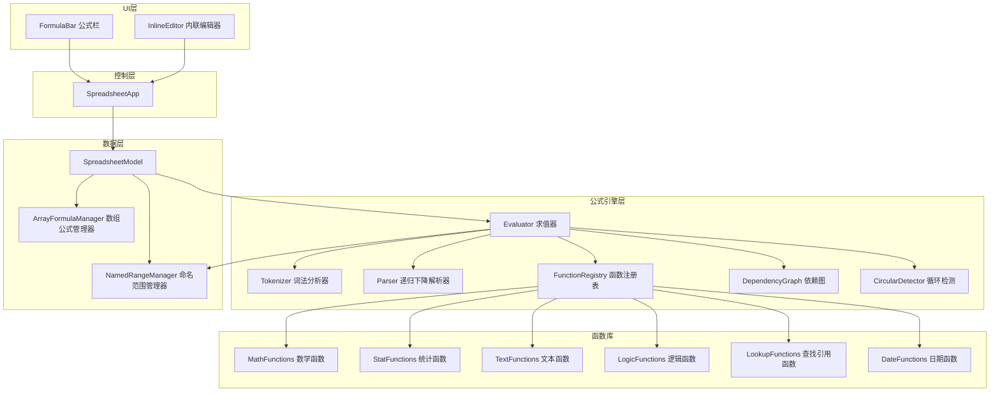
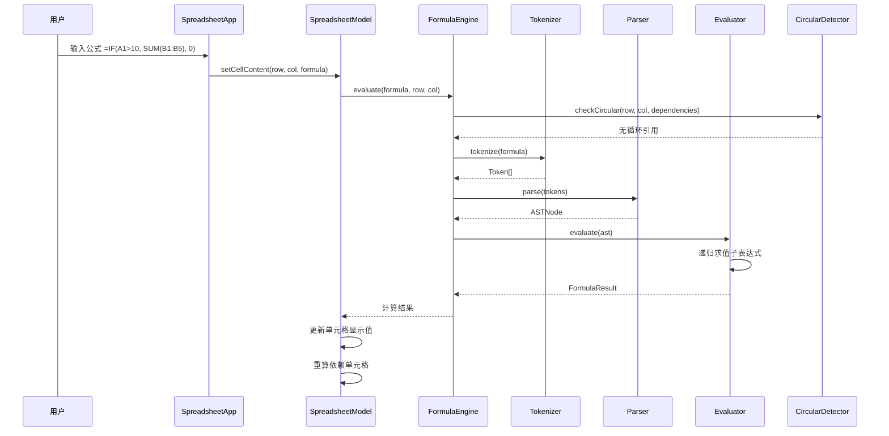

# 技术设计文档：公式与计算

## 概述

本设计文档描述 Canvas Excel (ice-excel) 公式与计算功能模块的技术方案。当前系统的 `FormulaEngine` 仅支持 `SUM`、`SUBTRACT`、`MULTIPLY`、`DIVIDE` 四个基础函数，采用单层 `=FUNC(args)` 的简单解析模式。本次扩展将：

1. 重构公式引擎，引入 **词法分析器（Tokenizer）** 和 **递归下降解析器（Parser）**，支持嵌套函数调用、运算符表达式和复杂参数
2. 新增六大函数类别共 40+ 个函数（数学、统计、文本、逻辑、查找引用、日期）
3. 增强公式栏交互（语法高亮、自动补全、参数提示）
4. 支持数组公式（CSE）、命名范围和循环引用检测

### 设计原则

- **零运行时依赖**：所有功能纯 TypeScript 实现，不引入第三方库
- **向后兼容**：现有 SUM/SUBTRACT/MULTIPLY/DIVIDE 公式行为不变
- **单一职责**：每个新模块一个文件，职责清晰
- **渐进式重构**：在现有 `FormulaEngine` 基础上扩展，不破坏已有接口

## 架构

### 整体架构图



### 公式求值流程



### 文件结构

```
src/
├── formula/
│   ├── tokenizer.ts          # 词法分析器：将公式字符串转为 Token 流
│   ├── parser.ts             # 递归下降解析器：将 Token 流转为 AST
│   ├── evaluator.ts          # 求值器：遍历 AST 计算结果
│   ├── types.ts              # 公式模块类型定义（Token、AST 节点等）
│   ├── function-registry.ts  # 函数注册表：管理所有可用函数的元数据和实现
│   ├── functions/
│   │   ├── math.ts           # 数学函数：ABS, ROUND, CEILING, FLOOR, MOD, POWER, SQRT, MAX, MIN, AVERAGE
│   │   ├── statistics.ts     # 统计函数：COUNT, COUNTA, COUNTIF, COUNTIFS, SUMIF, SUMIFS, AVERAGEIF
│   │   ├── text.ts           # 文本函数：LEFT, RIGHT, MID, LEN, TRIM, UPPER, LOWER, CONCATENATE, SUBSTITUTE, FIND, SEARCH, TEXT
│   │   ├── logic.ts          # 逻辑函数：IF, AND, OR, NOT, IFERROR, IFS, SWITCH
│   │   ├── lookup.ts         # 查找引用函数：VLOOKUP, HLOOKUP, INDEX, MATCH, OFFSET, INDIRECT
│   │   └── date.ts           # 日期函数：TODAY, NOW, DATE, YEAR, MONTH, DAY, DATEDIF, EDATE, EOMONTH
│   ├── dependency-graph.ts   # 依赖图管理：追踪单元格间的公式依赖关系
│   ├── circular-detector.ts  # 循环引用检测：基于 DFS 的循环检测
│   ├── named-range.ts        # 命名范围管理器
│   └── array-formula.ts      # 数组公式管理器
├── formula-bar/
│   ├── formula-bar.ts        # 公式栏主组件
│   ├── syntax-highlighter.ts # 语法高亮器
│   └── autocomplete.ts       # 自动补全组件
├── formula-engine.ts         # 现有文件，重构为新引擎的入口门面（Facade）
└── ...
```

## 组件与接口

### 1. Tokenizer（词法分析器）

将公式字符串分解为 Token 序列。

```typescript
// src/formula/tokenizer.ts
export class Tokenizer {
  /** 将公式字符串（不含前导 =）转为 Token 数组 */
  tokenize(input: string): Token[];
}
```

支持的 Token 类型：
- `Number`：数字常量（整数、小数）
- `String`：字符串常量（双引号包裹）
- `Boolean`：TRUE / FALSE
- `CellRef`：单元格引用（如 A1、$A$1）
- `RangeRef`：区域引用（如 A1:B10）
- `SheetRef`：跨 Sheet 引用（如 Sheet1!A1）
- `NamedRange`：命名范围标识符
- `Function`：函数名（后跟左括号）
- `Operator`：运算符（+、-、*、/、>、<、>=、<=、=、<>、&）
- `LeftParen`、`RightParen`：括号
- `Comma`：逗号（参数分隔符）

### 2. Parser（递归下降解析器）

将 Token 序列解析为抽象语法树（AST）。

```typescript
// src/formula/parser.ts
export class Parser {
  /** 将 Token 数组解析为 AST 根节点 */
  parse(tokens: Token[]): ASTNode;
}
```

支持的语法：
- 二元运算：`A1 + B1`、`A1 > 10`
- 一元运算：`-A1`
- 函数调用：`SUM(A1:A10)`
- 嵌套函数：`IF(A1>10, SUM(B1:B5), 0)`
- 字符串连接：`A1 & " " & B1`

运算符优先级（从低到高）：
1. 比较运算符：`=`、`<>`、`<`、`>`、`<=`、`>=`
2. 字符串连接：`&`
3. 加减：`+`、`-`
4. 乘除：`*`、`/`
5. 一元运算：`-`（负号）

### 3. Evaluator（求值器）

遍历 AST 递归求值。

```typescript
// src/formula/evaluator.ts
export class Evaluator {
  constructor(
    cellGetter: CellGetter,
    functionRegistry: FunctionRegistry,
    namedRangeManager: NamedRangeManager
  );

  /** 求值 AST 节点，返回计算结果 */
  evaluate(node: ASTNode): FormulaValue;
}
```

### 4. FunctionRegistry（函数注册表）

集中管理所有函数的元数据和实现。

```typescript
// src/formula/function-registry.ts
export class FunctionRegistry {
  /** 注册一个函数 */
  register(definition: FunctionDefinition): void;

  /** 获取函数定义 */
  get(name: string): FunctionDefinition | undefined;

  /** 获取所有已注册函数名 */
  getAllNames(): string[];

  /** 按前缀搜索函数（用于自动补全） */
  searchByPrefix(prefix: string): FunctionDefinition[];
}
```

### 5. DependencyGraph（依赖图）

追踪单元格间的公式依赖关系，支持增量更新。

```typescript
// src/formula/dependency-graph.ts
export class DependencyGraph {
  /** 设置单元格的依赖列表 */
  setDependencies(cellKey: string, dependencies: Set<string>): void;

  /** 获取依赖于指定单元格的所有单元格 */
  getDependents(cellKey: string): Set<string>;

  /** 获取拓扑排序后的重算顺序 */
  getRecalcOrder(changedCells: string[]): string[];

  /** 移除单元格的所有依赖关系 */
  removeDependencies(cellKey: string): void;
}
```

### 6. CircularDetector（循环引用检测）

在公式写入前检测循环引用。

```typescript
// src/formula/circular-detector.ts
export class CircularDetector {
  /**
   * 检测是否存在循环引用
   * @returns 如果存在循环引用，返回循环路径；否则返回 null
   */
  detect(
    cellKey: string,
    newDependencies: Set<string>,
    dependencyGraph: DependencyGraph
  ): string[] | null;
}
```

### 7. NamedRangeManager（命名范围管理器）

管理命名范围的 CRUD 操作。

```typescript
// src/formula/named-range.ts
export class NamedRangeManager {
  /** 创建命名范围 */
  create(name: string, range: RangeReference): NamedRangeResult;

  /** 更新命名范围 */
  update(oldName: string, newName: string, range: RangeReference): NamedRangeResult;

  /** 删除命名范围 */
  delete(name: string): boolean;

  /** 根据名称解析为区域引用 */
  resolve(name: string): RangeReference | null;

  /** 获取所有命名范围 */
  getAll(): NamedRange[];

  /** 验证名称合法性 */
  validateName(name: string): NameValidationResult;

  /** 行列插入/删除后更新所有命名范围的区域引用 */
  adjustForRowColChange(type: 'row' | 'col', index: number, count: number, isInsert: boolean): void;
}
```

### 8. ArrayFormulaManager（数组公式管理器）

管理数组公式的输入、存储和区域保护。

```typescript
// src/formula/array-formula.ts
export class ArrayFormulaManager {
  /** 注册数组公式 */
  register(origin: CellPosition, formula: string, resultRange: Selection): void;

  /** 检查单元格是否属于某个数组公式区域 */
  isInArrayFormula(row: number, col: number): boolean;

  /** 获取单元格所属的数组公式信息 */
  getArrayFormula(row: number, col: number): ArrayFormulaInfo | null;

  /** 删除数组公式 */
  delete(originRow: number, originCol: number): void;

  /** 检查结果区域是否与已有数据重叠 */
  checkOverlap(range: Selection, cellGetter: CellGetter): CellPosition[];
}
```

### 9. FormulaBar（公式栏增强）

```typescript
// src/formula-bar/formula-bar.ts
export class FormulaBar {
  constructor(
    inputElement: HTMLInputElement,
    functionRegistry: FunctionRegistry
  );

  /** 更新公式栏显示内容 */
  setValue(value: string, isArrayFormula?: boolean): void;

  /** 获取当前输入值 */
  getValue(): string;

  /** 启用/禁用语法高亮 */
  setHighlightEnabled(enabled: boolean): void;
}
```

```typescript
// src/formula-bar/autocomplete.ts
export class AutoComplete {
  constructor(
    anchorElement: HTMLElement,
    functionRegistry: FunctionRegistry,
    namedRangeManager: NamedRangeManager
  );

  /** 根据当前输入更新候选列表 */
  update(input: string, cursorPosition: number): void;

  /** 确认选中项 */
  confirm(): string | null;

  /** 移动选中项 */
  moveSelection(direction: 'up' | 'down'): void;

  /** 关闭候选列表 */
  close(): void;

  /** 候选列表是否可见 */
  isVisible(): boolean;
}
```

### 10. FormulaEngine 门面重构

现有 `FormulaEngine` 将重构为门面模式，内部委托给新的 Tokenizer → Parser → Evaluator 管线，同时保持公共 API 不变。

```typescript
// src/formula-engine.ts（重构后）
export class FormulaEngine {
  // 保持现有公共 API 不变
  public evaluate(formula: string, row: number, col: number): FormulaResult;
  public isFormula(content: string): boolean;
  public validateFormula(formula: string): { valid: boolean; error?: string };
  public getDependents(row: number, col: number): Dependency[];
  public getAffectedCells(row: number, col: number): Dependency[];

  // 新增 API
  public checkCircularReference(row: number, col: number, formula: string): string[] | null;
  public evaluateArrayFormula(formula: string, row: number, col: number): FormulaValue[][];
}
```

## 数据模型

### 公式模块类型定义

```typescript
// src/formula/types.ts

/** Token 类型 */
export type TokenType =
  | 'Number'
  | 'String'
  | 'Boolean'
  | 'CellRef'
  | 'RangeRef'
  | 'SheetRef'
  | 'NamedRange'
  | 'Function'
  | 'Operator'
  | 'LeftParen'
  | 'RightParen'
  | 'LeftBrace'
  | 'RightBrace'
  | 'Comma'
  | 'Colon'
  | 'EOF';

/** 词法 Token */
export interface Token {
  type: TokenType;
  value: string;
  position: number;  // 在原始字符串中的起始位置
}

/** AST 节点类型 */
export type ASTNodeType =
  | 'NumberLiteral'
  | 'StringLiteral'
  | 'BooleanLiteral'
  | 'CellReference'
  | 'RangeReference'
  | 'FunctionCall'
  | 'BinaryExpression'
  | 'UnaryExpression'
  | 'ArrayLiteral';

/** AST 节点基类 */
export interface ASTNodeBase {
  type: ASTNodeType;
}

export interface NumberLiteralNode extends ASTNodeBase {
  type: 'NumberLiteral';
  value: number;
}

export interface StringLiteralNode extends ASTNodeBase {
  type: 'StringLiteral';
  value: string;
}

export interface BooleanLiteralNode extends ASTNodeBase {
  type: 'BooleanLiteral';
  value: boolean;
}

export interface CellReferenceNode extends ASTNodeBase {
  type: 'CellReference';
  row: number;
  col: number;
  sheetName?: string;
  absolute: { row: boolean; col: boolean };
}

export interface RangeReferenceNode extends ASTNodeBase {
  type: 'RangeReference';
  startRow: number;
  startCol: number;
  endRow: number;
  endCol: number;
  sheetName?: string;
}

export interface FunctionCallNode extends ASTNodeBase {
  type: 'FunctionCall';
  name: string;
  args: ASTNode[];
}

export interface BinaryExpressionNode extends ASTNodeBase {
  type: 'BinaryExpression';
  operator: string;
  left: ASTNode;
  right: ASTNode;
}

export interface UnaryExpressionNode extends ASTNodeBase {
  type: 'UnaryExpression';
  operator: string;
  operand: ASTNode;
}

export interface ArrayLiteralNode extends ASTNodeBase {
  type: 'ArrayLiteral';
  elements: ASTNode[][];
}

export type ASTNode =
  | NumberLiteralNode
  | StringLiteralNode
  | BooleanLiteralNode
  | CellReferenceNode
  | RangeReferenceNode
  | FunctionCallNode
  | BinaryExpressionNode
  | UnaryExpressionNode
  | ArrayLiteralNode;

/** 公式值类型 */
export type FormulaValue = number | string | boolean | FormulaError | FormulaValue[][];

/** 公式错误类型 */
export interface FormulaError {
  type: ErrorType;
  message: string;
}

export type ErrorType =
  | '#VALUE!'
  | '#REF!'
  | '#DIV/0!'
  | '#NAME?'
  | '#NUM!'
  | '#N/A'
  | '#NULL!';

/** 函数定义 */
export interface FunctionDefinition {
  name: string;
  category: FunctionCategory;
  description: string;
  minArgs: number;
  maxArgs: number;          // -1 表示不限
  params: FunctionParam[];
  handler: FunctionHandler;
}

export type FunctionCategory = 'math' | 'statistics' | 'text' | 'logic' | 'lookup' | 'date';

export interface FunctionParam {
  name: string;
  description: string;
  type: 'number' | 'string' | 'boolean' | 'range' | 'any';
  optional?: boolean;
}

/** 函数处理器类型 */
export type FunctionHandler = (args: FormulaValue[], context: EvaluationContext) => FormulaValue;

/** 求值上下文 */
export interface EvaluationContext {
  row: number;
  col: number;
  getCellValue: (row: number, col: number, sheetName?: string) => FormulaValue;
  getRangeValues: (range: RangeReferenceNode) => FormulaValue[][];
  resolveNamedRange: (name: string) => RangeReferenceNode | null;
}

/** 命名范围 */
export interface NamedRange {
  name: string;
  range: RangeReferenceNode;
  sheetScope?: string;  // 作用域限定到特定工作表，undefined 表示全局
}

export interface NamedRangeResult {
  success: boolean;
  error?: 'duplicate' | 'invalid_name' | 'invalid_range';
  message?: string;
}

export interface NameValidationResult {
  valid: boolean;
  error?: string;
}

/** 数组公式信息 */
export interface ArrayFormulaInfo {
  originRow: number;
  originCol: number;
  formula: string;
  range: { startRow: number; startCol: number; endRow: number; endCol: number };
}

/** 单元格值获取器类型 */
export type CellGetter = (row: number, col: number, sheetName?: string) => FormulaValue;
```

### 对现有类型的扩展

在 `src/types.ts` 中新增：

```typescript
// Cell 接口新增字段
export interface Cell {
  // ... 现有字段 ...
  isArrayFormula?: boolean;           // 是否为数组公式
  arrayFormulaOrigin?: CellPosition;  // 数组公式的起始单元格
}
```

### 语法高亮 Token 类型

```typescript
// src/formula-bar/syntax-highlighter.ts
export interface HighlightToken {
  text: string;
  type: 'function' | 'cellRef' | 'rangeRef' | 'number' | 'string' | 'operator' | 'paren' | 'text';
  start: number;
  end: number;
}

export class SyntaxHighlighter {
  /** 将公式字符串转为带颜色标记的 Token 序列 */
  highlight(formula: string): HighlightToken[];
}
```


## 正确性属性

*正确性属性是在系统所有有效执行中都应成立的特征或行为——本质上是关于系统应该做什么的形式化陈述。属性是人类可读规范与机器可验证正确性保证之间的桥梁。*

### 属性 1：数学函数基本恒等式

*对任意* 数值 x，以下恒等式应成立：
- `ABS(x) >= 0` 且 `ABS(x) == ABS(-x)`
- `SQRT(x)² ≈ x`（对非负 x，在浮点精度范围内）
- `POWER(x, 1) == x`
- `MOD(a, b) == a - FLOOR(a/b) * b`（对非零 b）

**Validates: Requirements 1.1, 1.5, 1.6, 1.7**

### 属性 2：ROUND/CEILING/FLOOR 舍入边界

*对任意* 数值 x 和正的 significance s：
- `CEILING(x, s) >= x` 且 `CEILING(x, s) - x < s`
- `FLOOR(x, s) <= x` 且 `x - FLOOR(x, s) < s`
- `ROUND(x, d)` 与 x 的差不超过 `0.5 * 10^(-d)`

**Validates: Requirements 1.2, 1.3, 1.4**

### 属性 3：MAX/MIN/AVERAGE 与 SUM 的关系

*对任意* 非空数值数组 arr：
- `MIN(arr) <= AVERAGE(arr) <= MAX(arr)`
- `AVERAGE(arr) * COUNT(arr) ≈ SUM(arr)`（在浮点精度范围内）
- `MAX(arr)` 和 `MIN(arr)` 的结果都是 arr 中的某个元素

**Validates: Requirements 1.8, 1.9, 1.10, 2.1**

### 属性 4：数学函数非数值参数错误处理

*对任意* 非数值字符串（如 "abc"、"hello"），所有数学函数（ABS、ROUND、CEILING、FLOOR、MOD、POWER、SQRT）应返回 `#VALUE!` 错误。

**Validates: Requirements 1.11**

### 属性 5：条件统计函数正确性

*对任意* 数值数组 data、条件字符串 criteria 和求和数组 sumRange：
- `COUNTIF(data, criteria)` 应等于手动遍历 data 中满足 criteria 的元素数量
- `SUMIF(data, criteria, sumRange)` 应等于手动遍历 data 中满足 criteria 的对应 sumRange 元素之和
- `AVERAGEIF(data, criteria, sumRange) * COUNTIF(data, criteria) ≈ SUMIF(data, criteria, sumRange)`

**Validates: Requirements 2.3, 2.5, 2.7**

### 属性 6：多条件统计函数正确性

*对任意* 多个条件区域和条件对，`COUNTIFS` 的结果应等于所有条件交集的数量，`SUMIFS` 的结果应等于满足所有条件的对应求和区域元素之和。

**Validates: Requirements 2.4, 2.6**

### 属性 7：COUNT/COUNTA 计数正确性

*对任意* 混合内容的单元格区域：
- `COUNT(range)` 应等于区域中可解析为数值的单元格数量
- `COUNTA(range)` 应等于区域中内容非空的单元格数量
- `COUNT(range) <= COUNTA(range)`

**Validates: Requirements 2.1, 2.2**

### 属性 8：条件匹配运算符和通配符

*对任意* 数值 v 和比较条件字符串（如 ">5"、"<=10"、"<>0"），条件匹配结果应与直接对 v 执行对应比较运算的结果一致。*对任意* 文本 t 和通配符模式（`*` 和 `?`），匹配结果应与等价正则表达式的匹配结果一致。

**Validates: Requirements 2.8, 2.9**

### 属性 9：文本子串提取一致性

*对任意* 字符串 s 和有效的数量 n（0 <= n <= LEN(s)）：
- `LEFT(s, n) + RIGHT(s, LEN(s) - n) == s`（字符串拼接还原）
- `MID(s, 1, n) == LEFT(s, n)`
- `LEN(LEFT(s, n)) == n`

**Validates: Requirements 3.1, 3.2, 3.3, 3.4**

### 属性 10：TRIM 不变量

*对任意* 字符串 s，`TRIM(s)` 的结果应满足：
- 不以空格开头或结尾
- 不包含连续空格
- `TRIM(TRIM(s)) == TRIM(s)`（幂等性）

**Validates: Requirements 3.5**

### 属性 11：大小写转换幂等性与互逆性

*对任意* 字符串 s：
- `UPPER(UPPER(s)) == UPPER(s)`（幂等性）
- `LOWER(LOWER(s)) == LOWER(s)`（幂等性）
- `LOWER(UPPER(s)) == LOWER(s)`

**Validates: Requirements 3.6, 3.7**

### 属性 12：CONCATENATE 长度守恒

*对任意* 字符串列表 [s1, s2, ..., sn]，`CONCATENATE(s1, s2, ..., sn)` 的结果长度应等于 `LEN(s1) + LEN(s2) + ... + LEN(sn)`。

**Validates: Requirements 3.8**

### 属性 13：FIND/SEARCH round-trip

*对任意* 字符串 s 和存在于 s 中的子串 sub，`MID(s, FIND(sub, s), LEN(sub)) == sub`。对 SEARCH，`MID(LOWER(s), SEARCH(sub, s), LEN(sub)) == LOWER(sub)`。

**Validates: Requirements 3.10, 3.11**

### 属性 14：SUBSTITUTE 替换完整性

*对任意* 字符串 s、旧子串 old（非空且不等于 new）和新子串 new（不包含 old），`SUBSTITUTE(s, old, new)` 的结果不应包含 old。

**Validates: Requirements 3.9**

### 属性 15：IF 条件分支正确性

*对任意* 布尔值 cond 和两个值 a、b：
- 当 cond 为 TRUE 时，`IF(cond, a, b) == a`
- 当 cond 为 FALSE 时，`IF(cond, a, b) == b`

**Validates: Requirements 4.1**

### 属性 16：AND/OR 布尔聚合

*对任意* 布尔值列表 bools：
- `AND(bools) == bools[0] && bools[1] && ... && bools[n]`
- `OR(bools) == bools[0] || bools[1] || ... || bools[n]`
- `NOT(AND(bools)) == OR(NOT(b) for b in bools)`（德摩根定律）

**Validates: Requirements 4.2, 4.3, 4.4**

### 属性 17：IFERROR 错误拦截

*对任意* 值 v 和备选值 alt：
- 如果 v 是错误值（#VALUE!、#REF! 等），`IFERROR(v, alt) == alt`
- 如果 v 不是错误值，`IFERROR(v, alt) == v`

**Validates: Requirements 4.5**

### 属性 18：隐式布尔转换

*对任意* 数值 n，`IF(n, "true", "false")` 应在 n != 0 时返回 "true"，在 n == 0 时返回 "false"。空字符串应视为 FALSE。

**Validates: Requirements 4.8**

### 属性 19：VLOOKUP/HLOOKUP 精确匹配 round-trip

*对任意* 数据表 table 和 table 第一列/行中存在的值 key，`VLOOKUP(key, table, colIndex, FALSE)` 应返回 table 中 key 所在行的第 colIndex 列的值。HLOOKUP 同理但方向相反。

**Validates: Requirements 5.1, 5.2, 5.8**

### 属性 20：INDEX/MATCH round-trip

*对任意* 数据区域 range 和 range 中存在的值 v，`INDEX(range, MATCH(v, rangeCol, 0), col)` 应返回 v 所在行的第 col 列的值。

**Validates: Requirements 5.3, 5.4**

### 属性 21：OFFSET 等价于直接引用

*对任意* 基准单元格 (r, c) 和偏移量 (dr, dc)，`OFFSET((r,c), dr, dc)` 的值应等于单元格 (r+dr, c+dc) 的值。

**Validates: Requirements 5.5**

### 属性 22：INDIRECT round-trip

*对任意* 有效的单元格引用字符串 refStr（如 "A1"、"B2"），`INDIRECT(refStr)` 应返回该单元格的当前值。

**Validates: Requirements 5.6**

### 属性 23：DATE/YEAR/MONTH/DAY round-trip

*对任意* 有效的年 y（1900-9999）、月 m（1-12）、日 d（1-该月最大天数），`YEAR(DATE(y, m, d)) == y`，`MONTH(DATE(y, m, d)) == m`，`DAY(DATE(y, m, d)) == d`。

**Validates: Requirements 6.3, 6.4, 6.5, 6.6**

### 属性 24：DATEDIF 天数差正确性

*对任意* 两个日期 d1 < d2，`DATEDIF(d1, d2, "D")` 应等于 d2 与 d1 之间的实际天数差。

**Validates: Requirements 6.7**

### 属性 25：EOMONTH 返回月末

*对任意* 日期 d 和月数偏移 n，`DAY(EOMONTH(d, n))` 应等于目标月份的最后一天。且 `MONTH(EOMONTH(d, n))` 应等于 d 的月份加 n 后的月份（考虑跨年）。

**Validates: Requirements 6.9**

### 属性 26：语法高亮 token 完整性

*对任意* 公式字符串 f，`SyntaxHighlighter.highlight(f)` 返回的所有 token 的 text 拼接应等于原始字符串 f。且每个 token 的 type 应正确反映其内容类型（函数名为 'function'、单元格引用为 'cellRef'、字符串常量为 'string' 等）。

**Validates: Requirements 7.1, 7.9, 7.10**

### 属性 27：自动补全前缀匹配

*对任意* 已注册的函数名前缀 prefix，`AutoComplete.search(prefix)` 返回的每个函数名都应以 prefix 开头（不区分大小写），且所有以 prefix 开头的已注册函数都应出现在结果中。

**Validates: Requirements 7.2, 7.8**

### 属性 28：数组公式区域保护

*对任意* 已注册的数组公式区域，区域内的非起始单元格应被标记为数组公式成员（`isInArrayFormula` 返回 true），且尝试单独编辑应被阻止。

**Validates: Requirements 8.4**

### 属性 29：数组公式逐元素运算

*对任意* 两个等大小的数值数组 A 和 B，数组公式 `{=A*B}` 的结果中第 (i,j) 个元素应等于 `A[i][j] * B[i][j]`。

**Validates: Requirements 8.6**

### 属性 30：命名范围 CRUD round-trip

*对任意* 有效名称 name 和区域 range：
- 创建后，`resolve(name)` 应返回 range
- 更新为 newRange 后，`resolve(name)` 应返回 newRange
- 删除后，`resolve(name)` 应返回 null

**Validates: Requirements 9.1, 9.2, 9.3**

### 属性 31：命名范围在公式中等价于区域引用

*对任意* 命名范围 name 映射到区域 range，`SUM(name)` 的结果应等于 `SUM(range)` 的结果。

**Validates: Requirements 9.4**

### 属性 32：命名范围名称验证

*对任意* 字符串 s，名称验证应满足：以字母或下划线开头、仅包含字母数字下划线和句点、不与单元格引用格式（如 A1、BC123）冲突。

**Validates: Requirements 9.5**

### 属性 33：命名范围区域随行列变化自动更新

*对任意* 命名范围 name 映射到区域 (r1,c1):(r2,c2)，在 r1 之前插入 n 行后，命名范围应更新为 (r1+n,c1):(r2+n,c2)。

**Validates: Requirements 9.8**

### 属性 34：循环引用检测

*对任意* 依赖图，如果从单元格 A 出发沿依赖边可以回到 A（直接或间接），则循环检测器应返回非空的循环路径。如果不存在环，则应返回 null。

**Validates: Requirements 10.1, 10.2**

### 属性 35：循环引用阻止写入

*对任意* 会导致循环引用的公式，写入操作应失败，单元格内容应保持不变（等于写入前的值）。

**Validates: Requirements 10.3**

### 属性 36：断开循环后恢复正常

*对任意* 存在循环引用的依赖图，修改某个单元格使循环断开后，新公式应能正常写入并计算。

**Validates: Requirements 10.6**

## 错误处理

### 错误类型体系

| 错误代码 | 含义 | 触发场景 |
|---------|------|---------|
| `#VALUE!` | 值类型错误 | 数学函数接收非数值参数、文本函数参数类型不匹配、条件区域大小不一致 |
| `#REF!` | 引用无效 | INDEX 行列号越界、INDIRECT 无法解析引用、OFFSET 超出表格范围 |
| `#DIV/0!` | 除零错误 | MOD 除数为零、AVERAGEIF 无满足条件的单元格 |
| `#NAME?` | 名称未定义 | 公式中使用未定义的命名范围或不存在的函数名 |
| `#NUM!` | 数值错误 | SQRT 负数参数、DATEDIF 开始日期晚于结束日期、DATEDIF 无效单位 |
| `#N/A` | 值不可用 | VLOOKUP/HLOOKUP/MATCH 未找到匹配值、IFS 无条件为真、SWITCH 无匹配且无默认值 |

### 错误传播规则

1. 如果函数的任何参数求值结果为错误值，该错误应向上传播（除非被 IFERROR 拦截）
2. 错误值在单元格中显示为对应的错误代码字符串
3. 错误值参与运算时，运算结果也为错误值

### 循环引用错误处理

1. 检测到循环引用时，阻止公式写入，保留单元格原有内容
2. 通过 `formulaErrorCallbacks` 回调通知 UI 层显示警告
3. 警告信息包含循环路径（如 "循环引用: A1 → B1 → A1"）

### 数组公式错误处理

1. 数组公式结果区域与已有非空数据重叠时，弹出确认对话框
2. 用户取消时，不写入数组公式
3. 尝试编辑数组公式区域中的部分单元格时，显示提示 "不能更改数组的一部分"

## 测试策略

### 测试框架

- 单元测试：Vitest（与 Vite 生态集成）
- 属性测试：fast-check（TypeScript 属性测试库）
- E2E 测试：Playwright（现有 E2E 框架）

### 双重测试方法

本功能采用单元测试与属性测试互补的策略：

- **单元测试**：验证具体示例、边界条件和错误场景
  - 每个函数的基本用例（如 `ABS(-5) == 5`）
  - 错误条件（如 `SQRT(-1)` 返回 `#NUM!`）
  - 边界值（如 `MOD(10, 0)` 返回 `#DIV/0!`）
  - UI 交互（如 Ctrl+Shift+Enter 触发数组公式）
  - 集成测试（如公式栏与 FormulaEngine 的交互）

- **属性测试**：验证跨所有输入的通用属性
  - 每个属性测试最少运行 100 次迭代
  - 每个属性测试必须引用设计文档中的属性编号
  - 标签格式：`Feature: formula-calculation, Property {number}: {property_text}`

### 属性测试配置

```typescript
import fc from 'fast-check';

// 每个属性测试至少 100 次迭代
const NUM_RUNS = 100;

// 示例：属性 1 - 数学函数基本恒等式
// Feature: formula-calculation, Property 1: 数学函数基本恒等式
test('ABS(x) >= 0 且 ABS(x) == ABS(-x)', () => {
  fc.assert(
    fc.property(fc.double({ noNaN: true, noDefaultInfinity: true }), (x) => {
      const engine = getFormulaEngine();
      const absX = engine.evaluateFunction('ABS', [x]);
      const absNegX = engine.evaluateFunction('ABS', [-x]);
      return absX >= 0 && Math.abs(absX - absNegX) < 1e-10;
    }),
    { numRuns: NUM_RUNS }
  );
});
```

### 测试文件结构

```
src/__tests__/
├── formula/
│   ├── tokenizer.test.ts          # Tokenizer 单元测试
│   ├── parser.test.ts             # Parser 单元测试
│   ├── evaluator.test.ts          # Evaluator 单元测试
│   ├── math-functions.test.ts     # 数学函数单元测试
│   ├── stat-functions.test.ts     # 统计函数单元测试
│   ├── text-functions.test.ts     # 文本函数单元测试
│   ├── logic-functions.test.ts    # 逻辑函数单元测试
│   ├── lookup-functions.test.ts   # 查找引用函数单元测试
│   ├── date-functions.test.ts     # 日期函数单元测试
│   ├── circular-detector.test.ts  # 循环引用检测单元测试
│   ├── named-range.test.ts        # 命名范围单元测试
│   ├── array-formula.test.ts      # 数组公式单元测试
│   └── properties/
│       ├── math.property.test.ts       # 属性 1-4
│       ├── statistics.property.test.ts # 属性 5-8
│       ├── text.property.test.ts       # 属性 9-14
│       ├── logic.property.test.ts      # 属性 15-18
│       ├── lookup.property.test.ts     # 属性 19-22
│       ├── date.property.test.ts       # 属性 23-25
│       ├── formula-bar.property.test.ts # 属性 26-27
│       ├── array-formula.property.test.ts # 属性 28-29
│       ├── named-range.property.test.ts   # 属性 30-33
│       └── circular.property.test.ts      # 属性 34-36
├── formula-bar/
│   ├── syntax-highlighter.test.ts # 语法高亮单元测试
│   └── autocomplete.test.ts       # 自动补全单元测试
```

### 每个正确性属性对应一个属性测试

设计文档中的每个正确性属性（属性 1-36）必须由一个对应的属性测试实现。每个属性测试文件中的测试用例必须以注释标注其对应的属性编号和描述。
