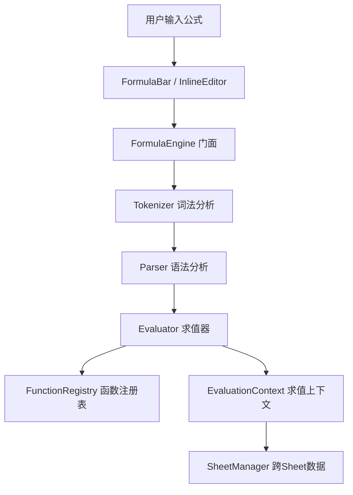

# 设计文档：P1 公式能力补齐

## 概述

本设计文档描述 ice-excel 电子表格应用 P1 优先级公式能力补齐的技术方案。涵盖五个核心需求：

1. **IFNA 逻辑函数** — 捕获 `#N/A` 错误并返回替代值，与 IFERROR 不同的是仅拦截 `#N/A`
2. **TEXTJOIN 文本函数** — 使用分隔符连接多个文本值，支持忽略空值和区域引用展平
3. **ROUNDUP/ROUNDDOWN/INT/TRUNC 数学函数** — 四种不同方向的数值舍入操作
4. **跨 Sheet 引用验证与完整性** — 确保 `Sheet1!A1` 和 `Sheet1!A1:B10` 语法在各种边界场景下正确工作
5. **内联编辑器公式自动补全** — 在单元格内编辑时复用 FormulaBar 的 AutoComplete 组件

所有新增函数遵循现有 `FunctionRegistry` + `handler` 模式注册，零运行时依赖。

## 架构

### 现有架构概览



### 变更范围

本次变更不改变整体架构，仅在现有管线中扩展：

| 层级 | 变更内容 |
|------|---------|
| 函数注册层 | 新增 IFNA、TEXTJOIN、ROUNDUP、ROUNDDOWN、INT、TRUNC 六个函数 handler |
| 求值器层 | 将 IFNA 加入 `ERROR_HANDLING_FUNCTIONS` 集合，使其能接收错误参数 |
| Tokenizer 层 | 增强单引号包裹的 Sheet 名称解析（如 `'Sheet 1'!A1`） |
| SheetManager 层 | 验证跨 Sheet 引用在删除/重命名场景下的完整性 |
| InlineEditor 层 | 集成 AutoComplete 组件，复用 FormulaBar 的自动补全逻辑 |

## 组件与接口

### 1. IFNA 函数（logic.ts）

在 `registerLogicFunctions()` 中新增 IFNA 注册：

```typescript
// 注册到 FunctionRegistry
{
  name: 'IFNA',
  category: 'logic',
  description: '如果第一个参数是 #N/A 错误则返回第二个参数',
  minArgs: 2,
  maxArgs: 2,
  params: [
    { name: 'value', description: '需要检查的值', type: 'any' },
    { name: 'value_if_na', description: '#N/A 时返回的值', type: 'any' },
  ],
  handler: (args) => {
    const value = args[0];
    // 仅拦截 #N/A，其他错误原样传播
    if (isError(value) && value.type === '#N/A') return args[1];
    return value;
  },
}
```

**关键设计决策**：IFNA 必须加入 `evaluator.ts` 的 `ERROR_HANDLING_FUNCTIONS` 集合，否则 Evaluator 会在参数求值阶段就传播错误，handler 永远收不到 `FormulaError` 对象。

### 2. TEXTJOIN 函数（text.ts）

在 `registerTextFunctions()` 中新增 TEXTJOIN 注册：

```typescript
{
  name: 'TEXTJOIN',
  category: 'text',
  description: '使用分隔符连接多个文本值',
  minArgs: 3,
  maxArgs: -1,  // 不限参数数量
  params: [
    { name: 'delimiter', description: '分隔符', type: 'string' },
    { name: 'ignore_empty', description: '是否忽略空值', type: 'boolean' },
    { name: 'text1', description: '要连接的文本', type: 'any' },
  ],
  handler: (args) => { /* 展平区域引用 + 按 ignore_empty 过滤 + join */ },
}
```

**展平逻辑**：从第 3 个参数开始，遇到 `FormulaValue[][]`（区域引用）时逐行逐列展平为一维字符串数组，然后根据 `ignore_empty` 参数决定是否跳过空字符串，最后用 `delimiter` 连接。

### 3. ROUNDUP/ROUNDDOWN/INT/TRUNC 数学函数（math.ts）

在 `registerMathFunctions()` 中新增四个函数：

| 函数 | 参数 | 行为 |
|------|------|------|
| ROUNDUP(number, num_digits) | 2 个 | 向远离零方向舍入 |
| ROUNDDOWN(number, num_digits) | 2 个 | 向接近零方向舍入 |
| INT(number) | 1 个 | `Math.floor(number)` — 向负无穷取整 |
| TRUNC(number, [num_digits]) | 1-2 个 | 截断小数部分（向零方向） |

**ROUNDUP 实现核心**：
```typescript
// 向远离零方向舍入
const factor = Math.pow(10, digits);
const result = Math.sign(num) * Math.ceil(Math.abs(num) * factor) / factor;
```

**INT vs TRUNC 区别**：
- `INT(-3.2)` = `-4`（Math.floor，向负无穷）
- `TRUNC(-3.2)` = `-3`（截断，向零方向）

### 4. 跨 Sheet 引用验证（tokenizer.ts + evaluator.ts + sheet-manager.ts）

#### 4.1 Tokenizer 增强：单引号 Sheet 名称

当前 Tokenizer 的 `readSheetRef` 方法不支持单引号包裹的 Sheet 名称。需要增强：

```typescript
// 在 readIdentifier 和 tokenize 主循环中增加单引号检测
if (ch === "'") {
  // 读取 'Sheet Name'!A1 格式
  return this.readQuotedSheetRef(input, pos, tokens);
}
```

新增 `readQuotedSheetRef` 方法：从 `'` 开始读取到匹配的 `'`，然后期望 `!`，再读取单元格引用。

#### 4.2 跨 Sheet 引用完整性

现有 `SheetManager` 已实现：
- `getCellFromSheet(sheetName, row, col)` — 跨 Sheet 数据获取
- `updateFormulasOnSheetDelete(deletedSheetName)` — 删除时更新公式为 `#REF!`
- `updateFormulasOnSheetRename(oldName, newName)` — 重命名时更新公式引用

需要验证和补全的场景：
- 引用不存在的 Sheet 名称时返回 `#REF!` 错误
- 单引号包裹的 Sheet 名称正确解析
- 跨 Sheet 引用与函数组合使用（如 `=SUM(Sheet2!A1:B10)`）

### 5. InlineEditor 自动补全集成（inline-editor.ts）

#### 5.1 设计方案

复用 `AutoComplete` 组件实例和 `FunctionRegistry`，在 InlineEditor 中添加：


#### 5.2 接口设计

InlineEditor 需要新增以下公共方法和依赖：

```typescript
class InlineEditor {
  // 新增：注入 AutoComplete 和 FunctionRegistry 依赖
  public setAutoComplete(autoComplete: AutoComplete, registry: FunctionRegistry): void;

  // 内部新增
  private dropdownEl: HTMLDivElement;       // 自动补全下拉列表
  private paramHintEl: HTMLDivElement;      // 参数提示浮层
  private autoComplete: AutoComplete | null;
  private functionRegistry: FunctionRegistry | null;
}
```

#### 5.3 键盘事件拦截优先级

当自动补全列表可见时，键盘事件处理优先级：
1. `ArrowUp/ArrowDown` → 移动候选项选中
2. `Tab` → 确认选中项（插入函数名 + 左括号）
3. `Escape` → 关闭候选列表（不退出编辑模式）
4. `Enter` → 确认选中项（与 Tab 相同行为）

当自动补全列表不可见时，恢复原有键盘行为。

## 数据模型

### 无新增数据模型

本次变更不引入新的数据结构或持久化格式变更。所有新增函数通过现有 `FunctionDefinition` 接口注册，使用现有 `FormulaValue` 类型系统。

### 现有关键类型（供参考）

```typescript
// 公式值类型（已有）
type FormulaValue = number | string | boolean | FormulaError | FormulaValue[][];

// 错误类型（已有，IFNA 需要检查 '#N/A'）
type ErrorType = '#VALUE!' | '#REF!' | '#DIV/0!' | '#NAME?' | '#NUM!' | '#N/A' | '#NULL!';

// 函数定义（已有，所有新函数遵循此接口）
interface FunctionDefinition {
  name: string;
  category: FunctionCategory;
  description: string;
  minArgs: number;
  maxArgs: number;
  params: FunctionParam[];
  handler: FunctionHandler;
}

// 自动补全候选项（已有，InlineEditor 复用）
interface AutoCompleteSuggestion {
  name: string;
  category: FunctionCategory | 'namedRange';
  description: string;
  source: SuggestionSource;
}
```


## 正确性属性

*属性（Property）是系统在所有有效执行中都应保持为真的特征或行为——本质上是对系统应做什么的形式化陈述。属性是人类可读规范与机器可验证正确性保证之间的桥梁。*

### Property 1: IFNA 选择性错误拦截

*For any* FormulaValue `v` 和任意替代值 `alt`，如果 `v` 是 `#N/A` 错误，则 `IFNA(v, alt)` 应返回 `alt`；如果 `v` 不是错误值，则 `IFNA(v, alt)` 应返回 `v`。

**Validates: Requirements 1.1, 1.3**

### Property 2: IFNA 非 #N/A 错误传播

*For any* 非 `#N/A` 类型的 FormulaError `e`（如 `#VALUE!`、`#REF!`、`#DIV/0!`、`#NAME?`、`#NUM!`、`#NULL!`）和任意替代值 `alt`，`IFNA(e, alt)` 应返回 `e` 本身（原样传播错误）。

**Validates: Requirements 1.2**

### Property 3: TEXTJOIN 分隔符连接与空值处理

*For any* 分隔符字符串 `delim`、布尔值 `ignoreEmpty`、以及非空文本值列表 `texts`，`TEXTJOIN(delim, ignoreEmpty, texts...)` 的结果应满足：当 `ignoreEmpty` 为 TRUE 时，结果等于过滤掉空字符串后的文本用 `delim` 连接；当 `ignoreEmpty` 为 FALSE 时，结果等于所有文本（包括空字符串）用 `delim` 连接。

**Validates: Requirements 2.1, 2.2, 2.3, 2.4**

### Property 4: ROUNDUP 向远离零方向舍入

*For any* 数值 `n` 和非负整数 `digits`，`ROUNDUP(n, digits)` 的结果 `r` 应满足：`|r| >= |n|`（绝对值不减小），且 `r` 的小数位数不超过 `digits`，且 `r` 与 `n` 同号（或 `n` 为零时 `r` 为零）。

**Validates: Requirements 3.1, 3.2**

### Property 5: ROUNDDOWN 向接近零方向舍入

*For any* 数值 `n` 和非负整数 `digits`，`ROUNDDOWN(n, digits)` 的结果 `r` 应满足：`|r| <= |n|`（绝对值不增大），且 `r` 的小数位数不超过 `digits`，且 `r` 与 `n` 同号（或 `n` 为零时 `r` 为零）。

**Validates: Requirements 3.3, 3.4**

### Property 6: INT 等价于 Math.floor

*For any* 数值 `n`，`INT(n)` 应返回 `Math.floor(n)`，即小于或等于 `n` 的最大整数。

**Validates: Requirements 3.5, 3.6**

### Property 7: TRUNC 向零方向截断

*For any* 数值 `n` 和非负整数 `digits`（默认为 0），`TRUNC(n, digits)` 的结果 `r` 应满足：`|r| <= |n|`，且 `r` 与 `n` 的差的绝对值小于 `10^(-digits)`，且 `r` 的小数位数不超过 `digits`。

**Validates: Requirements 3.7, 3.8, 3.9**

### Property 8: 跨 Sheet 引用正确获取数据

*For any* 存在的工作表名称 `sheetName` 和有效的单元格坐标 `(row, col)`，通过 `getCellValue(row, col, sheetName)` 获取的值应与直接从该工作表的 Model 中获取的单元格内容一致。

**Validates: Requirements 4.1, 4.2**

### Property 9: 引用不存在的工作表返回 #REF!

*For any* 不存在于 SheetManager 中的工作表名称 `sheetName`，对该工作表的任意单元格引用求值应返回 `#REF!` 错误。

**Validates: Requirements 4.3**

### Property 10: 单引号 Sheet 名称解析 round-trip

*For any* 包含空格或特殊字符的工作表名称 `name`，将 `'name'!A1` 格式的字符串经过 Tokenizer 解析后，得到的 SheetRef Token 中的工作表名称应等于原始 `name`。

**Validates: Requirements 4.4**

### Property 11: 重命名工作表后公式引用更新

*For any* 工作表重命名操作（从 `oldName` 到 `newName`），所有引用 `oldName` 的公式中的工作表名称应被更新为 `newName`，且公式求值结果不变。

**Validates: Requirements 4.5**

### Property 12: 删除工作表后公式返回 #REF!

*For any* 被删除的工作表名称 `deletedName`，所有引用该工作表的公式求值结果应更新为 `#REF!` 错误。

**Validates: Requirements 4.6**

### Property 13: InlineEditor 自动补全集成

*For any* 以 `=` 开头的输入内容和任意函数名前缀字符串 `prefix`，当 `prefix` 匹配 FunctionRegistry 中的函数时，InlineEditor 应显示候选列表，且候选列表支持上下方向键导航和 Tab 键确认插入。

**Validates: Requirements 5.1, 5.2, 5.3**

## 错误处理

### 函数参数错误

| 场景 | 处理方式 |
|------|---------|
| IFNA 参数不足（< 2 个） | Evaluator 参数数量检查返回 `#VALUE!` |
| TEXTJOIN 参数不足（< 3 个） | Evaluator 参数数量检查返回 `#VALUE!` |
| ROUNDUP/ROUNDDOWN 非数值参数 | `toNumber()` 转换失败返回 `#VALUE!` |
| INT/TRUNC 非数值参数 | `toNumber()` 转换失败返回 `#VALUE!` |
| TEXTJOIN 分隔符为错误值 | 错误传播，返回该错误 |

### 跨 Sheet 引用错误

| 场景 | 处理方式 |
|------|---------|
| 引用不存在的工作表 | `getCellContent()` 返回 `#REF!`，求值器生成 `FormulaError` |
| 单引号未闭合 | Tokenizer 抛出解析错误，FormulaEngine 捕获返回 `#错误!` |
| 删除被引用的工作表 | `updateFormulasOnSheetDelete()` 将公式内容更新为 `#REF!` |

### InlineEditor 错误处理

| 场景 | 处理方式 |
|------|---------|
| AutoComplete 未注入 | 不显示自动补全，编辑功能正常 |
| 候选列表为空 | 隐藏下拉列表 |
| 输入非公式内容 | 不触发自动补全 |

## 测试策略

### 双重测试方法

本特性采用单元测试和属性测试相结合的方式：

- **单元测试**：验证具体示例、边界条件和错误场景
- **属性测试**：验证跨所有输入的通用属性

### 属性测试配置

- **测试库**：使用 [fast-check](https://github.com/dubzzz/fast-check) 作为 TypeScript 属性测试库
- **最小迭代次数**：每个属性测试至少运行 100 次
- **标签格式**：每个属性测试必须包含注释引用设计文档中的属性编号
  - 格式：`Feature: formula-functions-p1, Property {number}: {property_text}`

### 单元测试范围

| 模块 | 测试重点 |
|------|---------|
| IFNA | 具体示例：`IFNA(VLOOKUP(...), "未找到")`、嵌套 IFNA |
| TEXTJOIN | 边界：空分隔符、单个参数、混合类型参数 |
| ROUNDUP/ROUNDDOWN | 具体示例：需求文档中的所有示例值 |
| INT/TRUNC | 边界：零值、极大/极小数、整数输入 |
| Tokenizer | 单引号 Sheet 名称：含空格、含特殊字符、嵌套引号 |
| InlineEditor | 集成测试：自动补全显示/隐藏、键盘导航、参数提示 |

### 属性测试范围

每个正确性属性（Property 1-13）必须由一个对应的属性测试实现。每个属性测试必须：

1. 使用 fast-check 的 `fc.property()` 或 `fc.assert()` API
2. 定义合适的 Arbitrary 生成器
3. 运行至少 100 次迭代
4. 包含注释标签引用对应的设计属性

### 生成器设计

| 属性 | 生成器 |
|------|--------|
| P1-P2 (IFNA) | `fc.oneof(fc.integer(), fc.string(), fc.boolean())` 生成 FormulaValue；`fc.constantFrom('#VALUE!', '#REF!', '#DIV/0!', '#NAME?', '#NUM!', '#NULL!')` 生成非 #N/A 错误 |
| P3 (TEXTJOIN) | `fc.string()` 生成分隔符；`fc.array(fc.string())` 生成文本列表；`fc.boolean()` 生成 ignoreEmpty |
| P4-P7 (数学函数) | `fc.double({ min: -1e10, max: 1e10, noNaN: true })` 生成数值；`fc.integer({ min: 0, max: 10 })` 生成小数位数 |
| P8-P9 (跨 Sheet) | `fc.string()` 生成工作表名称；`fc.integer({ min: 0, max: 99 })` 生成行列坐标 |
| P10 (Tokenizer) | `fc.stringOf(fc.oneof(fc.char(), fc.constant(' '), fc.constant('-')))` 生成含特殊字符的名称 |
| P13 (自动补全) | `fc.stringOf(fc.hexa()).filter(s => s.length > 0)` 生成函数名前缀 |
