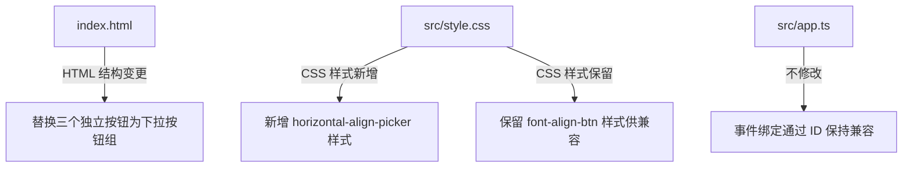

# 设计文档：横向对齐下拉按钮组

## 概述

将工具栏中三个独立的横向对齐按钮（左对齐、居中对齐、右对齐）整合为一个下拉按钮组（HorizontalAlignPicker），其 HTML 结构、CSS 样式和交互模式完全参照现有的纵向对齐按钮组（VerticalAlignPicker）。

此变更仅涉及 `index.html` 和 `src/style.css` 两个文件，不修改任何 TypeScript 脚本逻辑。原有按钮的 `id`、`data-align` 属性和 `title` 属性将保留在下拉选项元素上，确保 `app.ts` 中的事件绑定和状态更新逻辑无需任何改动。

### 设计决策

1. **完全复用 VerticalAlignPicker 的结构模式**：采用相同的 `外层容器 > 主按钮 > 下拉菜单 > 选项` 层级结构，保持交互一致性。
2. **CSS 类名采用 `horizontal-align-*` 前缀**：与 `vertical-align-*` 对称命名，便于维护。
3. **保留原有 ID 在选项元素上**：`font-align-left-btn`、`font-align-center-btn`、`font-align-right-btn` 这三个 ID 从独立按钮迁移到下拉选项的 `<div>` 元素上，`app.ts` 通过 `getElementById` 获取元素并绑定 `click` 事件的逻辑完全兼容。
4. **不新增 JS 逻辑**：下拉菜单的显示/隐藏复用现有的 CSS `visible` 类切换机制（已由 `app.ts` 中的通用下拉管理逻辑处理）。

## 架构

本次变更不涉及架构层面的修改。变更范围限定在视图层的两个文件：



### 变更文件清单

| 文件 | 变更类型 | 说明 |
|------|----------|------|
| `index.html` | 修改 | 替换三个独立按钮为下拉按钮组结构 |
| `src/style.css` | 新增 | 添加 `horizontal-align-*` 系列样式 |

## 组件与接口

### HTML 结构（新）

替换 `index.html` 中现有的三个独立横向对齐按钮：

```html
<!-- 替换前：三个独立按钮 -->
<button id="font-align-left-btn" class="toolbar-btn font-align-btn" title="左对齐">...</button>
<button id="font-align-center-btn" class="toolbar-btn font-align-btn" title="居中对齐">...</button>
<button id="font-align-right-btn" class="toolbar-btn font-align-btn" title="右对齐">...</button>
```

替换为：

```html
<!-- 替换后：下拉按钮组 -->
<div class="horizontal-align-picker" title="水平对齐">
  <button id="horizontal-align-btn" type="button">
    <svg width="15" height="15" viewBox="0 0 15 15" fill="none" xmlns="http://www.w3.org/2000/svg">
      <path d="M2 3.5C2 3.22386 2.22386 3 2.5 3H12.5C12.7761 3 13 3.22386 13 3.5C13 3.77614 12.7761 4 12.5 4H2.5C2.22386 4 2 3.77614 2 3.5ZM2 7.5C2 7.22386 2.22386 7 2.5 7H9.5C9.77614 7 10 7.22386 10 7.5C10 7.77614 9.77614 8 9.5 8H2.5C2.22386 8 2 7.77614 2 7.5ZM2 11.5C2 11.2239 2.22386 11 2.5 11H12.5C12.7761 11 13 11.2239 13 11.5C13 11.7761 12.7761 12 12.5 12H2.5C2.22386 12 2 11.7761 2 11.5Z" fill="currentColor" fill-rule="evenodd" clip-rule="evenodd"></path>
    </svg>
    <span id="horizontal-align-text">左对齐</span>
  </button>
  <div id="horizontal-align-dropdown" class="horizontal-align-dropdown">
    <div class="horizontal-align-option active" id="font-align-left-btn" data-align="left" title="左对齐">左对齐</div>
    <div class="horizontal-align-option" id="font-align-center-btn" data-align="center" title="居中对齐">居中对齐</div>
    <div class="horizontal-align-option" id="font-align-right-btn" data-align="right" title="右对齐">右对齐</div>
  </div>
</div>
```

### CSS 样式（新）

新增 `horizontal-align-*` 系列样式，与 `vertical-align-*` 保持一致：

| CSS 类名 | 对应参考 | 说明 |
|----------|----------|------|
| `.horizontal-align-picker` | `.vertical-align-picker` | 外层容器，相对定位 |
| `.horizontal-align-picker button` | `.vertical-align-picker button` | 主按钮样式 |
| `.horizontal-align-picker button svg` | `.vertical-align-picker button svg` | 图标尺寸 |
| `#horizontal-align-text` | `#vertical-align-text` | 文字标签字号 |
| `.horizontal-align-dropdown` | `.vertical-align-dropdown` | 下拉菜单定位、背景、边框、阴影 |
| `.horizontal-align-dropdown.visible` | `.vertical-align-dropdown.visible` | 显示状态 |
| `.horizontal-align-option` | `.vertical-align-option` | 选项样式 |
| `.horizontal-align-option:hover` | `.vertical-align-option:hover` | 悬停效果 |
| `.horizontal-align-option.active` | `.vertical-align-option.active` | 选中状态 |

### 兼容性接口

以下是 `app.ts` 中依赖的 DOM 接口，本次变更需确保兼容：

| 接口 | 使用方式 | 兼容方案 |
|------|----------|----------|
| `getElementById('font-align-left-btn')` | 绑定 click 事件 | ID 保留在下拉选项 `<div>` 上 |
| `getElementById('font-align-center-btn')` | 绑定 click 事件 | ID 保留在下拉选项 `<div>` 上 |
| `getElementById('font-align-right-btn')` | 绑定 click 事件 | ID 保留在下拉选项 `<div>` 上 |
| `classList.toggle('active', ...)` | 更新选中状态 | `<div>` 元素同样支持 classList 操作 |

## 数据模型

本次变更不涉及数据模型的修改。所有数据层逻辑（单元格对齐属性的存储和读取）保持不变。


## 正确性属性

*属性（Property）是在系统所有有效执行中都应保持为真的特征或行为——本质上是关于系统应该做什么的形式化陈述。属性是人类可读规范与机器可验证正确性保证之间的桥梁。*

### 属性 1：选择选项后下拉菜单关闭

*对于任意*对齐选项（左对齐、居中对齐、右对齐），当用户点击该选项时，下拉菜单应从 DOM 中移除 `visible` 类，回到隐藏状态。

**验证需求：2.4**

### 属性 2：选中状态的唯一性

*对于任意*对齐方式的选择操作，被选中的选项应拥有 `active` CSS 类，而其余两个选项不应拥有 `active` 类。即在任何时刻，下拉菜单中有且仅有一个选项处于 `active` 状态。

**验证需求：5.1**

### 属性 3：主按钮文字标签与选中状态同步

*对于任意*对齐方式的选择操作，主按钮的文字标签（`#horizontal-align-text`）应更新为与当前选中对齐方式对应的中文标签文字。

**验证需求：5.2**

## 错误处理

本次变更仅涉及 HTML 和 CSS，不涉及脚本逻辑，因此错误处理场景有限：

| 场景 | 处理方式 |
|------|----------|
| 下拉菜单在页面加载时意外显示 | CSS 默认 `display: none` 确保隐藏 |
| 主题切换后样式异常 | 使用 CSS 变量（`var(--theme-*)`）确保主题兼容 |
| ID 冲突 | 原有三个 ID 从 `<button>` 迁移到 `<div>`，不会产生重复 ID |
| 事件绑定失效 | 保留原有 ID 和 `data-align` 属性，`app.ts` 的 `getElementById` + `addEventListener('click')` 对 `<div>` 元素同样有效 |

## 测试策略

### 单元测试（Example-based）

针对具体的结构和初始状态进行验证：

1. **HTML 结构完整性**：验证 `.horizontal-align-picker` 容器存在，内含一个主按钮（带 SVG 图标和文字标签）和一个下拉菜单（含三个选项）。（验证需求 1.1, 1.2, 1.3, 1.4）
2. **DOM 属性兼容性**：验证三个选项元素分别保留了正确的 `id`（`font-align-left-btn`、`font-align-center-btn`、`font-align-right-btn`）、`data-align` 属性（`left`、`center`、`right`）和 `title` 属性。（验证需求 4.1, 4.2, 4.3）
3. **初始状态**：验证下拉菜单默认不含 `visible` 类（隐藏状态），且"左对齐"选项默认含 `active` 类。（验证需求 2.3, 5.3）
4. **下拉菜单切换**：验证点击主按钮后下拉菜单添加 `visible` 类，再次点击移除。（验证需求 2.2）

### 属性测试（Property-based）

使用属性测试库验证通用属性，每个属性测试至少运行 100 次迭代：

1. **Feature: horizontal-align-button-group, Property 1: 选择选项后下拉菜单关闭**
   - 随机选择一个对齐选项，点击后验证下拉菜单隐藏
2. **Feature: horizontal-align-button-group, Property 2: 选中状态的唯一性**
   - 随机选择一个对齐选项，验证有且仅有该选项拥有 `active` 类
3. **Feature: horizontal-align-button-group, Property 3: 主按钮文字标签与选中状态同步**
   - 随机选择一个对齐选项，验证主按钮文字与选中项对应

### 测试工具

- 属性测试库：`fast-check`（TypeScript 生态中成熟的属性测试库）
- 测试框架：`vitest`（与 Vite 生态集成）
- DOM 测试：`jsdom` 环境（vitest 内置支持）
- 每个属性测试必须通过注释引用设计文档中的属性编号
- 每个正确性属性由单个属性测试实现
