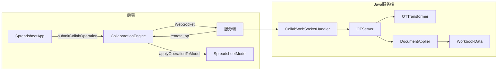
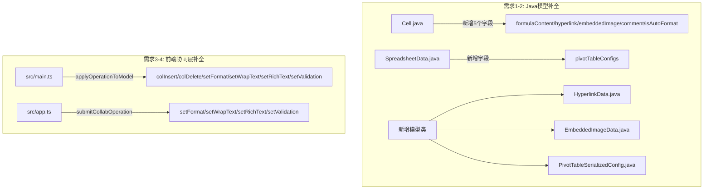
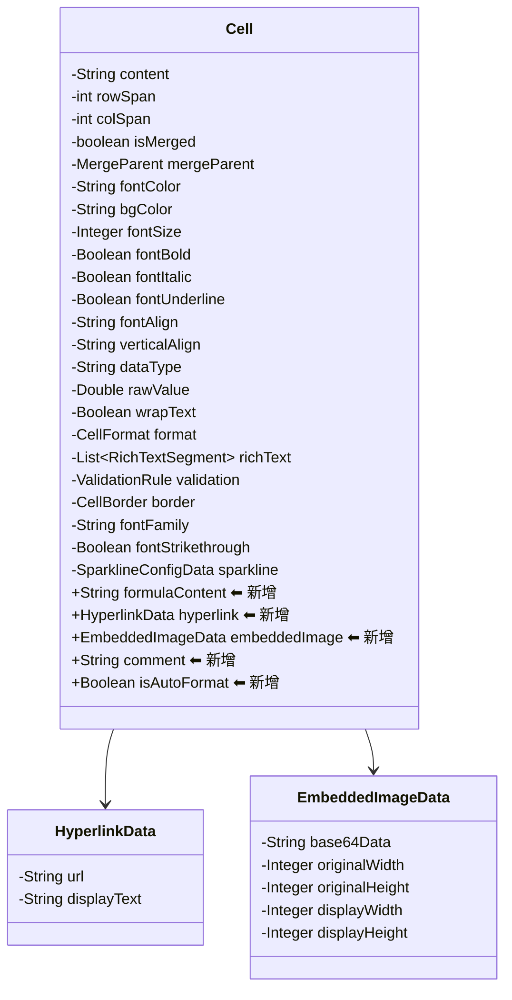
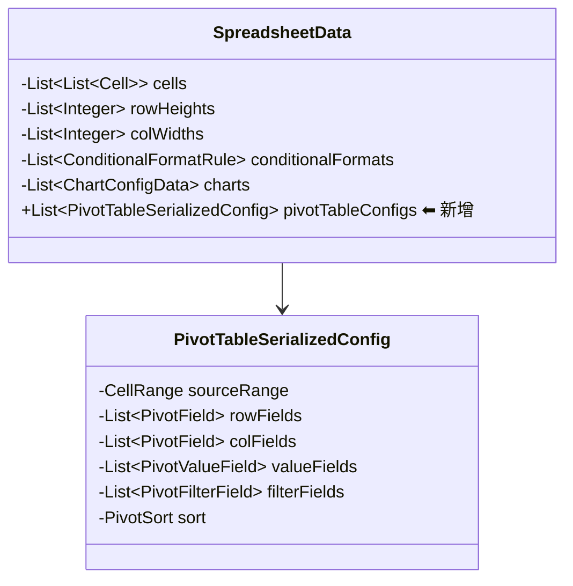

# 技术设计文档：Java 服务端与前端协同层功能补全

## 概述

本设计文档描述如何补全 ice-excel 协同编辑链路中 Java 服务端模型和前端协同层的断层，涵盖两个层面：

1. **Java 服务端模型补全**：Cell 模型新增 `formulaContent`、`hyperlink`、`embeddedImage`、`comment`、`isAutoFormat` 字段；SpreadsheetData 模型新增 `pivotTableConfigs` 字段
2. **前端协同层补全**：`applyOperationToModel` 补全 colInsert/colDelete/setFormat/setWrapText/setRichText/setValidation 的远程操作应用；`submitCollabOperation` 补全 setFormat/setWrapText/setRichText/setValidation 的操作提交

### 设计目标

- 前后端 JSON 序列化格式完全兼容（往返一致性）
- Java 服务端 Cell/SpreadsheetData 模型与前端 TypeScript 接口字段一一对应
- 前端协同层所有已定义的操作类型均能正确提交和接收应用

## 架构

### 现有架构



### 变更影响范围




## 组件与接口

### 1. Java 服务端 Cell 模型补全（需求 1）

**现有字段**：content, rowSpan, colSpan, isMerged, mergeParent, fontColor, bgColor, fontSize, fontBold, fontItalic, fontUnderline, fontAlign, verticalAlign, dataType, rawValue, wrapText, format, richText, validation, border, fontFamily, fontStrikethrough, sparkline

**需新增字段**：

| 字段名 | Java 类型 | 对应前端类型 | 说明 |
|--------|-----------|-------------|------|
| `formulaContent` | `String` | `string` | 公式原始文本（如 `=SUM(A1:A10)`） |
| `hyperlink` | `HyperlinkData` | `HyperlinkData` | 超链接数据（url + displayText） |
| `embeddedImage` | `EmbeddedImageData` | `EmbeddedImage` | 内嵌图片数据 |
| `comment` | `String` | `string` | 批注内容 |
| `isAutoFormat` | `Boolean` | `boolean` | 是否为自动检测的格式 |

**新增模型类**：

```java
// HyperlinkData.java
@JsonInclude(JsonInclude.Include.NON_NULL)
public class HyperlinkData {
    private String url;
    private String displayText;
    // getter/setter/equals/hashCode
}

// EmbeddedImageData.java
@JsonInclude(JsonInclude.Include.NON_NULL)
public class EmbeddedImageData {
    private String base64Data;
    private Integer originalWidth;
    private Integer originalHeight;
    private Integer displayWidth;
    private Integer displayHeight;
    // getter/setter/equals/hashCode
}
```

**设计决策**：
- 使用 `@JsonInclude(NON_NULL)` 确保 null 字段不输出到 JSON，与前端 `undefined` 语义一致
- `isAutoFormat` 使用 `Boolean`（包装类型）而非 `boolean`（基本类型），以支持 null 值（不输出到 JSON）
- `embeddedImage` 的宽高使用 `Integer` 而非 `int`，因为 `displayWidth`/`displayHeight` 是可选字段

### 2. Java 服务端 SpreadsheetData 模型补全（需求 2）

**需新增字段**：

| 字段名 | Java 类型 | 说明 |
|--------|-----------|------|
| `pivotTableConfigs` | `List<PivotTableSerializedConfig>` | 透视表配置列表 |

**新增模型类**：

```java
// PivotTableSerializedConfig.java
@JsonInclude(JsonInclude.Include.NON_NULL)
public class PivotTableSerializedConfig {
    private CellRange sourceRange;
    private List<PivotField> rowFields;
    private List<PivotField> colFields;
    private List<PivotValueField> valueFields;
    private List<PivotFilterField> filterFields;
    private PivotSort sort;
    // getter/setter/equals/hashCode
}

// PivotField.java
public class PivotField {
    private int fieldIndex;
    private String fieldName;
}

// PivotValueField.java
public class PivotValueField {
    private int fieldIndex;
    private String fieldName;
    private String aggregateFunc;
}

// PivotFilterField.java
public class PivotFilterField {
    private int fieldIndex;
    private String fieldName;
    private List<String> selectedValues;
}

// PivotSort.java
@JsonInclude(JsonInclude.Include.NON_NULL)
public class PivotSort {
    private String by;        // "label" | "value"
    private int fieldIndex;
    private String direction;  // "asc" | "desc"
}
```

### 3. 前端协同层补全（需求 3、4）

**applyOperationToModel 补全**（src/main.ts）：

```typescript
// 在 switch(op.type) 中新增以下 case：
case 'colInsert':
  targetModel.insertColumns(op.colIndex, op.count);
  break;
case 'colDelete':
  targetModel.deleteColumns(op.colIndex, op.count);
  break;
case 'setFormat':
  targetModel.setCellFormat(op.row, op.col, op.format);
  break;
case 'setWrapText':
  targetModel.setCellWrapText(op.row, op.col, op.wrapText);
  break;
case 'setRichText':
  targetModel.setCellRichText(op.row, op.col, op.richText);
  break;
case 'setValidation':
  targetModel.setCellValidation(op.row, op.col, op.validation);
  break;
```

**submitCollabOperation 补全**（src/app.ts）：

在用户执行 setFormat/setWrapText/setRichText/setValidation 操作的代码路径中，添加协同操作提交调用。每个操作必须包含 `sheetId` 字段。


## 数据模型

### Java 服务端 Cell 模型（补全后）



### Java 服务端 SpreadsheetData 模型（补全后）



### JSON 序列化格式对照

前端 Cell 与 Java Cell 的 JSON 字段映射：

| 前端字段 | JSON 键名 | Java 字段 | Java 注解 |
|---------|----------|----------|----------|
| `isMerged` | `"isMerged"` | `isMerged` | `@JsonProperty("isMerged")` |
| `isAutoFormat` | `"isAutoFormat"` | `isAutoFormat` | `@JsonProperty("isAutoFormat")` |
| `formulaContent` | `"formulaContent"` | `formulaContent` | 无需（驼峰一致） |
| `hyperlink` | `"hyperlink"` | `hyperlink` | 无需 |
| `embeddedImage` | `"embeddedImage"` | `embeddedImage` | 无需 |
| `comment` | `"comment"` | `comment` | 无需 |

**Jackson 全局配置**：
- `@JsonInclude(NON_NULL)` 在所有模型类上，确保 null 字段不输出
- `DeserializationFeature.FAIL_ON_UNKNOWN_PROPERTIES = false`，忽略未知字段
- `@JsonProperty("isMerged")` 和 `@JsonProperty("isAutoFormat")` 确保 boolean 字段名正确


## 正确性属性

*属性是一种在系统所有有效执行中都应成立的特征或行为——本质上是关于系统应该做什么的形式化陈述。属性是人类可读规范与机器可验证正确性保证之间的桥梁。*

### Property 1: JSON 序列化往返一致性

*对于任意*有效的 Java Cell/SpreadsheetData 对象，将其序列化为 JSON 后再反序列化，应产生与原始对象语义等价的结果（`equals` 相等）。

这是一个经典的往返属性（round-trip property）。Cell 包含新增的 formulaContent、hyperlink、embeddedImage、comment、isAutoFormat 字段，SpreadsheetData 包含新增的 pivotTableConfigs 字段，所有字段都必须在序列化/反序列化过程中保持不变。

**Validates: Requirements 1.7, 5.1, 5.2**

### Property 2: JSON 序列化 null 字段排除

*对于任意*包含部分 null 字段的 Java Cell 对象，序列化为 JSON 字符串后，该字符串中不应包含值为 `null` 的 JSON 键值对。

这确保了 Java 端的 null 语义与前端的 undefined 语义一致——前端 JSON 中不存在的字段在 Java 端表示为 null，序列化时不输出。

**Validates: Requirements 1.6, 5.3**

### Property 3: 未知字段反序列化容错

*对于任意*有效的 Cell JSON 加上任意额外的未知字段，Java 反序列化应成功且不抛出异常，已知字段的值应与原始 JSON 一致。

这保证了前端版本升级新增字段时，旧版 Java 服务端不会因未知字段而崩溃。

**Validates: Requirements 5.5**

### Property 4: 远程列操作应用正确性

*对于任意*有效的 SpreadsheetModel（列数 ≥ 1）和任意有效的 colInsert/colDelete 远程操作，通过 `applyOperationToModel` 应用后，模型的列数应正确变化：colInsert 增加 count 列，colDelete 减少 count 列（不超过现有列数）。

这验证了前端协同层对列结构操作的正确处理。colInsert 和 colDelete 是结构性操作，影响整个模型的列数。

**Validates: Requirements 3.1, 3.2**

### Property 5: 远程单元格属性操作应用正确性

*对于任意*有效的 SpreadsheetModel 和任意有效的 setFormat/setWrapText/setRichText/setValidation 远程操作，通过 `applyOperationToModel` 应用后，目标单元格的对应属性应等于操作中指定的值。

这验证了前端协同层对单元格属性设置操作的正确处理。四种操作类型共享相同的模式：设置指定单元格的指定属性。

**Validates: Requirements 3.3, 3.4, 3.5, 3.6**

### Property 6: 协同操作 sheetId 完整性

*对于任意*通过前端协同层提交的操作（包括 setFormat、setWrapText、setRichText、setValidation），操作对象中应包含非空的 sheetId 字段。

这确保了多工作表环境下，所有协同操作都能被正确路由到目标工作表。

**Validates: Requirements 4.5**


## 错误处理

### Java 服务端

| 场景 | 处理方式 |
|------|---------|
| JSON 反序列化遇到未知字段 | 忽略（`FAIL_ON_UNKNOWN_PROPERTIES = false`） |
| JSON 反序列化遇到类型不匹配 | Jackson 抛出 `JsonMappingException`，WebSocket Handler 捕获并记录日志 |
| Cell 新增字段为 null | 正常处理，`@JsonInclude(NON_NULL)` 确保序列化时不输出 |
| OT 变换后操作被消除（如编辑的列被删除） | `transform` 返回 null，`OTServer.receiveOperation` 返回 null，不广播 |
| DocumentApplier 操作目标行/列越界 | 静默忽略（与现有行为一致） |

### 前端协同层

| 场景 | 处理方式 |
|------|---------|
| 远程操作类型未识别 | switch 的 default 分支静默忽略 |
| 远程操作的 sheetId 找不到对应 Model | 回退到当前活动工作表的 Model |
| model 方法调用失败（如 insertColumns 返回 false） | 静默忽略，不影响后续操作处理 |

## 测试策略

### 属性测试（Property-Based Testing）

**Java 服务端**使用 **jqwik** 库（已在 pom.xml 中配置，版本 1.9.2）。

**配置要求**：
- 每个属性测试最少运行 100 次迭代
- 每个测试方法必须用注释标注对应的设计属性
- 标注格式：`// Feature: java-server-feature-support, Property {number}: {property_text}`

**属性测试覆盖**：

| 属性 | 测试类 | 生成器 |
|------|--------|--------|
| Property 1: JSON 往返一致性 | `CellSerializationPropertyTest` | 随机生成 Cell/SpreadsheetData 对象（随机填充各字段组合） |
| Property 2: null 字段排除 | `CellSerializationPropertyTest` | 随机生成部分字段为 null 的 Cell |
| Property 3: 未知字段容错 | `CellSerializationPropertyTest` | 在有效 JSON 中注入随机未知字段 |
| Property 4: 远程列操作应用 | `ApplyOperationPropertyTest` | 随机生成 SpreadsheetModel 和 colInsert/colDelete 操作 |
| Property 5: 远程属性操作应用 | `ApplyOperationPropertyTest` | 随机生成 SpreadsheetModel 和 setFormat/setWrapText/setRichText/setValidation 操作 |
| Property 6: sheetId 完整性 | `CollabSubmitPropertyTest` | 随机生成用户操作场景，验证提交的操作包含 sheetId |

### 单元测试

**Java 服务端**使用 JUnit 5 + Spring Boot Test。

| 测试类 | 覆盖范围 |
|--------|---------|
| `CellModelTest` | Cell 新增字段的 getter/setter、equals/hashCode |
| `SpreadsheetDataModelTest` | pivotTableConfigs 字段的 getter/setter |
| `HyperlinkDataTest` | HyperlinkData 模型的序列化/反序列化 |
| `EmbeddedImageDataTest` | EmbeddedImageData 模型的序列化/反序列化 |
| `PivotTableSerializedConfigTest` | PivotTableSerializedConfig 模型的序列化/反序列化 |

**前端协同层**：

| 测试文件 | 覆盖范围 |
|---------|---------|
| `applyOperationToModel.test.ts` | colInsert/colDelete/setFormat/setWrapText/setRichText/setValidation 的远程操作应用 |

### 测试平衡原则

- **属性测试**：覆盖通用不变量（往返一致性、null 排除、操作应用正确性），通过随机化发现边界情况
- **单元测试**：覆盖具体示例和边界情况（空文档、单行/单列、越界操作），验证特定行为
- 两者互补：属性测试验证通用正确性，单元测试验证具体场景

### 属性测试标注示例

```java
// Feature: java-server-feature-support, Property 1: JSON 序列化往返一致性
@Property(tries = 100)
void cellRoundTrip(@ForAll("randomCell") Cell cell) throws Exception {
    ObjectMapper mapper = new ObjectMapper();
    mapper.configure(DeserializationFeature.FAIL_ON_UNKNOWN_PROPERTIES, false);
    String json = mapper.writeValueAsString(cell);
    Cell deserialized = mapper.readValue(json, Cell.class);
    assertThat(deserialized).isEqualTo(cell);
}
```
