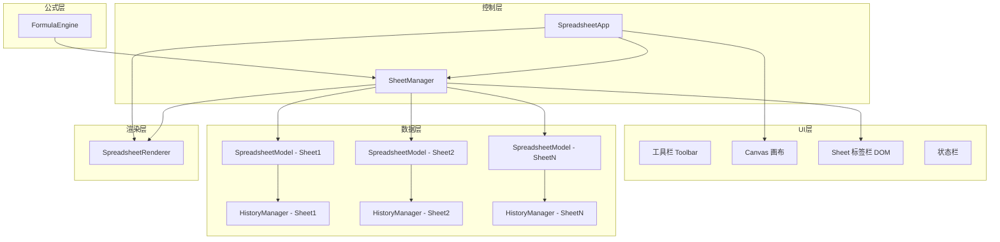
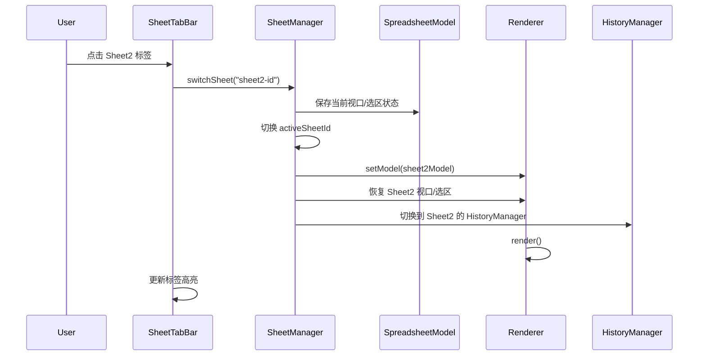
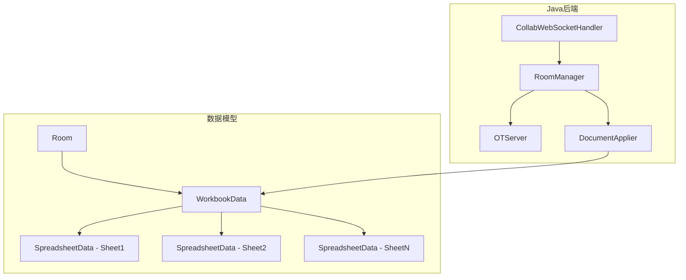

# 技术设计文档：多工作表（Multi-Sheet）

## 概述

本设计为 ice-excel 电子表格应用引入多工作表（Multi-Sheet）支持。当前应用基于单一 `SpreadsheetData` 数据结构运行，所有组件（Model、Renderer、HistoryManager、FormulaEngine）均围绕单工作表设计。本次改造将引入 `SheetManager` 作为工作表管理层，在现有 MVC 架构之上协调多工作表的数据切换、UI 渲染和公式计算。

核心设计原则：
- **最小侵入**：尽量复用现有 `SpreadsheetModel`、`SpreadsheetRenderer` 等类，通过数据切换而非重构实现多工作表
- **独立历史栈**：每个工作表维护独立的 `HistoryManager`，撤销/重做仅影响当前活动工作表
- **DOM 标签栏**：Sheet 标签栏使用 DOM 元素渲染（非 Canvas），置于 Canvas 下方、状态栏上方，降低渲染复杂度
- **向后兼容**：支持旧版单工作表 JSON 数据的自动迁移

## 架构

### 整体架构图



### 数据流



### 关键设计决策

1. **每个 Sheet 独立 SpreadsheetModel 实例**：而非在单个 Model 内切换数据。这样每个 Sheet 的内部缓存（mergeCache、contentCache）天然隔离，避免切换时的缓存失效问题。

2. **Renderer 通过 setModel() 切换数据源**：SpreadsheetRenderer 新增 `setModel(model)` 方法，切换时重新绑定数据源并触发渲染。这比重建 Renderer 实例更高效。

3. **Sheet 标签栏使用 DOM 而非 Canvas**：标签栏需要支持文本输入（重命名）、拖拽排序、右键菜单等复杂交互，DOM 实现更自然且可维护。

4. **FormulaEngine 扩展跨 Sheet 引用**：通过注入 `sheetCellGetter` 回调，FormulaEngine 可以从 SheetManager 获取任意工作表的单元格数据，无需直接依赖 SheetManager。

## 组件与接口

### 1. SheetManager（新增）

工作表管理器，作为多工作表功能的核心协调者。

```typescript
// 文件：src/sheet-manager.ts

export class SheetManager {
  private sheets: SheetMeta[];
  private sheetDataMap: Map<string, SheetData>;
  private activeSheetId: string;
  private app: SpreadsheetApp;

  constructor(app: SpreadsheetApp);

  // 工作表 CRUD
  addSheet(afterSheetId?: string): SheetMeta;
  deleteSheet(sheetId: string): boolean;
  duplicateSheet(sheetId: string): SheetMeta;
  renameSheet(sheetId: string, newName: string): RenameResult;

  // 切换与排序
  switchSheet(sheetId: string): void;
  reorderSheet(sheetId: string, newIndex: number): void;

  // 隐藏/显示
  hideSheet(sheetId: string): boolean;
  showSheet(sheetId: string): void;
  getHiddenSheets(): SheetMeta[];

  // 颜色标记
  setTabColor(sheetId: string, color: string | null): void;

  // 查询
  getActiveSheet(): SheetMeta;
  getActiveModel(): SpreadsheetModel;
  getSheetByName(name: string): SheetMeta | undefined;
  getSheetById(id: string): SheetMeta | undefined;
  getVisibleSheets(): SheetMeta[];
  getAllSheets(): SheetMeta[];

  // 跨 Sheet 公式支持
  getCellFromSheet(sheetName: string, row: number, col: number): Cell | null;

  // 序列化
  serializeWorkbook(): string;
  deserializeWorkbook(json: string): boolean;
  migrateFromLegacy(json: string): boolean;

  // 名称生成
  generateSheetName(): string;
  generateCopyName(originalName: string): string;
}
```

### 2. SheetTabBar（新增）

底部工作表标签栏 UI 组件。

```typescript
// 文件：src/sheet-tab-bar.ts

export class SheetTabBar {
  private container: HTMLDivElement;
  private tabsContainer: HTMLDivElement;
  private addButton: HTMLButtonElement;
  private scrollLeftBtn: HTMLButtonElement;
  private scrollRightBtn: HTMLButtonElement;
  private sheetManager: SheetManager;

  constructor(parentElement: HTMLElement, sheetManager: SheetManager);

  // 渲染
  render(): void;
  private renderTab(sheet: SheetMeta): HTMLDivElement;
  private updateScrollArrows(): void;

  // 交互
  private handleTabClick(sheetId: string): void;
  private handleTabDoubleClick(sheetId: string): void;
  private handleTabContextMenu(e: MouseEvent, sheetId: string): void;
  private handleAddClick(): void;

  // 拖拽排序
  private initDragAndDrop(tabElement: HTMLDivElement, sheetId: string): void;

  // 重命名（通过 Modal prompt 弹窗）
  private showRenameModal(sheetId: string): void;

  // 主题适配
  applyTheme(themeColors: ThemeColors): void;

  // 销毁
  destroy(): void;
}
```

### 3. SheetContextMenu（新增）

工作表标签右键上下文菜单。

```typescript
// 文件：src/sheet-context-menu.ts

export class SheetContextMenu {
  private menuElement: HTMLDivElement;
  private sheetManager: SheetManager;
  private sheetTabBar: SheetTabBar;

  constructor(sheetManager: SheetManager, sheetTabBar: SheetTabBar);

  show(x: number, y: number, sheetId: string): void;
  hide(): void;

  private buildMenuItems(sheetId: string): MenuItem[];
  private handleRename(sheetId: string): void;
  private handleDelete(sheetId: string): void;
  private handleDuplicate(sheetId: string): void;
  private handleHide(sheetId: string): void;
  private handleShowHidden(): void;
  private handleTabColor(sheetId: string): void;

  applyTheme(themeColors: ThemeColors): void;
  destroy(): void;
}
```

### 4. SpreadsheetModel（修改）

现有 Model 类需要少量修改以支持多工作表场景。

```typescript
// 新增/修改的方法

export class SpreadsheetModel {
  // 新增：获取内部数据引用（供 SheetManager 保存/恢复）
  getData(): SpreadsheetData;

  // 新增：替换内部数据（供 SheetManager 切换工作表时使用）
  // 注意：已有 loadFromData() 方法可复用
  loadFromData(source: SpreadsheetData): void;

  // 新增：获取/设置关联的 HistoryManager
  getHistoryManager(): HistoryManager;
  setHistoryManager(hm: HistoryManager): void;
}
```

### 5. SpreadsheetRenderer（修改）

渲染器需要支持动态切换数据源。

```typescript
export class SpreadsheetRenderer {
  // 新增：切换绑定的 Model
  setModel(model: SpreadsheetModel): void;

  // 新增：获取/设置画布高度（标签栏占用空间后需调整）
  setCanvasHeight(height: number): void;
}
```

### 6. FormulaEngine（修改）

公式引擎需要支持跨 Sheet 引用解析。

```typescript
export class FormulaEngine {
  // 新增：设置跨 Sheet 单元格获取器
  setSheetCellGetter(
    getter: (sheetName: string, row: number, col: number) => Cell | null
  ): void;

  // 修改：parseCellReference 支持 SheetName!CellRef 格式
  // 修改：parseRangeReference 支持 SheetName!RangeRef 格式
  // 修改：evaluate 支持跨 Sheet 引用求值
}
```

### 7. SpreadsheetApp（修改）

主控制器集成 SheetManager。

```typescript
export class SpreadsheetApp {
  private sheetManager: SheetManager;
  private sheetTabBar: SheetTabBar;

  // 修改 constructor：初始化 SheetManager 和 SheetTabBar
  // 修改 handleUndo/handleRedo：委托给当前活动 Sheet 的 HistoryManager
  // 新增：getSheetManager() 供外部访问
}
```

### 8. Modal 通用弹窗组件（新增）

封装统一的弹窗组件，替代浏览器原生 `alert()`、`confirm()`、`prompt()`。

```typescript
// 文件：src/modal.ts

export interface ModalOptions {
  title?: string;              // 弹窗标题
  message?: string;            // 文本内容
  confirmText?: string;        // 确认按钮文本，默认「确定」
  cancelText?: string;         // 取消按钮文本，默认「取消」
  customContent?: HTMLElement;  // 自定义 DOM 内容（替代 message）
  showCancel?: boolean;        // 是否显示取消按钮，默认 true
  inputDefault?: string;       // prompt 模式的输入框默认值
  inputPlaceholder?: string;   // prompt 模式的输入框占位文本
}

export class Modal {
  // 信息提示（替代 alert）
  static alert(message: string, options?: Partial<ModalOptions>): Promise<void>;

  // 确认对话框（替代 confirm）
  static confirm(message: string, options?: Partial<ModalOptions>): Promise<boolean>;

  // 输入对话框（替代 prompt）
  static prompt(message: string, options?: Partial<ModalOptions>): Promise<string | null>;

  // 自定义内容弹窗（用于复杂表单场景）
  static custom(options: ModalOptions): Promise<boolean>;

  // 内部方法
  private static show(options: ModalOptions, mode: 'alert' | 'confirm' | 'prompt' | 'custom'): Promise<string | boolean | null>;
  private static createOverlay(): HTMLDivElement;
  private static createDialog(options: ModalOptions, mode: string): HTMLDivElement;
  private static destroy(overlay: HTMLDivElement): void;
}
```

设计要点：
- 使用 CSS 变量适配亮色/暗色主题，样式与现有项目 UI 一致（圆角、阴影、字体等）
- 遮罩层半透明黑色背景，点击遮罩或按 Escape 关闭（等同取消）
- Enter 键触发确认，Escape 键触发取消
- 弹窗显示时自动聚焦到输入框（prompt 模式）或确认按钮
- `customContent` 参数支持传入任意 DOM 元素，用于复杂表单（如颜色选择器、隐藏工作表列表等）

需要替换的现有调用（扫描结果）：
- `src/app.ts`：约 15 处 `alert()` 调用、1 处 `prompt()` 调用
- `src/ui-controls.ts`：1 处 `alert()`、1 处 `confirm()`
- `src/data-manager.ts`：1 处 `alert()`

## 数据模型

### SheetMeta（工作表元数据）

```typescript
// 文件：src/types.ts（新增）

export interface SheetMeta {
  id: string;           // 唯一标识符（UUID）
  name: string;         // 工作表名称，如 "Sheet1"
  visible: boolean;     // 是否可见
  tabColor: string | null; // 标签颜色，null 表示无颜色
  order: number;        // 排序序号
}
```

### SheetData（单个工作表完整数据）

```typescript
export interface SheetData {
  meta: SheetMeta;
  model: SpreadsheetModel;   // 独立的 Model 实例
  historyManager: HistoryManager; // 独立的历史管理器
  viewportState: ViewportState;   // 保存的视口状态
}
```

### ViewportState（视口状态快照）

```typescript
export interface ViewportState {
  scrollX: number;
  scrollY: number;
  selection: Selection | null;
  activeCell: CellPosition | null;
}
```

### RenameResult（重命名结果）

```typescript
export interface RenameResult {
  success: boolean;
  error?: 'empty' | 'duplicate' | 'invalid';
  message?: string;
}
```

### WorkbookData（工作簿序列化格式）

```typescript
export interface WorkbookData {
  version: "2.0";
  timestamp: string;
  activeSheetId: string;
  sheets: Array<{
    meta: SheetMeta;
    data: object;  // 现有 exportToJSON 的 data 部分
    metadata: object; // 现有 exportToJSON 的 metadata 部分
  }>;
}
```

### 旧版数据兼容

当导入的 JSON 数据 `version` 为 `"1.0"` 或不包含 `sheets` 数组时，`SheetManager.migrateFromLegacy()` 将自动将其包装为包含单个工作表的 `WorkbookData` 格式。

### 跨 Sheet 引用语法

| 格式 | 示例 | 说明 |
|------|------|------|
| `SheetName!CellRef` | `Sheet2!A1` | 普通名称引用 |
| `SheetName!RangeRef` | `Sheet2!A1:B5` | 范围引用 |
| `'Sheet Name'!CellRef` | `'My Sheet'!A1` | 含空格/特殊字符的名称 |

正则解析模式：
```
/^(?:'([^']+)'|([A-Za-z0-9_\u4e00-\u9fff]+))!([A-Z]+\d+(?::[A-Z]+\d+)?)$/i
```

### themes.json 扩展

在 `light` 和 `dark` 主题的 `colors` 对象中新增以下颜色键：

```json
{
  "sheetTabBackground": "#f0f0f0",
  "sheetTabActiveBackground": "#ffffff",
  "sheetTabText": "#333333",
  "sheetTabActiveText": "#000000",
  "sheetTabBorder": "#d0d0d0",
  "sheetTabHoverBackground": "#e8e8e8"
}
```

### HTML 结构变更

在 `index.html` 的 `.spreadsheet-container` 和 `.status-bar` 之间插入标签栏容器：

```html
<div class="spreadsheet-container">
  <canvas id="excel-canvas"></canvas>
</div>
<!-- 新增：Sheet 标签栏 -->
<div id="sheet-tab-bar" class="sheet-tab-bar"></div>
<div class="status-bar">...</div>
```

### CSS 变量扩展

```css
:root {
  --sheet-tab-height: 32px;
}
```

Canvas 高度计算需减去标签栏高度：
```
canvasHeight = window.innerHeight - toolbarHeight - headerHeight - statusBarHeight - sheetTabHeight
```


## 正确性属性（Correctness Properties）

*属性（Property）是指在系统所有有效执行中都应成立的特征或行为——本质上是对系统应做什么的形式化陈述。属性是人类可读规范与机器可验证正确性保证之间的桥梁。*

### Property 1: 工作表列表不变量

*对于任意* SheetManager 状态，在执行任意序列的新增、删除、重命名、排序操作后，所有工作表的 id 应互不相同，所有工作表的 name 应互不相同，且每个工作表都应关联一个有效的 SpreadsheetModel 实例和 HistoryManager 实例。

**Validates: Requirements 1.1**

### Property 2: 独立历史栈隔离

*对于任意* 包含两个或更多工作表的工作簿，在 Sheet A 上执行编辑操作后切换到 Sheet B 执行撤销，Sheet A 的数据应保持不变。

**Validates: Requirements 1.3**

### Property 3: 视口状态切换往返

*对于任意* 视口状态（scrollX、scrollY、selection），从 Sheet A 切换到 Sheet B 再切回 Sheet A 后，恢复的视口状态应与切换前完全一致。

**Validates: Requirements 1.4**

### Property 4: 工作簿序列化往返

*对于任意* 有效的工作簿数据（包含多个工作表、各种单元格数据、格式、合并信息），序列化为 JSON 后再反序列化，应产生等价的工作簿数据（工作表数量、名称、顺序、可见性、颜色标记、单元格内容均一致）。

**Validates: Requirements 1.5**

### Property 5: 旧版数据迁移保真

*对于任意* 有效的 v1.0 格式 JSON 数据，迁移后应产生包含恰好一个工作表的 WorkbookData，且该工作表的单元格数据与原始数据完全一致。

**Validates: Requirements 1.6**

### Property 6: 新增工作表位置与激活

*对于任意* 工作表列表和当前活动工作表，新增工作表后：(a) 新工作表应位于原活动工作表的紧邻右侧，(b) 新工作表应成为新的活动工作表，(c) 新工作表的名称应不与任何已有工作表重复。

**Validates: Requirements 3.1, 3.2, 3.3**

### Property 7: 切换工作表设置活动状态

*对于任意* 可见工作表集合中的任意工作表，调用 switchSheet 后该工作表应成为活动工作表，且 getActiveSheet() 返回该工作表。

**Validates: Requirements 2.3**

### Property 8: 删除工作表减少计数

*对于任意* 包含多于一个工作表的工作簿，删除一个工作表后，工作表总数应减少 1，且被删除工作表的 id 不应出现在剩余列表中。

**Validates: Requirements 4.2**

### Property 9: 删除活动工作表后的邻居切换

*对于任意* 包含多于一个工作表的工作簿，当删除当前活动工作表时，新的活动工作表应为：若被删除工作表左侧有可见工作表则切换到左侧，否则切换到右侧。

**Validates: Requirements 4.4**

### Property 10: 删除工作表撤销往返

*对于任意* 工作表，删除后执行撤销操作，应恢复该工作表及其完整数据（包括单元格内容、格式、合并信息）。

**Validates: Requirements 4.5**

### Property 11: 重命名验证拒绝无效名称

*对于任意* 仅由空白字符组成的字符串，或与工作簿中已有工作表同名的字符串，重命名操作应被拒绝，工作表名称应保持不变。

**Validates: Requirements 5.3, 5.4, 5.5**

### Property 12: 工作表排序保持完整性

*对于任意* 工作表列表和任意有效的源位置/目标位置，排序操作后：(a) 工作表总数不变，(b) 所有工作表的 id 集合不变，(c) 被移动的工作表位于目标位置。

**Validates: Requirements 6.3**

### Property 13: 复制工作表数据等价与位置

*对于任意* 工作表，复制后：(a) 新工作表的单元格数据应与源工作表深度相等，(b) 新工作表应位于源工作表的紧邻右侧，(c) 新工作表应成为活动工作表，(d) 新工作表名称应遵循「原名称 (副本)」格式。

**Validates: Requirements 7.1, 7.2, 7.3, 7.4**

### Property 14: 隐藏/显示往返

*对于任意* 包含多于一个可见工作表的工作簿中的任意可见工作表，隐藏后该工作表不应出现在 getVisibleSheets() 结果中；再次显示后该工作表应重新出现在 getVisibleSheets() 结果中。

**Validates: Requirements 8.1, 8.2, 8.6**

### Property 15: 隐藏活动工作表后的切换

*对于任意* 包含多于一个可见工作表的工作簿，当隐藏当前活动工作表时，新的活动工作表应为一个可见工作表。

**Validates: Requirements 8.3**

### Property 16: 标签颜色设置与清除

*对于任意* 工作表和任意颜色值，设置 tabColor 后 getSheetById 返回的 meta 应包含该颜色；设置为 null 后 tabColor 应为 null。

**Validates: Requirements 9.2, 9.4**

### Property 17: 跨 Sheet 引用解析往返

*对于任意* 有效的工作表名称（包括含空格和特殊字符的名称）和有效的单元格地址，构造跨 Sheet 引用字符串后解析，应正确提取出工作表名称和单元格地址。

**Validates: Requirements 10.1, 10.2**

### Property 18: 跨 Sheet 引用求值正确性

*对于任意* 包含多个工作表的工作簿，当 Sheet A 中的公式引用 Sheet B 的单元格时，公式求值结果应等于 Sheet B 中该单元格的当前值。

**Validates: Requirements 10.3**

### Property 19: 不存在的工作表引用返回 #REF!

*对于任意* 不存在于工作簿中的工作表名称，包含该名称的跨 Sheet 引用公式应求值为 `#REF!` 错误。

**Validates: Requirements 10.4**

### Property 20: 跨 Sheet 依赖重算

*对于任意* 跨 Sheet 公式引用，当被引用的源单元格值发生变化时，引用该单元格的公式应自动重新计算并反映新值。

**Validates: Requirements 10.6**

### Property 21: 删除被引用工作表产生 #REF!

*对于任意* 被其他工作表公式引用的工作表，删除该工作表后，所有引用它的公式应求值为 `#REF!` 错误。

**Validates: Requirements 10.7**

### Property 22: 重命名被引用工作表更新公式

*对于任意* 被其他工作表公式引用的工作表，重命名该工作表后，所有引用它的公式文本中的工作表名称应自动更新为新名称，且公式求值结果不变。

**Validates: Requirements 10.8**

### Property 23: 上下文菜单状态正确性

*对于任意* 工作簿状态，当仅剩一个可见工作表时，上下文菜单的「删除」和「隐藏」选项应被禁用；当存在多个可见工作表时，这两个选项应被启用。

**Validates: Requirements 11.3**

### Property 24: 默认名称生成唯一性

*对于任意* 已有工作表名称集合（包含若干 "SheetN" 格式的名称），generateSheetName() 生成的名称应不与集合中任何名称重复，且格式为 "SheetN"（N 为正整数）。

**Validates: Requirements 3.2**

### Property 25: Modal 返回值一致性

*对于任意* Modal 调用，`alert` 应始终 resolve 为 `void`；`confirm` 在用户点击确认时 resolve 为 `true`，取消时 resolve 为 `false`；`prompt` 在用户输入并确认时 resolve 为输入字符串，取消时 resolve 为 `null`。

**Validates: Requirements 12.3**

## Java 后端协同支持

### 设计概述

当前 Java 后端基于单工作表模型运行：每个 Room 包含一个 `SpreadsheetData` 文档和一个 `OTServer` 实例。多工作表改造需要：

1. **操作携带 sheetId**：所有 `CollabOperation` 新增 `sheetId` 字段，标识操作所属的工作表
2. **Room 持有多工作表文档**：`Room` 的 document 从 `SpreadsheetData` 升级为 `WorkbookData`（包含多个 Sheet 的数据）
3. **新增 Sheet 级操作类型**：新增 `SheetAddOp`、`SheetDeleteOp`、`SheetRenameOp`、`SheetReorderOp`、`SheetDuplicateOp` 等操作
4. **DocumentApplier 扩展**：支持按 sheetId 路由操作到对应的 `SpreadsheetData`，以及处理 Sheet 级操作

### 架构变更图



### 新增 Java 模型类

#### WorkbookData（工作簿数据）

```java
// 文件：javaServer/src/main/java/com/iceexcel/server/model/WorkbookData.java

@JsonInclude(JsonInclude.Include.NON_NULL)
public class WorkbookData {
    private String version;           // "2.0"
    private String activeSheetId;     // 当前活动工作表 ID
    private List<SheetEntry> sheets;  // 有序工作表列表

    // 按 sheetId 查找对应的 SpreadsheetData
    public SpreadsheetData getSheetData(String sheetId);
    // 按 sheetId 查找对应的 SheetEntry
    public SheetEntry getSheetEntry(String sheetId);
    // 从旧版单工作表数据迁移
    public static WorkbookData migrateFromLegacy(SpreadsheetData legacy);
}
```

#### SheetEntry（工作表条目）

```java
// 文件：javaServer/src/main/java/com/iceexcel/server/model/SheetEntry.java

@JsonInclude(JsonInclude.Include.NON_NULL)
public class SheetEntry {
    private String id;                // 唯一标识符
    private String name;              // 工作表名称
    private boolean visible;          // 是否可见
    private String tabColor;          // 标签颜色（可为 null）
    private int order;                // 排序序号
    private SpreadsheetData data;     // 工作表数据
}
```

#### Sheet 级操作类

```java
// 新增操作类型，注册到 CollabOperation 的 @JsonSubTypes

// 新增工作表
public class SheetAddOp extends CollabOperation {
    private String sheetId;       // 新工作表 ID
    private String sheetName;     // 新工作表名称
    private int insertIndex;      // 插入位置
    public String getType() { return "sheetAdd"; }
}

// 删除工作表
public class SheetDeleteOp extends CollabOperation {
    private String sheetId;       // 被删除的工作表 ID
    public String getType() { return "sheetDelete"; }
}

// 重命名工作表
public class SheetRenameOp extends CollabOperation {
    private String sheetId;       // 目标工作表 ID
    private String oldName;       // 旧名称
    private String newName;       // 新名称
    public String getType() { return "sheetRename"; }
}

// 排序工作表
public class SheetReorderOp extends CollabOperation {
    private String sheetId;       // 被移动的工作表 ID
    private int oldIndex;         // 原位置
    private int newIndex;         // 新位置
    public String getType() { return "sheetReorder"; }
}

// 复制工作表
public class SheetDuplicateOp extends CollabOperation {
    private String sourceSheetId; // 源工作表 ID
    private String newSheetId;    // 新工作表 ID
    private String newSheetName;  // 新工作表名称
    public String getType() { return "sheetDuplicate"; }
}

// 隐藏/显示工作表
public class SheetVisibilityOp extends CollabOperation {
    private String sheetId;       // 目标工作表 ID
    private boolean visible;      // 设置可见性
    public String getType() { return "sheetVisibility"; }
}

// 设置标签颜色
public class SheetTabColorOp extends CollabOperation {
    private String sheetId;       // 目标工作表 ID
    private String tabColor;      // 颜色值（null 表示清除）
    public String getType() { return "sheetTabColor"; }
}
```

### CollabOperation 基类修改

```java
public abstract class CollabOperation {
    private String userId;
    private long timestamp;
    private int revision;
    private String sheetId;  // 新增：操作所属的工作表 ID（Sheet 级操作可为 null）

    // getter/setter...
}
```

所有现有操作（CellEditOp、FontBoldOp 等）在发送时需携带 `sheetId`，后端据此将操作路由到对应工作表的 `SpreadsheetData`。

### Room 模型修改

```java
public class Room {
    private String roomId;
    private WorkbookData workbook;  // 从 SpreadsheetData document 改为 WorkbookData
    private List<CollabOperation> operations;
    private int revision;
    private ConcurrentHashMap<String, ClientConnection> clients;
}
```

### DocumentApplier 修改

```java
public class DocumentApplier {
    /**
     * 将操作应用到工作簿
     * 根据操作类型路由：
     * - Sheet 级操作（sheetAdd/sheetDelete/...）：直接修改 WorkbookData 的 sheets 列表
     * - 单元格级操作（cellEdit/fontBold/...）：根据 sheetId 找到对应 SpreadsheetData 后应用
     */
    public static void apply(WorkbookData workbook, CollabOperation op);

    // 现有的 apply(SpreadsheetData, CollabOperation) 保留，供内部调用
    public static void apply(SpreadsheetData document, CollabOperation op);

    // 新增：Sheet 级操作应用
    private static void applySheetAdd(WorkbookData workbook, SheetAddOp op);
    private static void applySheetDelete(WorkbookData workbook, SheetDeleteOp op);
    private static void applySheetRename(WorkbookData workbook, SheetRenameOp op);
    private static void applySheetReorder(WorkbookData workbook, SheetReorderOp op);
    private static void applySheetDuplicate(WorkbookData workbook, SheetDuplicateOp op);
    private static void applySheetVisibility(WorkbookData workbook, SheetVisibilityOp op);
    private static void applySheetTabColor(WorkbookData workbook, SheetTabColorOp op);
}
```

### OTTransformer 修改

Sheet 级操作的 OT 转换规则：

| 操作 A \ 操作 B | SheetAdd | SheetDelete | SheetRename | 单元格操作 |
|----------------|----------|-------------|-------------|-----------|
| SheetAdd | 无冲突（不同 ID） | 无冲突 | 无冲突 | 无冲突 |
| SheetDelete | 无冲突 | 同 Sheet 则消除 | 同 Sheet 则消除 | 同 Sheet 则消除单元格操作 |
| SheetRename | 无冲突 | 同 Sheet 则消除 | 同 Sheet 后者覆盖 | 无冲突 |
| 单元格操作 | 无冲突 | 同 Sheet 则消除 | 无冲突 | 现有转换逻辑 |

核心规则：
- 不同 `sheetId` 的操作之间无需转换（天然隔离）
- 同一 `sheetId` 的单元格操作使用现有转换逻辑
- `SheetDeleteOp` 会消除同 Sheet 的所有后续操作

```java
// OTTransformer 新增方法
private static CollabOperation transformSheetOps(CollabOperation opA, CollabOperation opB) {
    // 不同 sheetId 的操作无需转换
    if (opA.getSheetId() != null && opB.getSheetId() != null
        && !opA.getSheetId().equals(opB.getSheetId())) {
        return opA;
    }
    // SheetDelete 消除同 Sheet 的操作
    if (opB instanceof SheetDeleteOp) {
        String deletedId = ((SheetDeleteOp) opB).getSheetId();
        if (deletedId.equals(opA.getSheetId())) {
            return null; // 操作被消除
        }
    }
    return opA;
}
```

### RoomManager 修改

```java
public class RoomManager {
    // createEmptyDocument() 改为 createEmptyWorkbook()
    private WorkbookData createEmptyWorkbook() {
        WorkbookData workbook = new WorkbookData();
        workbook.setVersion("2.0");
        SheetEntry defaultSheet = new SheetEntry();
        defaultSheet.setId(UUID.randomUUID().toString());
        defaultSheet.setName("Sheet1");
        defaultSheet.setVisible(true);
        defaultSheet.setOrder(0);
        defaultSheet.setData(createEmptyDocument());
        workbook.setSheets(List.of(defaultSheet));
        workbook.setActiveSheetId(defaultSheet.getId());
        return workbook;
    }

    // getDocument() 改为 getWorkbook()
    public WorkbookData getWorkbook(String roomId);

    // receiveOperation 中 DocumentApplier.apply 调用改为传入 WorkbookData
}
```

### CollabWebSocketHandler 修改

```java
// handleJoin：发送 WorkbookData 而非 SpreadsheetData
private void handleJoin(WebSocketSession session, JsonNode payload) {
    // ...
    ObjectNode statePayload = objectMapper.createObjectNode();
    statePayload.set("workbook", objectMapper.valueToTree(room.getWorkbook()));
    statePayload.put("revision", roomManager.getRevision(roomId));
    statePayload.set("users", objectMapper.valueToTree(roomManager.getAllUsers(roomId)));
    sendMessage(session, "state", statePayload);
}

// handleSync：发送 WorkbookData 快照
private void handleSync(WebSocketSession session, String roomId, JsonNode payload) {
    // 快照模式发送完整 WorkbookData
    // 增量模式发送操作列表（操作已携带 sheetId）
}
```

### 数据库兼容

`RoomEntity` 的 `documentJson` 字段从存储 `SpreadsheetData` JSON 改为存储 `WorkbookData` JSON。加载时通过检查 `version` 字段判断格式：
- 无 `version` 或 `version` 为 `"1.0"`：调用 `WorkbookData.migrateFromLegacy()` 迁移
- `version` 为 `"2.0"`：直接反序列化为 `WorkbookData`

### WebSocket 消息协议变更

| 消息类型 | 变更 |
|---------|------|
| `state` | payload.document → payload.workbook（WorkbookData 格式） |
| `operation` | payload.operation 新增 sheetId 字段 |
| `remote_op` | payload.operation 新增 sheetId 字段 |
| `sync` | 快照模式返回 WorkbookData |

前端 `CollabClient` 需同步修改以适配新的消息格式。

## 错误处理

### 工作表操作错误

| 场景 | 处理方式 |
|------|----------|
| 删除最后一个工作表 | 拒绝操作，菜单项置灰 |
| 隐藏最后一个可见工作表 | 拒绝操作，菜单项置灰 |
| 重命名为空字符串/纯空白 | 拒绝，恢复原名称 |
| 重命名为已存在的名称 | 拒绝，显示提示「工作表名称已存在」 |
| 拖拽到原位置 | 静默忽略，不记录历史 |

### 跨 Sheet 公式错误

| 场景 | 处理方式 |
|------|----------|
| 引用不存在的工作表 | 返回 `#REF!` 错误 |
| 引用超出范围的单元格 | 返回 `#REF!` 错误 |
| 被引用工作表被删除 | 所有引用公式更新为 `#REF!` |
| 跨 Sheet 循环引用 | 返回 `#CIRCULAR!` 错误 |
| 引用隐藏工作表的数据 | 正常求值（隐藏不影响数据访问） |

### 序列化错误

| 场景 | 处理方式 |
|------|----------|
| JSON 解析失败 | 返回 false，记录错误日志 |
| 版本号缺失 | 尝试作为旧版格式迁移 |
| 工作表数据不完整 | 跳过损坏的工作表，记录警告 |
| LocalStorage 空间不足 | 捕获异常，提示用户导出文件 |

## 测试策略

### 双重测试方法

本功能采用单元测试与属性测试相结合的方式确保正确性：

- **单元测试**：验证具体示例、边界条件和错误处理
- **属性测试**：验证跨所有输入的通用属性

### 属性测试配置

- 使用 [fast-check](https://github.com/dubzzz/fast-check) 作为 TypeScript 属性测试库
- 每个属性测试最少运行 100 次迭代
- 每个属性测试必须以注释引用设计文档中的属性编号
- 标签格式：`Feature: multi-sheet-tabs, Property {number}: {property_text}`
- 每个正确性属性由一个属性测试实现

### 单元测试范围

| 测试类别 | 覆盖内容 |
|----------|----------|
| SheetManager 初始化 | 默认创建 Sheet1、初始状态验证（需求 1.2） |
| 边界条件 | 删除最后一个工作表被拒绝（需求 4.3）、隐藏最后一个可见工作表被拒绝（需求 8.4）、拖拽到原位置无操作（需求 6.4） |
| 跨 Sheet 公式错误 | 引用不存在工作表返回 #REF!、超出范围返回 #REF!（需求 10.4, 10.5） |
| 上下文菜单状态 | 单工作表时禁用删除/隐藏（需求 11.3） |
| 旧版数据迁移 | v1.0 格式自动迁移（需求 1.6） |
| 标签栏 DOM | + 按钮存在性（需求 2.2） |

### 属性测试范围

| 属性编号 | 测试描述 | 对应需求 |
|----------|----------|----------|
| Property 1 | 工作表列表不变量 | 1.1 |
| Property 2 | 独立历史栈隔离 | 1.3 |
| Property 3 | 视口状态切换往返 | 1.4 |
| Property 4 | 工作簿序列化往返 | 1.5 |
| Property 5 | 旧版数据迁移保真 | 1.6 |
| Property 6 | 新增工作表位置与激活 | 3.1, 3.2, 3.3 |
| Property 7 | 切换工作表设置活动状态 | 2.3 |
| Property 8 | 删除工作表减少计数 | 4.2 |
| Property 9 | 删除活动工作表后的邻居切换 | 4.4 |
| Property 10 | 删除工作表撤销往返 | 4.5 |
| Property 11 | 重命名验证拒绝无效名称 | 5.3, 5.4, 5.5 |
| Property 12 | 工作表排序保持完整性 | 6.3 |
| Property 13 | 复制工作表数据等价与位置 | 7.1, 7.2, 7.3, 7.4 |
| Property 14 | 隐藏/显示往返 | 8.1, 8.2, 8.6 |
| Property 15 | 隐藏活动工作表后的切换 | 8.3 |
| Property 16 | 标签颜色设置与清除 | 9.2, 9.4 |
| Property 17 | 跨 Sheet 引用解析往返 | 10.1, 10.2 |
| Property 18 | 跨 Sheet 引用求值正确性 | 10.3 |
| Property 19 | 不存在的工作表引用返回 #REF! | 10.4 |
| Property 20 | 跨 Sheet 依赖重算 | 10.6 |
| Property 21 | 删除被引用工作表产生 #REF! | 10.7 |
| Property 22 | 重命名被引用工作表更新公式 | 10.8 |
| Property 23 | 上下文菜单状态正确性 | 11.3 |
| Property 24 | 默认名称生成唯一性 | 3.2 |

### 测试文件组织

```
src/__tests__/
├── sheet-manager.test.ts              # SheetManager 单元测试
├── sheet-manager.pbt.test.ts          # SheetManager 属性测试（Property 1-16, 23-24）
├── cross-sheet-formula.test.ts        # 跨 Sheet 公式单元测试
├── cross-sheet-formula.pbt.test.ts    # 跨 Sheet 公式属性测试（Property 17-22）
├── sheet-tab-bar.test.ts              # SheetTabBar DOM 单元测试
├── modal.test.ts                      # Modal 组件单元测试（Property 25）
└── workbook-serialization.pbt.test.ts # 序列化属性测试（Property 4-5）
```
