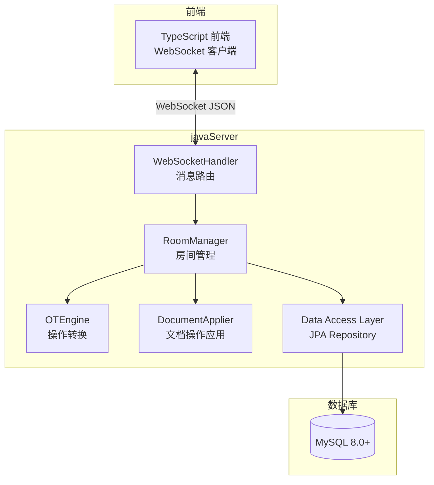

# 设计文档

## 概述

本设计描述将 ice-excel 协同编辑后端从 Node.js/TypeScript + JSON 文件存储迁移到 Java (Spring Boot) + MySQL 的技术方案。

核心设计决策：
- 使用 Spring Boot 3.x 作为应用框架，利用其 WebSocket 原生支持（不使用 STOMP 子协议）
- 使用 Spring Data JPA + Hibernate 作为 ORM 层，连接 MySQL 8.0+
- 使用 Jackson 处理 JSON 序列化/反序列化，保持与前端消息格式完全兼容
- OT 算法从 TypeScript 逐函数翻译为 Java，保持转换逻辑一致
- 使用 Maven 作为构建工具

## 架构

### 整体架构



### 分层架构

采用经典的三层架构：

1. **表现层（WebSocket）**: `CollabWebSocketHandler` 处理 WebSocket 连接和消息路由
2. **业务逻辑层**: `RoomManager`、`OTEngine`、`DocumentApplier` 处理协同编辑核心逻辑
3. **数据访问层**: Spring Data JPA Repository 封装数据库操作

### 与 Node.js 服务的对应关系

| Node.js 模块 | Java 类 | 说明 |
|---|---|---|
| `index.ts` | `CollabWebSocketHandler` | WebSocket 消息处理和路由 |
| `room-manager.ts` | `RoomManager` | 房间生命周期管理 |
| `ot-server.ts` | `OTServer` | OT 服务端状态和操作接收 |
| `ot.ts` | `OTTransformer` | OT 转换算法 |
| `database.ts` | `RoomRepository` + `OperationRepository` | 数据持久化 |
| `types.ts` | `model/` 包下的各 Java 类 | 数据模型定义 |

## 组件与接口

### 1. WebSocket 配置与处理器

**WebSocketConfig**: Spring WebSocket 配置类，注册 WebSocket 端点。

```java
@Configuration
@EnableWebSocket
public class WebSocketConfig implements WebSocketConfigurer {
    @Override
    public void registerWebSocketHandlers(WebSocketHandlerRegistry registry) {
        registry.addHandler(collabWebSocketHandler(), "/")
                .setAllowedOrigins("*");
    }
}
```

**CollabWebSocketHandler**: 继承 `TextWebSocketHandler`，处理所有 WebSocket 消息。

```java
public class CollabWebSocketHandler extends TextWebSocketHandler {
    // 消息类型路由
    void handleTextMessage(WebSocketSession session, TextMessage message);
    // 连接关闭处理
    void afterConnectionClosed(WebSocketSession session, CloseStatus status);
    
    // 内部消息处理方法
    private void handleJoin(WebSocketSession session, JsonNode payload);
    private void handleOperation(WebSocketSession session, String roomId, String userId, JsonNode payload);
    private void handleCursor(String roomId, String userId, JsonNode payload);
    private void handleSync(WebSocketSession session, String roomId, JsonNode payload);
    private void handleDisconnect(WebSocketSession session);
}
```

### 2. 房间管理器

**RoomManager**: 管理所有房间的生命周期，协调 OT 引擎和数据持久化。

```java
@Service
public class RoomManager {
    private final ConcurrentHashMap<String, Room> rooms = new ConcurrentHashMap<>();
    private final ConcurrentHashMap<String, OTServer> otStates = new ConcurrentHashMap<>();
    private final ScheduledExecutorService saveScheduler;
    
    // 获取或创建房间（优先从数据库加载）
    Room getOrCreateRoom(String roomId);
    // 用户加入房间
    JoinResult joinRoom(String roomId, String userId, String userName, WebSocketSession ws);
    // 用户离开房间
    boolean leaveRoom(String roomId, String userId);
    // 接收并处理操作
    ReceiveResult receiveOperation(String roomId, int clientRevision, CollabOperation op);
    // 获取指定修订号之后的操作
    List<CollabOperation> getOperationsSince(String roomId, int sinceRevision);
    // 保存所有房间数据
    void saveAll();
}
```

### 3. OT 引擎

**OTServer**: OT 服务端状态管理。

```java
public class OTServer {
    private List<CollabOperation> operations;
    private int revision;
    
    // 接收客户端操作并处理转换
    ReceiveResult receiveOperation(int clientRevision, CollabOperation op);
    // 获取指定修订号之后的操作
    List<CollabOperation> getOperationsSince(int sinceRevision);
}
```

**OTTransformer**: 无状态的 OT 转换工具类。

```java
public class OTTransformer {
    // 对两个操作执行转换，返回转换后的操作对
    static TransformResult transform(CollabOperation opA, CollabOperation opB);
    // 对操作列表执行转换
    static CollabOperation transformAgainst(CollabOperation op, List<CollabOperation> ops);
}
```

### 4. 文档操作应用器

**DocumentApplier**: 将操作应用到文档快照。

```java
public class DocumentApplier {
    // 将操作应用到文档
    static void apply(SpreadsheetData document, CollabOperation op);
}
```

### 5. 数据访问层

**RoomEntity**: 房间 JPA 实体。

```java
@Entity
@Table(name = "rooms")
public class RoomEntity {
    @Id
    private String roomId;
    
    @Column(columnDefinition = "JSON")
    private String documentJson;  // SpreadsheetData 的 JSON 序列化
    
    private int revision;
    private long updatedAt;
}
```

**OperationEntity**: 操作历史 JPA 实体。

```java
@Entity
@Table(name = "operations")
public class OperationEntity {
    @Id
    @GeneratedValue(strategy = GenerationType.IDENTITY)
    private Long id;
    
    private String roomId;
    private int revision;
    
    @Column(columnDefinition = "JSON")
    private String operationJson;  // CollabOperation 的 JSON 序列化
    
    private String userId;
    private long timestamp;
}
```

**RoomRepository / OperationRepository**: Spring Data JPA Repository 接口。

```java
public interface RoomRepository extends JpaRepository<RoomEntity, String> {
}

public interface OperationRepository extends JpaRepository<OperationEntity, Long> {
    List<OperationEntity> findByRoomIdAndRevisionGreaterThanOrderByRevisionAsc(
        String roomId, int sinceRevision);
    List<OperationEntity> findByRoomIdOrderByRevisionAsc(String roomId);
}
```

## 数据模型

### MySQL 表结构

#### rooms 表

| 列名 | 类型 | 说明 |
|---|---|---|
| room_id | VARCHAR(255) PK | 房间 ID |
| document_json | JSON | SpreadsheetData 的 JSON 序列化 |
| revision | INT | 当前修订号 |
| updated_at | BIGINT | 最后更新时间戳 |

#### operations 表

| 列名 | 类型 | 说明 |
|---|---|---|
| id | BIGINT PK AUTO_INCREMENT | 自增主键 |
| room_id | VARCHAR(255) INDEX | 房间 ID |
| revision | INT | 操作修订号 |
| operation_json | JSON | CollabOperation 的 JSON 序列化 |
| user_id | VARCHAR(255) | 操作用户 ID |
| timestamp | BIGINT | 操作时间戳 |

索引：`(room_id, revision)` 联合索引，用于按修订号范围查询。

### Java 数据模型（与 TypeScript 类型对应）

#### CollabOperation 类型层次

```java
// 基类
public abstract class CollabOperation {
    private String type;
    private String userId;
    private long timestamp;
    private int revision;
}

// 14 种具体操作子类
public class CellEditOp extends CollabOperation { ... }
public class CellMergeOp extends CollabOperation { ... }
public class CellSplitOp extends CollabOperation { ... }
public class RowInsertOp extends CollabOperation { ... }
public class RowDeleteOp extends CollabOperation { ... }
public class RowResizeOp extends CollabOperation { ... }
public class ColResizeOp extends CollabOperation { ... }
public class FontColorOp extends CollabOperation { ... }
public class BgColorOp extends CollabOperation { ... }
public class FontSizeOp extends CollabOperation { ... }
public class FontBoldOp extends CollabOperation { ... }
public class FontItalicOp extends CollabOperation { ... }
public class FontUnderlineOp extends CollabOperation { ... }
public class FontAlignOp extends CollabOperation { ... }
```

使用 Jackson 的 `@JsonTypeInfo` + `@JsonSubTypes` 注解实现多态 JSON 序列化/反序列化，以 `type` 字段作为类型标识符。

#### SpreadsheetData

```java
public class SpreadsheetData {
    private List<List<Cell>> cells;
    private List<Integer> rowHeights;
    private List<Integer> colWidths;
}

public class Cell {
    private String content;
    private int rowSpan;
    private int colSpan;
    private boolean isMerged;
    private MergeParent mergeParent;  // 可选
    private String fontColor;         // 可选
    private String bgColor;           // 可选
    private Integer fontSize;         // 可选
    private Boolean fontBold;         // 可选
    private Boolean fontItalic;       // 可选
    private Boolean fontUnderline;    // 可选
    private String fontAlign;         // 可选: "left", "center", "right"
}
```

#### WebSocket 消息格式

保持与 Node.js 服务完全一致的 JSON 格式：

```json
{
    "type": "join|leave|operation|ack|remote_op|sync|cursor|user_join|user_leave|state",
    "payload": { ... }
}
```

### 项目目录结构

```
javaServer/
├── pom.xml
├── src/
│   ├── main/
│   │   ├── java/com/iceexcel/server/
│   │   │   ├── IceExcelServerApplication.java    # Spring Boot 入口
│   │   │   ├── config/
│   │   │   │   └── WebSocketConfig.java           # WebSocket 配置
│   │   │   ├── websocket/
│   │   │   │   └── CollabWebSocketHandler.java    # WebSocket 消息处理
│   │   │   ├── service/
│   │   │   │   ├── RoomManager.java               # 房间管理
│   │   │   │   ├── OTServer.java                  # OT 服务端状态
│   │   │   │   ├── OTTransformer.java             # OT 转换算法
│   │   │   │   └── DocumentApplier.java           # 文档操作应用
│   │   │   ├── model/
│   │   │   │   ├── CollabOperation.java           # 操作基类
│   │   │   │   ├── CellEditOp.java                # 各操作子类...
│   │   │   │   ├── SpreadsheetData.java           # 文档数据
│   │   │   │   ├── Cell.java                      # 单元格
│   │   │   │   ├── Room.java                      # 房间内存模型
│   │   │   │   └── WebSocketMessage.java          # 消息模型
│   │   │   ├── entity/
│   │   │   │   ├── RoomEntity.java                # 房间 JPA 实体
│   │   │   │   └── OperationEntity.java           # 操作 JPA 实体
│   │   │   └── repository/
│   │   │       ├── RoomRepository.java            # 房间 Repository
│   │   │       └── OperationRepository.java       # 操作 Repository
│   │   └── resources/
│   │       └── application.yml                    # 配置文件
│   └── test/
│       └── java/com/iceexcel/server/
│           ├── service/
│           │   ├── OTTransformerTest.java
│           │   ├── DocumentApplierTest.java
│           │   └── RoomManagerTest.java
│           └── model/
│               └── CollabOperationSerializationTest.java
└── README.md
```


## 正确性属性

*正确性属性是系统在所有有效执行中都应保持为真的特征或行为——本质上是关于系统应该做什么的形式化陈述。属性是人类可读规范与机器可验证正确性保证之间的桥梁。*

### Property 1: CollabOperation JSON 序列化往返一致性

*For any* 有效的 CollabOperation 对象（14 种操作类型中的任意一种），使用 Jackson 序列化为 JSON 字符串后再反序列化，应该产生与原始对象等价的对象。

**Validates: Requirements 3.6**

### Property 2: OT 转换对任意操作对不崩溃且保持类型一致

*For any* 两个有效的 CollabOperation 对象，调用 `OTTransformer.transform(opA, opB)` 不应抛出异常，且返回的转换结果（如果非 null）应该保持与原始操作相同的操作类型。

**Validates: Requirements 3.1, 3.2**

### Property 3: 同位置 rowInsert 使用 userId 字典序决胜

*For any* 两个 rowInsert 操作，当它们的 rowIndex 相同时，userId 字典序较大的操作经过转换后其 rowIndex 应该增加（被推后），而字典序较小的操作保持原位。

**Validates: Requirements 3.3**

### Property 4: 被删除行上的操作转换返回 null

*For any* 包含行索引的操作（cellEdit、fontColor 等），当存在一个并发的 rowDelete 操作且该操作的行索引在删除范围内时，转换结果应该为 null。

**Validates: Requirements 3.4**

### Property 5: 重叠 cellMerge 转换返回 null

*For any* 两个 cellMerge 操作，当它们的区域存在重叠时，对后到达的操作执行转换应该返回 null。

**Validates: Requirements 3.5**

### Property 6: 操作应用后文档状态一致性

*For any* 有效的 SpreadsheetData 文档和有效的 CollabOperation 操作，将操作应用到文档后：
- cellEdit: 目标单元格的 content 等于操作中的 content
- cellMerge: 主单元格的 rowSpan/colSpan 正确，被合并单元格的 isMerged 为 true
- rowInsert: 文档行数增加 count，行高数组长度增加 count
- rowDelete: 文档行数减少 count，行高数组长度减少 count

**Validates: Requirements 6.1, 6.2, 6.3, 6.4, 6.5**

### Property 7: 房间数据存储/读取往返一致性

*For any* 有效的 SpreadsheetData 和修订号，保存到 MySQL 后再加载，应该得到等价的文档数据和修订号。

**Validates: Requirements 1.3, 5.1, 5.4**

### Property 8: 操作历史存储/查询往返一致性

*For any* 有效的 CollabOperation 列表和修订号范围，保存到 MySQL 后按修订号范围查询，应该返回正确的操作子集且顺序一致。

**Validates: Requirements 1.4, 5.2**

### Property 9: 颜色分配唯一性

*For any* 房间和不超过颜色池大小的用户数量，每个加入房间的用户应该获得不同的颜色。

**Validates: Requirements 4.3**

### Property 10: WebSocket 消息 JSON 格式兼容性

*For any* 有效的 WebSocketMessage 对象，Java 服务序列化的 JSON 结构应该与 Node.js 服务的消息格式一致（相同的字段名和嵌套结构）。

**Validates: Requirements 2.7**

## 错误处理

### 数据库错误

| 场景 | 处理方式 |
|---|---|
| 启动时数据库连接失败 | 记录错误日志，以非零退出码终止（需求 1.5） |
| 运行时数据库写入失败 | 记录错误日志，抛出异常，不静默丢失数据（需求 5.5） |
| 运行时数据库读取失败 | 记录错误日志，创建空白文档作为降级方案 |

### WebSocket 错误

| 场景 | 处理方式 |
|---|---|
| 消息 JSON 解析失败 | 记录警告日志，忽略该消息 |
| 未加入房间的客户端发送操作消息 | 记录警告日志，忽略该消息 |
| WebSocket 连接异常断开 | 触发 `afterConnectionClosed`，正常执行离开房间流程 |

### OT 转换错误

| 场景 | 处理方式 |
|---|---|
| 操作转换后被消除（返回 null） | 向发送者返回当前修订号的 ack，不广播 |
| 操作目标超出文档范围 | 静默忽略（与 Node.js 行为一致） |

## 测试策略

### 单元测试

使用 JUnit 5 + Mockito：

- **OTTransformer 测试**: 针对每种操作类型组合的转换逻辑编写具体用例
- **DocumentApplier 测试**: 针对每种操作类型的文档应用逻辑编写具体用例
- **RoomManager 测试**: 使用 Mockito mock 数据库层，测试房间生命周期
- **序列化测试**: 验证 JSON 消息格式与 Node.js 服务一致

### 属性测试

使用 [jqwik](https://jqwik.net/)（Java 属性测试库）：

- 每个正确性属性对应一个属性测试
- 每个属性测试至少运行 100 次迭代
- 每个测试用注释标注对应的设计属性编号
- 标注格式: `Feature: node-to-java-migration, Property {number}: {property_text}`

### 集成测试

使用 Spring Boot Test + Testcontainers（MySQL）：

- WebSocket 消息处理端到端测试
- 数据库持久化往返测试
- 房间生命周期集成测试

### 测试优先级

1. OT 转换算法的属性测试（核心正确性）
2. 序列化/反序列化的往返测试（兼容性）
3. 文档操作应用的属性测试（数据一致性）
4. WebSocket 消息处理的集成测试（端到端）
5. 数据库持久化的集成测试（可靠性）
