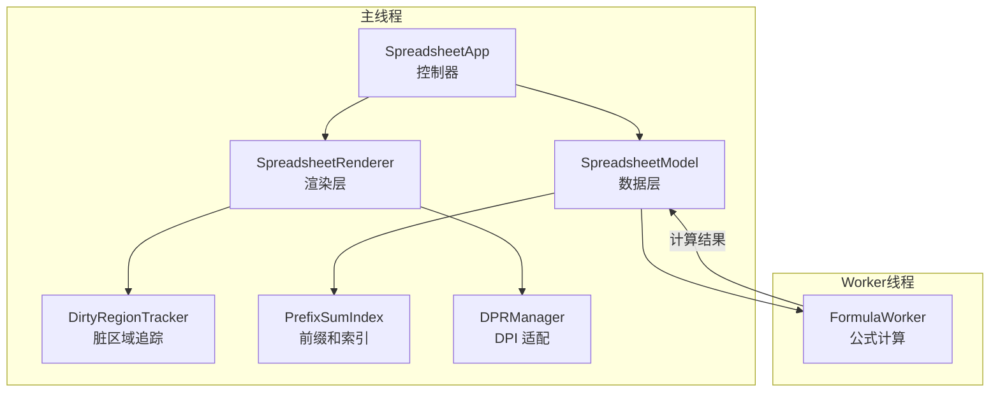
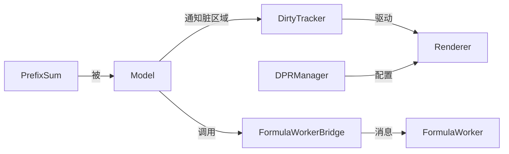
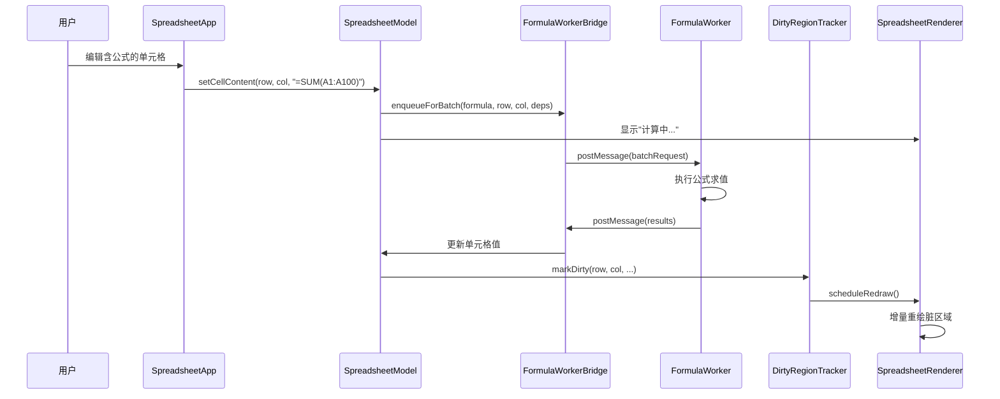

# 技术设计文档：性能与体验优化

## 概述

本设计文档针对 Canvas Excel (ice-excel) 的四大性能优化方向提供技术方案：

1. **大数据量滚动与渲染优化**：通过前缀和数组实现 O(log n) 行列定位，替代当前 O(n) 逐行遍历；引入帧时间监控和惯性滚动跳帧机制
2. **Web Worker 公式计算**：将公式求值迁移到独立 Worker 线程，主线程保持 UI 响应；支持批量重算和超时控制
3. **增量渲染**：引入脏区域追踪机制，仅重绘变更的单元格区域，减少不必要的全量 Canvas 重绘
4. **高 DPI 屏幕适配**：根据 `devicePixelRatio` 动态调整 Canvas 物理尺寸和绘制缩放，确保文字和线条在高分辨率屏幕上清晰锐利

### 设计原则

- **零运行时依赖**：所有优化方案使用原生浏览器 API，不引入第三方库
- **渐进增强**：各优化模块独立实现，可单独启用或禁用，不影响现有功能
- **向后兼容**：保持现有 `SpreadsheetModel`、`SpreadsheetRenderer`、`SpreadsheetApp` 的公共 API 不变

## 架构

### 整体架构变更



### 模块依赖关系



## 组件与接口

### 1. PrefixSumIndex（前缀和索引）

负责维护行高/列宽的前缀和数组，提供 O(log n) 的坐标定位能力。

**文件**：`src/prefix-sum-index.ts`

```typescript
export class PrefixSumIndex {
  private sizes: number[];        // 原始行高/列宽数组
  private prefixSums: number[];   // 前缀和数组，prefixSums[i] = sizes[0] + ... + sizes[i-1]
  private hiddenSet: Set<number>; // 隐藏行/列集合引用
  private dirty: boolean;         // 是否需要重建

  constructor(sizes: number[], hiddenSet: Set<number>);

  /** 重建前缀和数组（排除隐藏行/列） */
  rebuild(): void;

  /** 根据像素偏移量查找索引，O(log n) 二分查找 */
  getIndexAtOffset(offset: number): number;

  /** 获取指定索引的像素偏移量，O(1) 查找 */
  getOffsetAtIndex(index: number): number;

  /** 获取总像素长度，O(1) */
  getTotalSize(): number;

  /** 更新单个元素的尺寸，标记 dirty */
  update(index: number, newSize: number): void;

  /** 在指定位置插入元素 */
  insert(index: number, count: number, defaultSize: number): void;

  /** 删除指定位置的元素 */
  remove(index: number, count: number): void;
}
```

### 2. FormulaWorkerBridge（Worker 通信桥接）

主线程侧的 Worker 管理器，负责任务调度、超时控制和结果回调。

**文件**：`src/formula-worker-bridge.ts`

```typescript
/** Worker 消息类型 */
interface WorkerRequest {
  id: string;                    // 任务唯一 ID
  type: 'evaluate' | 'batch';
  formulas: Array<{
    formula: string;
    row: number;
    col: number;
    dependencies: Record<string, string>; // "row-col" -> 单元格内容
  }>;
}

interface WorkerResponse {
  id: string;
  results: Array<{
    row: number;
    col: number;
    value: string;
    error?: string;
  }>;
}

export class FormulaWorkerBridge {
  private worker: Worker | null;
  private pendingTasks: Map<string, {
    resolve: (results: WorkerResponse['results']) => void;
    reject: (error: Error) => void;
    timer: ReturnType<typeof setTimeout>;
  }>;
  private batchQueue: WorkerRequest['formulas'];
  private batchTimer: ReturnType<typeof setTimeout> | null;

  constructor();

  /** 提交单个公式计算任务 */
  evaluate(formula: string, row: number, col: number,
           dependencies: Record<string, string>): Promise<string>;

  /** 将公式加入批量队列，在下一个微任务中统一发送 */
  enqueueForBatch(formula: string, row: number, col: number,
                  dependencies: Record<string, string>): Promise<string>;

  /** 取消指定单元格的待处理任务 */
  cancelTask(row: number, col: number): void;

  /** 终止并重建 Worker（超时恢复） */
  private resetWorker(): void;

  /** 销毁 Worker */
  dispose(): void;
}
```

### 3. FormulaWorker（Worker 线程）

**文件**：`src/formula-worker.ts`

在 Worker 线程中运行，接收公式计算请求并返回结果。复用 `FormulaEngine` 的解析和求值逻辑。

```typescript
// Worker 入口，监听 message 事件
self.onmessage = (event: MessageEvent<WorkerRequest>) => {
  const { id, formulas } = event.data;
  const results = formulas.map(({ formula, row, col, dependencies }) => {
    // 使用 FormulaEngine 的纯计算逻辑求值
    // dependencies 提供所需的单元格数据
    return { row, col, value, error };
  });
  self.postMessage({ id, results });
};
```

### 4. DirtyRegionTracker（脏区域追踪器）

负责收集数据变更产生的脏区域，在 `requestAnimationFrame` 中批量处理。

**文件**：`src/dirty-region-tracker.ts`

```typescript
/** 脏区域矩形（像素坐标） */
interface DirtyRect {
  x: number;
  y: number;
  width: number;
  height: number;
}

export class DirtyRegionTracker {
  private dirtyRects: DirtyRect[];
  private isScrolling: boolean;
  private canvasArea: number;       // Canvas 总面积
  private rafId: number | null;

  constructor(canvasWidth: number, canvasHeight: number);

  /** 标记单元格为脏区域 */
  markDirty(row: number, col: number, x: number, y: number,
            width: number, height: number): void;

  /** 标记合并单元格为脏区域（整个合并区域） */
  markMergedDirty(startRow: number, startCol: number,
                  x: number, y: number, width: number, height: number): void;

  /** 设置滚动状态（滚动时强制全量重绘） */
  setScrolling(scrolling: boolean): void;

  /** 判断是否应该全量重绘（脏区域面积 > 50% Canvas 面积） */
  shouldFullRedraw(): boolean;

  /** 获取并清空脏区域队列 */
  flush(): DirtyRect[];

  /** 调度下一帧重绘 */
  scheduleRedraw(callback: () => void): void;

  /** 更新 Canvas 尺寸 */
  updateCanvasSize(width: number, height: number): void;
}
```

### 5. DPRManager（DPI 适配管理器）

**文件**：`src/dpr-manager.ts`

```typescript
export class DPRManager {
  private canvas: HTMLCanvasElement;
  private ctx: CanvasRenderingContext2D;
  private currentDPR: number;
  private cssWidth: number;
  private cssHeight: number;
  private mediaQuery: MediaQueryList | null;
  private onDPRChange: (() => void) | null;

  constructor(canvas: HTMLCanvasElement, ctx: CanvasRenderingContext2D);

  /** 获取当前 DPR */
  getDPR(): number;

  /** 应用 DPR 缩放：设置 Canvas 物理尺寸并执行 ctx.scale */
  applyScale(): void;

  /** 更新 CSS 尺寸（窗口缩放时调用） */
  updateSize(cssWidth: number, cssHeight: number): void;

  /** 监听 DPR 变化事件 */
  onDPRChanged(callback: () => void): void;

  /** 计算 1 物理像素对应的 CSS 像素值 */
  getPhysicalPixel(): number;

  /** 销毁监听器 */
  dispose(): void;
}
```

### 组件交互时序



## 数据模型

### PrefixSumIndex 内部数据结构

```typescript
// 前缀和数组示例（行高场景）
// sizes:      [25, 25, 30, 25, 25]  // 原始行高
// prefixSums: [0, 25, 50, 80, 105, 130]  // prefixSums[i] = sum(sizes[0..i-1])
// 
// getOffsetAtIndex(3) = prefixSums[3] = 80
// getIndexAtOffset(60) → 二分查找 → 返回 2（第3行）
// getTotalSize() = prefixSums[length] = 130
```

### Worker 消息协议

```typescript
// 主线程 → Worker
interface WorkerRequest {
  id: string;                    // UUID，用于匹配响应
  type: 'evaluate' | 'batch';   // 单个求值 / 批量求值
  formulas: Array<{
    formula: string;             // 公式字符串，如 "=SUM(A1:A10)"
    row: number;                 // 公式所在行
    col: number;                 // 公式所在列
    dependencies: Record<string, string>; // 依赖单元格数据快照
  }>;
}

// Worker → 主线程
interface WorkerResponse {
  id: string;                    // 与请求匹配的 UUID
  results: Array<{
    row: number;
    col: number;
    value: string;               // 计算结果字符串
    error?: string;              // 错误信息（如 #VALUE!, #DIV/0!）
  }>;
}
```

### DirtyRect 数据结构

```typescript
interface DirtyRect {
  x: number;      // 脏区域左上角 X（Canvas 像素坐标）
  y: number;      // 脏区域左上角 Y
  width: number;  // 脏区域宽度
  height: number; // 脏区域高度
}
```

### 现有类型扩展

```typescript
// 扩展 Viewport 接口（types.ts）
interface Viewport {
  // ... 现有字段保持不变
  scrollX: number;
  scrollY: number;
  startRow: number;
  startCol: number;
  endRow: number;
  endCol: number;
  offsetX: number;
  offsetY: number;
}

// 扩展 Cell 接口（types.ts）
interface Cell {
  // ... 现有字段保持不变
  isComputing?: boolean;  // 公式正在 Worker 中计算
}
```


## 正确性属性

*正确性属性是指在系统所有有效执行中都应成立的特征或行为——本质上是对系统应做什么的形式化陈述。属性是连接人类可读规格说明与机器可验证正确性保证之间的桥梁。*

### 属性 1：前缀和定位与逐行遍历结果一致

*对于任意* 行高数组（元素为正整数）和任意隐藏行集合，以及任意像素偏移量 y（0 ≤ y ≤ 总高度），`PrefixSumIndex.getIndexAtOffset(y)` 的返回值应与当前 `SpreadsheetModel.getRowAtY(y)` 逐行遍历的返回值完全一致。同理适用于列宽和 `getColAtX`。

**验证需求：1.6**

### 属性 2：按需加载单次扩展行数不超过 500

*对于任意* 当前行数 N 和任意视口结束行 endRow，当 `endRow >= N - 50` 触发数据扩展时，扩展后的总行数应满足 `newRowCount - N <= 500`。

**验证需求：1.4**

### 属性 3：Worker 计算结果与主线程一致

*对于任意* 有效公式字符串、单元格位置和依赖数据集合，`FormulaWorker` 在 Worker 线程中的计算结果应与 `FormulaEngine.evaluate()` 在主线程中的计算结果完全一致（值和错误类型均相同）。

**验证需求：2.1, 2.8**

### 属性 4：Worker 结果回写往返正确性

*对于任意* 公式计算结果（包含 row、col、value），当 `FormulaWorkerBridge` 接收到 Worker 响应后，`Model.getCell(row, col).content` 应等于响应中的 `value` 值。

**验证需求：2.4**

### 属性 5：全量重绘判断正确性

*对于任意* 一组脏区域矩形和 Canvas 尺寸，`DirtyRegionTracker.shouldFullRedraw()` 应在以下任一条件成立时返回 `true`：(a) 脏区域总面积超过 Canvas 面积的 50%；(b) 当前处于滚动状态。其他情况返回 `false`。

**验证需求：3.4, 3.5**

### 属性 6：脏区域标记正确性

*对于任意* 单元格变更（内容或样式），`DirtyRegionTracker` 中应存在覆盖该单元格的脏区域矩形。若该单元格属于合并单元格区域，则脏区域应覆盖整个合并区域（从合并起始单元格到结束单元格的完整矩形）。

**验证需求：3.7, 3.8**

### 属性 7：DPR 尺寸计算正确性

*对于任意* 正数 DPR 值和正整数 CSS 宽高（cssWidth, cssHeight），`DPRManager.applyScale()` 执行后，Canvas 元素的 `width` 属性应等于 `Math.round(cssWidth * dpr)`，`height` 属性应等于 `Math.round(cssHeight * dpr)`，且 Canvas 的 `style.width` 应等于 `cssWidth + 'px'`，`style.height` 应等于 `cssHeight + 'px'`。

**验证需求：4.1, 4.2, 4.7**

### 属性 8：网格线物理像素宽度

*对于任意* 正数 DPR 值，渲染网格线时设置的 `ctx.lineWidth` 应等于 `1 / dpr`，确保在高 DPI 屏幕上渲染为恰好 1 物理像素宽度。

**验证需求：4.5**

## 错误处理

### Worker 相关错误

| 错误场景 | 处理策略 |
|---------|---------|
| Worker 创建失败（浏览器不支持） | 回退到主线程同步计算，记录警告日志 |
| Worker 计算超时（>5秒） | 终止 Worker，在单元格显示 `#TIMEOUT!`，自动重建新 Worker |
| Worker 运行时异常 | 捕获 `error` 事件，在单元格显示 `#ERROR!`，重建 Worker |
| Worker 消息格式错误 | 忽略无效消息，记录错误日志 |

### 渲染相关错误

| 错误场景 | 处理策略 |
|---------|---------|
| 帧时间超过 16ms | 输出 `console.warn` 性能警告，包含帧耗时和视口范围 |
| Canvas context 获取失败 | 抛出初始化错误，阻止应用启动 |
| DPR 值异常（≤0 或 NaN） | 回退使用 DPR=1 |

### 数据相关错误

| 错误场景 | 处理策略 |
|---------|---------|
| 前缀和数组与实际数据不一致 | 在行高/列宽变更时标记 dirty，下次查询前自动重建 |
| 脏区域坐标越界 | 裁剪到 Canvas 有效范围内 |

## 测试策略

### 双重测试方法

本特性采用单元测试与属性测试相结合的方式：

- **单元测试**：验证具体示例、边界条件和错误场景
- **属性测试**：验证跨所有输入的通用属性

两者互补，单元测试捕获具体 bug，属性测试验证通用正确性。

### 属性测试配置

- **测试库**：[fast-check](https://github.com/dubzzz/fast-check)（TypeScript 原生支持的属性测试库）
- **每个属性测试最少运行 100 次迭代**
- **每个属性测试必须通过注释引用设计文档中的属性编号**
- **标签格式**：`Feature: performance-optimization, Property {number}: {property_text}`
- **每个正确性属性由一个属性测试实现**

### 单元测试范围

| 模块 | 测试重点 |
|------|---------|
| PrefixSumIndex | 空数组、单元素、隐藏行/列、插入/删除后重建 |
| FormulaWorkerBridge | 超时处理、任务取消、Worker 重建、批量合并 |
| DirtyRegionTracker | 空队列、单区域、多区域合并、面积阈值边界 |
| DPRManager | DPR=1/2/3、DPR 变化事件、窗口缩放 |

### 属性测试范围

| 属性编号 | 测试描述 | 生成器 |
|---------|---------|--------|
| 属性 1 | 前缀和定位 vs 逐行遍历 | 随机行高数组 + 随机隐藏集合 + 随机偏移量 |
| 属性 2 | 按需加载行数限制 | 随机当前行数 + 随机视口位置 |
| 属性 3 | Worker vs 主线程计算一致性 | 随机简单公式 + 随机依赖数据 |
| 属性 4 | Worker 结果回写往返 | 随机单元格位置 + 随机计算结果 |
| 属性 5 | 全量重绘判断 | 随机脏区域矩形集合 + 随机 Canvas 尺寸 + 随机滚动状态 |
| 属性 6 | 脏区域标记 | 随机单元格变更 + 随机合并单元格配置 |
| 属性 7 | DPR 尺寸计算 | 随机 DPR (0.5~4) + 随机 CSS 尺寸 |
| 属性 8 | 网格线像素宽度 | 随机 DPR (0.5~4) |

### 集成测试

- 100,000 行数据首屏渲染时间 < 2 秒（需求 1.1）
- 100,000 行数据滚动帧时间 < 16ms（需求 1.2）
- 惯性滚动跳帧验证（需求 1.3）
- Worker 超时恢复流程（需求 2.6）
- 编辑期间任务取消流程（需求 2.7）
