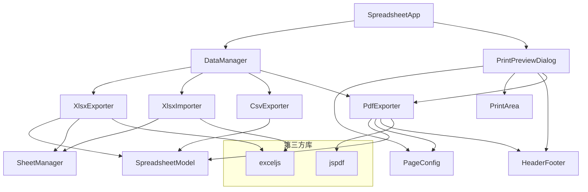

# 设计文档：打印与导出

## 概述

本设计为 Canvas Excel（ice-excel）新增打印与导出功能模块，涵盖：
1. 打印预览与页面设置（浏览器原生打印 API）
2. 打印区域与页眉页脚
3. XLSX 导出/导入（通过 ExcelJS 库）
4. CSV 导出（纯 TypeScript 实现，零依赖）
5. PDF 导出（通过 jsPDF 库）

该模块遵循现有 MVC 架构，在 DataManager 基础上扩展，新增独立的导出器/导入器类。CSV 导出保持零运行时依赖；XLSX 和 PDF 功能引入最小化的第三方库作为运行时依赖。

### 技术选型决策

| 功能 | 方案 | 理由 |
|------|------|------|
| XLSX 导出/导入 | ExcelJS | 纯 JS 实现，支持流式写入，类型定义完善，支持样式/合并/公式，体积适中（~500KB gzipped） |
| PDF 导出 | jsPDF + jsPDF-AutoTable | 纯 JS 实现，支持中文字体嵌入，表格渲染插件成熟 |
| CSV 导出 | 手写实现 | RFC 4180 规范简单，无需引入依赖 |
| 打印预览 | 浏览器原生 `window.print()` | 零依赖，利用 CSS `@media print` 控制打印样式 |

## 架构

### 模块关系图



### 文件结构

```
src/
├── print-export/
│   ├── types.ts              # 打印导出相关类型定义
│   ├── page-config.ts        # 页面配置（纸张/方向/边距）
│   ├── print-area.ts         # 打印区域管理
│   ├── header-footer.ts      # 页眉页脚处理
│   ├── print-preview-dialog.ts  # 打印预览对话框
│   ├── xlsx-exporter.ts      # XLSX 导出
│   ├── xlsx-importer.ts      # XLSX 导入
│   ├── csv-exporter.ts       # CSV 导出
│   └── pdf-exporter.ts       # PDF 导出
```

### 集成方式

- `DataManager` 新增 `exportToXlsx()`、`importFromXlsx()`、`exportToCsv()`、`exportToPdf()` 公共方法，作为外部调用入口
- `SpreadsheetApp` 新增工具栏按钮事件绑定和右键菜单项
- 打印预览对话框复用现有 `Modal` 组件的遮罩层模式，但使用自定义全屏布局
- 打印区域配置持久化到 `WorkbookData` 的 `metadata` 字段中

## 组件与接口

### 1. PageConfig — 页面配置

负责管理打印页面参数，提供分页计算能力。

```typescript
class PageConfig {
  paperSize: PaperSize;        // 'A4' | 'A3' | 'Letter' | 'Legal'
  orientation: Orientation;     // 'portrait' | 'landscape'
  margins: PageMargins;         // { top, bottom, left, right } (mm)
  
  /** 获取可用打印区域尺寸（扣除边距后），单位 mm */
  getContentArea(): { width: number; height: number };
  
  /** 根据行高/列宽计算分页断点 */
  calculatePageBreaks(
    rowHeights: number[],
    colWidths: number[],
    startRow: number, endRow: number,
    startCol: number, endCol: number
  ): PageBreakResult;
  
  /** 序列化为 JSON（用于持久化） */
  serialize(): PageConfigData;
  
  /** 从 JSON 反序列化 */
  static deserialize(data: PageConfigData): PageConfig;
}
```

### 2. PrintArea — 打印区域管理

管理用户自定义的打印范围，与 SpreadsheetModel 的数据范围检测配合。

```typescript
class PrintArea {
  /** 设置打印区域 */
  set(range: CellRange): void;
  
  /** 清除打印区域 */
  clear(): void;
  
  /** 获取有效打印范围（未设置时返回数据范围） */
  getEffectiveRange(model: SpreadsheetModel): CellRange;
  
  /** 是否已设置自定义打印区域 */
  isSet(): boolean;
  
  /** 序列化 */
  serialize(): CellRange | null;
  
  /** 反序列化 */
  static deserialize(data: CellRange | null): PrintArea;
}
```

### 3. HeaderFooter — 页眉页脚

处理页眉页脚模板的解析与变量替换。

```typescript
class HeaderFooter {
  header: HeaderFooterSection;  // { left, center, right }
  footer: HeaderFooterSection;
  
  /** 渲染页眉文本（替换占位符） */
  renderHeader(context: HeaderFooterContext): HeaderFooterSection;
  
  /** 渲染页脚文本（替换占位符） */
  renderFooter(context: HeaderFooterContext): HeaderFooterSection;
  
  /** 是否有内容 */
  isEmpty(): boolean;
  
  /** 序列化 */
  serialize(): HeaderFooterData;
  
  /** 反序列化 */
  static deserialize(data: HeaderFooterData): HeaderFooter;
}
```

占位符替换规则：
- `{page}` → 当前页码
- `{pages}` → 总页数
- `{date}` → 当前日期（yyyy-MM-dd）
- `{time}` → 当前时间（HH:mm）
- `{sheetName}` → 工作表名称

### 4. PrintPreviewDialog — 打印预览对话框

全屏模态对话框，提供分页预览、页面设置和打印触发。

```typescript
class PrintPreviewDialog {
  constructor(
    model: SpreadsheetModel,
    sheetManager: SheetManager | null,
    pageConfig: PageConfig,
    printArea: PrintArea,
    headerFooter: HeaderFooter
  );
  
  /** 打开预览对话框 */
  open(): void;
  
  /** 关闭对话框 */
  close(): void;
  
  /** 执行打印（调用 window.print） */
  print(): void;
  
  /** 页面设置变更时重新计算分页（500ms 内响应） */
  private refreshPreview(): void;
  
  /** 渲染指定页到预览区域 */
  private renderPage(pageIndex: number): void;
}
```

### 5. XlsxExporter — XLSX 导出

将工作簿数据转换为 .xlsx 文件。

```typescript
class XlsxExporter {
  constructor(sheetManager: SheetManager | null, model: SpreadsheetModel);
  
  /** 导出为 XLSX 并触发下载 */
  async export(filename?: string): Promise<void>;
  
  /** 将 Cell 样式映射到 ExcelJS 样式 */
  private mapCellStyle(cell: Cell): ExcelJS.Style;
  
  /** 将 CellBorder 映射到 ExcelJS 边框 */
  private mapBorder(border: CellBorder): ExcelJS.Borders;
  
  /** 将 CellFormat 映射到 ExcelJS 数字格式 */
  private mapNumberFormat(format: CellFormat): string;
}
```

### 6. XlsxImporter — XLSX 导入

解析 .xlsx 文件并加载到工作簿。

```typescript
class XlsxImporter {
  constructor(sheetManager: SheetManager | null, model: SpreadsheetModel);
  
  /** 从 File 对象导入 */
  async import(file: File): Promise<ImportResult>;
  
  /** 将 ExcelJS 样式映射回 Cell 属性 */
  private mapStyleToCell(style: ExcelJS.Style): Partial<Cell>;
  
  /** 将 ExcelJS 数字格式映射回 CellFormat */
  private mapNumberFormatToCell(numFmt: string): CellFormat | undefined;
  
  /** 将解析结果转换为 WorkbookData */
  private toWorkbookData(workbook: ExcelJS.Workbook): WorkbookData;
}
```

### 7. CsvExporter — CSV 导出

纯 TypeScript 实现，无第三方依赖。

```typescript
class CsvExporter {
  constructor(model: SpreadsheetModel);
  
  /** 导出为 CSV 并触发下载 */
  export(options: CsvExportOptions): void;
  
  /** 将单元格矩阵转换为 CSV 字符串 */
  toCsvString(
    model: SpreadsheetModel,
    range: CellRange
  ): string;
  
  /** 对字段值进行 CSV 转义 */
  private escapeField(value: string): string;
  
  /** 获取单元格显示值 */
  private getDisplayValue(cell: Cell): string;
}
```

### 8. PdfExporter — PDF 导出

使用 jsPDF 将电子表格渲染为 PDF。

```typescript
class PdfExporter {
  constructor(
    model: SpreadsheetModel,
    pageConfig: PageConfig,
    headerFooter: HeaderFooter,
    printArea: PrintArea
  );
  
  /** 导出为 PDF 并触发下载 */
  async export(filename?: string): Promise<void>;
  
  /** 渲染单页表格内容到 PDF */
  private renderPage(
    doc: jsPDF,
    pageData: PageData,
    pageIndex: number,
    totalPages: number
  ): void;
  
  /** 渲染页眉页脚 */
  private renderHeaderFooter(
    doc: jsPDF,
    pageIndex: number,
    totalPages: number
  ): void;
}
```

## 数据模型

### 新增类型定义（`src/print-export/types.ts`）

```typescript
/** 纸张大小 */
type PaperSize = 'A4' | 'A3' | 'Letter' | 'Legal';

/** 纸张尺寸映射（mm） */
const PAPER_DIMENSIONS: Record<PaperSize, { width: number; height: number }> = {
  A4: { width: 210, height: 297 },
  A3: { width: 297, height: 420 },
  Letter: { width: 216, height: 279 },
  Legal: { width: 216, height: 356 },
};

/** 页面方向 */
type Orientation = 'portrait' | 'landscape';

/** 页面边距（mm） */
interface PageMargins {
  top: number;     // 0-100
  bottom: number;  // 0-100
  left: number;    // 0-100
  right: number;   // 0-100
}

/** 页面配置序列化数据 */
interface PageConfigData {
  paperSize: PaperSize;
  orientation: Orientation;
  margins: PageMargins;
}

/** 单元格范围 */
interface CellRange {
  startRow: number;
  startCol: number;
  endRow: number;
  endCol: number;
}

/** 页眉页脚区段 */
interface HeaderFooterSection {
  left: string;
  center: string;
  right: string;
}

/** 页眉页脚序列化数据 */
interface HeaderFooterData {
  header: HeaderFooterSection;
  footer: HeaderFooterSection;
}

/** 页眉页脚渲染上下文 */
interface HeaderFooterContext {
  page: number;
  pages: number;
  date: string;
  time: string;
  sheetName: string;
}

/** 分页计算结果 */
interface PageBreakResult {
  pages: PageData[];
  totalPages: number;
}

/** 单页数据范围 */
interface PageData {
  rowStart: number;
  rowEnd: number;
  colStart: number;
  colEnd: number;
}

/** CSV 导出选项 */
interface CsvExportOptions {
  filename?: string;
  usePrintArea?: boolean;  // 是否仅导出打印区域
}

/** XLSX/PDF 导入结果 */
interface ImportResult {
  success: boolean;
  errors: string[];
  warnings: string[];
}
```

### WorkbookData 扩展

在现有 `WorkbookSheetEntry.metadata` 中新增打印配置字段：

```typescript
// metadata 中新增的字段
interface SheetPrintMetadata {
  printArea?: CellRange | null;
  pageConfig?: PageConfigData;
  headerFooter?: HeaderFooterData;
}
```

这些字段通过 `metadata` 对象持久化，不影响现有 `WorkbookData` 的 `version: "2.0"` 格式兼容性。

### Cell 到 XLSX 的属性映射

| Cell 属性 | ExcelJS 属性 | 说明 |
|-----------|-------------|------|
| `content` | `cell.value` | 文本内容 |
| `rawValue` | `cell.value` (number) | 数值 |
| `formulaContent` | `cell.value = { formula }` | 公式字符串 |
| `fontBold` | `font.bold` | 加粗 |
| `fontItalic` | `font.italic` | 斜体 |
| `fontUnderline` | `font.underline` | 下划线 |
| `fontStrikethrough` | `font.strike` | 删除线 |
| `fontSize` | `font.size` | 字号 |
| `fontColor` | `font.color.argb` | 字体颜色 |
| `fontFamily` | `font.name` | 字体族 |
| `bgColor` | `fill.fgColor.argb` | 背景色 |
| `fontAlign` | `alignment.horizontal` | 水平对齐 |
| `verticalAlign` | `alignment.vertical` | 垂直对齐 |
| `wrapText` | `alignment.wrapText` | 自动换行 |
| `border` | `border.{top,bottom,left,right}` | 边框样式 |
| `format.pattern` | `numFmt` | 数字格式 |
| `rowSpan/colSpan` | `worksheet.mergeCells()` | 合并单元格 |

### BorderStyle 映射

| Cell BorderStyle | ExcelJS style |
|-----------------|---------------|
| `'solid'` | `'thin'` (width≤1) / `'medium'` (width≤2) / `'thick'` |
| `'dashed'` | `'dashed'` |
| `'dotted'` | `'dotted'` |
| `'double'` | `'double'` |


## 正确性属性

*正确性属性是在系统所有有效执行中都应成立的特征或行为——本质上是关于系统应该做什么的形式化陈述。属性是人类可读规范与机器可验证正确性保证之间的桥梁。*

### 属性 1：方向切换交换内容区域尺寸

*对于任意*纸张大小和边距配置，纵向模式下的内容区域宽度应等于横向模式下的内容区域高度，反之亦然。

**验证需求：1.3**

### 属性 2：边距值约束在有效范围内

*对于任意*数值作为边距输入，PageConfig 应将其钳制到 [0, 100] 范围内。负值应被钳制为 0，超过 100 的值应被钳制为 100。

**验证需求：1.4**

### 属性 3：打印区域设置/获取一致性

*对于任意*有效的单元格范围，将其设置为打印区域后，调用 `getEffectiveRange()` 应返回与设置时完全相同的范围。

**验证需求：2.1, 2.2**

### 属性 4：打印区域设置后清除恢复默认

*对于任意*打印区域，先设置再清除后，`isSet()` 应返回 false，`getEffectiveRange()` 应回退到数据范围而非之前设置的打印区域。

**验证需求：2.3**

### 属性 5：默认打印范围覆盖所有数据单元格

*对于任意*包含数据的 SpreadsheetModel（未设置打印区域时），`getEffectiveRange()` 返回的范围应包含所有非空单元格，且不应有非空单元格落在该范围之外。

**验证需求：2.4**

### 属性 6：打印区域序列化往返一致性

*对于任意* PrintArea 配置（包括已设置和未设置两种状态），序列化后再反序列化应产生等价的 PrintArea 对象，即 `isSet()` 状态和范围值均保持一致。

**验证需求：2.5**

### 属性 7：页眉页脚占位符替换完整性

*对于任意*包含占位符 `{page}`、`{pages}`、`{date}`、`{time}`、`{sheetName}` 的模板字符串，以及任意有效的 HeaderFooterContext，渲染后的输出不应包含任何未替换的占位符标记，且每个占位符应被替换为上下文中对应的实际值。

**验证需求：3.2, 3.3**

### 属性 8：空页眉页脚检测

*对于任意* HeaderFooter 对象，当且仅当所有六个文本字段（header.left、header.center、header.right、footer.left、footer.center、footer.right）均为空字符串时，`isEmpty()` 应返回 true。

**验证需求：3.4**

### 属性 9：XLSX 导出/导入往返一致性

*对于任意*有效的 WorkbookData 对象（包含单元格内容、数值、公式、字体样式、背景色、对齐、边框、合并单元格、行高、列宽、数字格式、自动换行），导出为 XLSX 后再导入应产生等价的 WorkbookData 对象。等价性比较应覆盖所有可导出的单元格属性。

**验证需求：4.2, 4.3, 4.4, 4.5, 4.6, 4.7, 5.2, 5.3, 5.4, 5.5, 5.6, 5.7, 5.10, 5.11**

### 属性 10：CSV 字段转义往返一致性

*对于任意*字符串值（包括包含逗号、换行符、双引号、中文字符的字符串），经过 `escapeField()` 转义后，按照 RFC 4180 规则解析应还原为原始字符串。

**验证需求：6.3**

### 属性 11：CSV 导出使用显示值

*对于任意*具有数字格式的单元格（如货币、百分比、日期），CSV 导出的字段值应等于该单元格的格式化显示文本，而非原始数值的字符串表示。

**验证需求：6.4**

### 属性 12：CSV 合并单元格仅在左上角输出

*对于任意*包含合并单元格的 SpreadsheetModel，CSV 输出中合并区域的左上角位置应包含单元格内容，合并区域内其余所有位置应输出空字符串。

**验证需求：6.7**

### 属性 13：CSV 打印区域过滤

*对于任意* SpreadsheetModel 和已设置的打印区域，当 `usePrintArea` 选项为 true 时，CSV 输出的行列数应精确匹配打印区域的行列范围，不包含打印区域外的数据。

**验证需求：6.5**

### 属性 14：分页计算与页面配置一致性

*对于任意*行高/列宽数组和 PageConfig，`calculatePageBreaks()` 返回的每一页数据范围内的行高之和不应超过内容区域高度，列宽之和不应超过内容区域宽度。

**验证需求：7.3, 1.3**

## 错误处理

### XLSX 导出错误
- ExcelJS 库加载失败：显示提示"XLSX 导出功能不可用，请检查网络连接"
- 数据转换异常（如不支持的单元格类型）：捕获异常，记录警告，跳过问题单元格继续导出
- Blob 创建或下载触发失败：显示提示"文件下载失败，请重试"

### XLSX 导入错误
- 文件格式无效（非 ZIP 或非 XLSX 结构）：显示"文件格式无效，请选择有效的 .xlsx 文件"
- 文件损坏（ZIP 解压失败）：显示"文件已损坏，无法读取"
- 不支持的功能（VBA 宏、数据透视表缓存等）：跳过并在导入完成后显示警告列表
- 样式映射失败（未知格式代码）：回退到默认格式，记录警告

### CSV 导出错误
- CSV 为纯文本生成，几乎不会出错
- Blob 创建或下载触发失败：显示提示"文件下载失败，请重试"

### PDF 导出错误
- jsPDF 库加载失败：显示提示"PDF 导出功能不可用，请检查网络连接"
- 中文字体加载失败：回退到默认字体，显示警告"中文字符可能无法正确显示"
- 内存不足（数据量过大）：捕获异常，建议用户缩小打印区域

### 打印预览错误
- 分页计算异常：回退到单页显示全部内容
- `window.print()` 被浏览器阻止：显示提示"打印被浏览器阻止，请检查弹窗设置"

### 通用错误处理策略
- 所有异步操作使用 `try/catch` 包裹
- 错误信息通过现有 `Modal.alert()` 组件显示
- 警告信息通过 `console.warn()` 记录，重要警告通过 Modal 显示
- 不修改用户当前工作簿数据，除非操作明确成功

## 测试策略

### 测试框架

- 单元测试与属性测试：Vitest + fast-check（项目已有配置）
- E2E 测试：Playwright（项目已有配置）
- 测试文件位置：`src/__tests__/print-export/`

### 属性测试（Property-Based Testing）

每个属性测试使用 fast-check 库，最少运行 100 次迭代。每个正确性属性对应一个属性测试。

测试标签格式：`Feature: print-and-export, Property {N}: {属性描述}`

| 属性 | 测试文件 | 生成器策略 |
|------|---------|-----------|
| P1: 方向交换尺寸 | `page-config.pbt.test.ts` | 随机纸张大小 + 随机边距 |
| P2: 边距钳制 | `page-config.pbt.test.ts` | 随机数值（含负数和超大值） |
| P3: 打印区域设置/获取 | `print-area.pbt.test.ts` | 随机 CellRange |
| P4: 打印区域清除 | `print-area.pbt.test.ts` | 随机 CellRange |
| P5: 默认数据范围 | `print-area.pbt.test.ts` | 随机稀疏单元格矩阵 |
| P6: 打印区域序列化往返 | `print-area.pbt.test.ts` | 随机 PrintArea 状态 |
| P7: 占位符替换 | `header-footer.pbt.test.ts` | 随机模板 + 随机上下文值 |
| P8: 空检测 | `header-footer.pbt.test.ts` | 随机 6 字段组合（空/非空） |
| P9: XLSX 往返 | `xlsx-roundtrip.pbt.test.ts` | 随机 WorkbookData（含样式/合并/格式） |
| P10: CSV 转义往返 | `csv-exporter.pbt.test.ts` | 随机字符串（含特殊字符） |
| P11: CSV 显示值 | `csv-exporter.pbt.test.ts` | 随机数值 + 随机格式 |
| P12: CSV 合并单元格 | `csv-exporter.pbt.test.ts` | 随机合并区域矩阵 |
| P13: CSV 打印区域过滤 | `csv-exporter.pbt.test.ts` | 随机数据 + 随机打印区域 |
| P14: 分页计算 | `page-config.pbt.test.ts` | 随机行高/列宽数组 + 随机页面配置 |

### 单元测试

单元测试聚焦于具体示例、边界情况和错误条件：

| 测试范围 | 测试文件 | 关注点 |
|---------|---------|--------|
| PageConfig | `page-config.test.ts` | 各纸张尺寸的精确数值、边距边界值 0 和 100 |
| PrintArea | `print-area.test.ts` | 空模型的默认范围、单单元格打印区域 |
| HeaderFooter | `header-footer.test.ts` | 各占位符的具体替换结果、无占位符的透传 |
| CsvExporter | `csv-exporter.test.ts` | UTF-8 BOM 前缀、空表格导出、中文内容 |
| XlsxExporter | `xlsx-exporter.test.ts` | 各 BorderStyle 映射、颜色格式转换 |
| XlsxImporter | `xlsx-importer.test.ts` | 无效文件错误处理、不支持功能的警告 |
| PdfExporter | `pdf-exporter.test.ts` | 页面尺寸设置、中文字体加载 |

### E2E 测试

通过 Playwright 测试完整用户流程：

- 打印预览对话框的打开/关闭
- 页面设置参数修改后预览更新
- XLSX 导出下载验证
- CSV 导出下载验证
- XLSX 文件导入后数据验证
