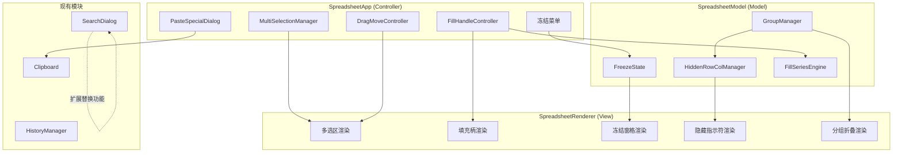

# 设计文档：选区与编辑增强

## 概述

本设计为 ice-excel Canvas 电子表格应用增加 11 项选区与编辑增强功能。核心变更是将现有的单选区模型（`Selection`）扩展为多选区模型（`MultiSelection`），并在此基础上实现填充柄、查找替换、选择性粘贴、拖拽移动、批量删除、冻结窗格、隐藏行列、分组折叠等功能。

设计遵循现有 MVC 架构：
- **Model 层**（`SpreadsheetModel`）：新增隐藏行列状态、分组数据、冻结配置、填充序列推断逻辑
- **View 层**（`SpreadsheetRenderer`）：扩展多选区渲染、填充柄绘制、冻结区域分区渲染、隐藏指示符、分组折叠按钮
- **Controller 层**（`SpreadsheetApp`）：扩展鼠标/键盘事件处理，协调多选区交互、拖拽移动、选择性粘贴对话框

所有新增代码使用 TypeScript strict 模式，零运行时依赖，颜色从 `themeColors` 读取，UI 文本使用简体中文。

## 架构

### 整体架构变更



### 模块职责划分

| 新增模块 | 文件 | 职责 |
|---------|------|------|
| MultiSelectionManager | `src/multi-selection.ts` | 多选区状态管理、选区增删、合并计算 |
| FillSeriesEngine | `src/fill-series.ts` | 填充序列模式推断与数据生成 |
| PasteSpecialDialog | `src/paste-special-dialog.ts` | 选择性粘贴 UI 对话框 |
| GroupManager | `src/group-manager.ts` | 行列分组数据管理、嵌套层级 |

| 扩展模块 | 变更内容 |
|---------|---------|
| `src/types.ts` | 新增 MultiSelection、FreezeConfig、RowColumnGroup 等接口 |
| `src/app.ts` | 多选区交互、填充柄拖拽、拖拽移动、快捷键扩展 |
| `src/model.ts` | 隐藏行列状态、冻结配置、批量删除、填充操作 |
| `src/renderer.ts` | 多选区渲染、填充柄绘制、冻结分区、隐藏指示符、分组按钮 |
| `src/search-dialog.ts` | 替换输入框、替换/全部替换按钮、模式切换 |
| `src/history-manager.ts` | 新增 ActionType（batchDelete、hide、group、freeze、fill、dragMove、pasteSpecial、replace） |

## 组件与接口

### 1. 多选区管理（MultiSelectionManager）

```typescript
// src/multi-selection.ts
export class MultiSelectionManager {
  private selections: Selection[];
  private activeIndex: number;

  /** 清除所有选区，设置单选区 */
  public setSingle(selection: Selection): void;

  /** 添加一个新选区（Ctrl+点击） */
  public addSelection(selection: Selection): void;

  /** 获取所有选区 */
  public getSelections(): Selection[];

  /** 获取当前活动选区 */
  public getActiveSelection(): Selection | null;

  /** 获取所有选区覆盖的单元格位置集合 */
  public getAllCells(): CellPosition[];

  /** 判断指定单元格是否在任意选区内 */
  public containsCell(row: number, col: number): boolean;

  /** 清除所有选区 */
  public clear(): void;

  /** 获取选区数量 */
  public getCount(): number;

  /** 设置全选 */
  public selectAll(maxRow: number, maxCol: number): void;

  /** 判断是否为全选状态 */
  public isSelectAll(): boolean;
}
```

**与 SpreadsheetApp 的集成**：
- `SpreadsheetApp` 内部将 `currentSelection: Selection | null` 替换为 `multiSelection: MultiSelectionManager`
- 向后兼容：`getActiveSelection()` 返回值等价于原 `currentSelection`
- `handleMouseDown` 中检测 `event.ctrlKey`（或 `event.metaKey`），决定调用 `setSingle` 还是 `addSelection`
- 格式化操作（加粗、字体颜色等）遍历 `multiSelection.getAllCells()` 应用

**与 SpreadsheetRenderer 的集成**：
- 新增 `setMultiSelection(selections: Selection[], activeIndex: number)` 方法
- `renderSelection()` 遍历所有选区分别绘制背景和边框
- 活动选区使用 `selectionBorder` 颜色，非活动选区使用半透明变体

### 2. 整行/整列选择

在 `SpreadsheetApp.handleMouseDown` 中扩展行号/列号点击逻辑：

```typescript
// 行号点击扩展逻辑（伪代码）
if (clickedRow !== null) {
  const fullRowSelection: Selection = {
    startRow: clickedRow, startCol: 0,
    endRow: clickedRow, endCol: model.getColCount() - 1
  };

  if (event.ctrlKey || event.metaKey) {
    multiSelection.addSelection(fullRowSelection);
  } else if (event.shiftKey && multiSelection.getActiveSelection()) {
    // 扩展到范围
    const active = multiSelection.getActiveSelection();
    multiSelection.setSingle({
      startRow: Math.min(active.startRow, clickedRow),
      startCol: 0,
      endRow: Math.max(active.endRow, clickedRow),
      endCol: model.getColCount() - 1
    });
  } else {
    multiSelection.setSingle(fullRowSelection);
  }
}
```

行号区域拖拽：在 `handleMouseMove` 中检测拖拽起始于行号区域时，连续扩展选区覆盖经过的所有行。

### 3. 全选（Ctrl+A）

在 `handleKeyDown` 中添加：

```typescript
if ((event.ctrlKey || event.metaKey) && event.key === 'a') {
  event.preventDefault();
  multiSelection.selectAll(model.getRowCount() - 1, model.getColCount() - 1);
  renderer.setMultiSelection(multiSelection.getSelections(), 0);
  // 高亮所有行号和列号
  renderer.setHighlightAll(true);
}
```

方向键按下时检测全选状态，取消全选并定位到对应单元格。

### 4. 填充柄（FillHandle）

**渲染**：在 `renderSelection()` 末尾，计算活动选区右下角坐标，绘制 6×6 像素方块。

```typescript
// 在 renderSelection 中追加
private renderFillHandle(selection: Selection): void {
  // 计算选区右下角屏幕坐标
  const handleSize = 6;
  const x = selectionEndX - handleSize / 2;
  const y = selectionEndY - handleSize / 2;

  this.ctx.fillStyle = this.themeColors.selectionBorder;
  this.ctx.fillRect(x, y, handleSize, handleSize);
}
```

**交互**（SpreadsheetApp）：
- `handleMouseDown`：检测点击是否在填充柄区域（选区右下角 ±4px），进入填充拖拽模式
- `handleMouseMove`：填充拖拽模式下，计算目标范围，绘制虚线预览边框
- `handleMouseUp`：调用 `FillSeriesEngine` 推断模式并填充数据

**FillSeriesEngine**（`src/fill-series.ts`）：

```typescript
export class FillSeriesEngine {
  /** 推断源数据的填充模式 */
  public static inferPattern(values: string[]): FillPattern;

  /** 根据模式生成填充数据 */
  public static generate(pattern: FillPattern, count: number, direction: FillDirection): string[];
}
```

填充模式推断逻辑：
1. 全部为数字 → 计算等差 → 数字递增/递减
2. 全部为日期 → 计算日期间隔 → 日期递增/递减
3. 混合或文本 → 复制填充

### 5. 查找与替换

扩展现有 `SearchDialog`：

```typescript
// search-dialog.ts 扩展
export class SearchDialog {
  // 新增属性
  private replaceInput: HTMLInputElement;
  private replaceBtn: HTMLButtonElement;
  private replaceAllBtn: HTMLButtonElement;
  private mode: 'find' | 'findReplace';

  // 新增回调
  private onReplace: ((searchText: string, replaceText: string) => boolean) | null;
  private onReplaceAll: ((searchText: string, replaceText: string) => number) | null;

  /** Ctrl+F 打开查找模式，Ctrl+H 打开查找替换模式 */
  public show(mode?: 'find' | 'findReplace'): void;

  public setReplaceHandler(handler: (search: string, replace: string) => boolean): void;
  public setReplaceAllHandler(handler: (search: string, replace: string) => number): void;
}
```

UI 布局：在现有查找输入框下方添加替换输入框行，包含"替换"和"全部替换"按钮。通过 CSS `display` 控制替换行的显示/隐藏。

### 6. 选择性粘贴（PasteSpecialDialog）

```typescript
// src/paste-special-dialog.ts
export type PasteSpecialMode = 'values' | 'formats' | 'formulas' | 'transpose';

export class PasteSpecialDialog {
  private dialog: HTMLDivElement;
  private onSelect: ((mode: PasteSpecialMode) => void) | null;

  constructor();
  public show(): void;
  public hide(): void;
  public setSelectHandler(handler: (mode: PasteSpecialMode) => void): void;
}
```

**剪贴板数据扩展**：

```typescript
// SpreadsheetApp 中的剪贴板数据结构扩展
interface ClipboardCellData {
  content: string;
  formulaContent?: string;
  format?: Partial<CellFormat>;
  fontColor?: string;
  bgColor?: string;
  fontSize?: number;
  fontBold?: boolean;
  fontItalic?: boolean;
  fontUnderline?: boolean;
  fontAlign?: 'left' | 'center' | 'right';
  verticalAlign?: 'top' | 'middle' | 'bottom';
}

interface InternalClipboard {
  cells: ClipboardCellData[][];
  startRow: number;
  startCol: number;
}
```

粘贴模式处理：
- **仅粘贴值**：只写入 `content`，忽略格式和公式
- **仅粘贴格式**：只应用格式属性，不修改目标内容
- **仅粘贴公式**：只写入 `formulaContent`，根据偏移调整引用
- **转置粘贴**：行列互换后写入全部数据

### 7. 拖拽移动

在 `SpreadsheetApp` 中新增拖拽移动状态：

```typescript
private isDragMoving: boolean = false;
private dragMoveSource: Selection | null = null;
private dragMoveTarget: CellPosition | null = null;
```

**交互流程**：
1. `handleMouseDown`：检测点击位置是否在选区边框上（±3px），进入拖拽移动模式
2. `handleMouseMove`：计算目标位置，渲染半透明预览
3. `handleMouseUp`：检查目标区域是否有非空单元格，有则弹出确认对话框；执行移动操作

**边框命中检测**：

```typescript
private isOnSelectionBorder(x: number, y: number): boolean {
  const rect = this.renderer.getSelectionRect();
  if (!rect) return false;
  const threshold = 3;
  const onLeft = Math.abs(x - rect.x) <= threshold && y >= rect.y && y <= rect.y + rect.height;
  const onRight = Math.abs(x - (rect.x + rect.width)) <= threshold && y >= rect.y && y <= rect.y + rect.height;
  const onTop = Math.abs(y - rect.y) <= threshold && x >= rect.x && x <= rect.x + rect.width;
  const onBottom = Math.abs(y - (rect.y + rect.height)) <= threshold && x >= rect.x && x <= rect.x + rect.width;
  return onLeft || onRight || onTop || onBottom;
}
```

### 8. 批量删除行/列

在 `SpreadsheetModel` 中新增：

```typescript
/** 批量删除多行（支持不连续行，自动逆序处理） */
public batchDeleteRows(rowIndices: number[]): boolean;

/** 批量删除多列（支持不连续列，自动逆序处理） */
public batchDeleteColumns(colIndices: number[]): boolean;
```

实现要点：
- 将行/列索引排序后从大到小逆序删除，避免索引偏移问题
- 删除前检查剩余行/列数是否 ≥ 1
- 整个批量操作作为单个 `HistoryAction` 记录

右键菜单扩展：当选区为整行/整列时，显示"删除选中行"/"删除选中列"选项。

### 9. 冻结窗格

**Model 层**：

```typescript
// SpreadsheetModel 新增
private freezeRows: number = 0;
private freezeCols: number = 0;

public setFreezeRows(count: number): void;
public setFreezeCols(count: number): void;
public getFreezeRows(): number;
public getFreezeCols(): number;
```

**Renderer 层**：

冻结窗格将画布分为四个区域：

```
┌──────────┬────────────────┐
│ 冻结角   │ 冻结行区域      │
│ (固定)   │ (水平滚动)      │
├──────────┼────────────────┤
│ 冻结列   │ 正常滚动区域    │
│ (垂直滚动)│                │
└──────────┴────────────────┘
```

渲染流程变更：
1. 先渲染正常滚动区域（使用 `scrollX`/`scrollY`）
2. 渲染冻结行区域（`scrollY = 0`，使用正常 `scrollX`）
3. 渲染冻结列区域（`scrollX = 0`，使用正常 `scrollY`）
4. 渲染冻结角区域（`scrollX = 0`，`scrollY = 0`）
5. 在冻结边界绘制分隔线

每个区域使用 `ctx.save()`/`ctx.clip()`/`ctx.restore()` 限制绘制范围。

**Controller 层**：通过工具栏菜单提供冻结选项（冻结首行、冻结首列、冻结至当前单元格、取消冻结）。

### 10. 隐藏行/列

**Model 层**：

```typescript
// SpreadsheetModel 新增
private hiddenRows: Set<number>;
private hiddenCols: Set<number>;

public hideRows(indices: number[]): void;
public hideCols(indices: number[]): void;
public unhideRows(indices: number[]): void;
public unhideCols(indices: number[]): void;
public isRowHidden(row: number): boolean;
public isColHidden(col: number): boolean;
public getHiddenRows(): Set<number>;
public getHiddenCols(): Set<number>;
```

**Renderer 层**：
- `updateViewport()` 和坐标计算方法中跳过隐藏行/列
- 在隐藏行/列的相邻标题之间绘制双线指示符（两条平行细线，间距 2px）
- `getRowY()`/`getColX()` 等坐标方法需排除隐藏行/列的高度/宽度

**Model 层坐标适配**：
- `getRowY(row)` 累加时跳过 `hiddenRows` 中的行
- `getColX(col)` 累加时跳过 `hiddenCols` 中的列
- `getTotalHeight()`/`getTotalWidth()` 排除隐藏行/列

### 11. 分组折叠（GroupManager）

```typescript
// src/group-manager.ts
export interface RowColumnGroup {
  type: 'row' | 'col';
  start: number;
  end: number;
  level: number;       // 嵌套层级（1-8）
  collapsed: boolean;
}

export class GroupManager {
  private rowGroups: RowColumnGroup[];
  private colGroups: RowColumnGroup[];

  /** 创建行分组 */
  public createRowGroup(startRow: number, endRow: number): boolean;

  /** 创建列分组 */
  public createColGroup(startCol: number, endCol: number): boolean;

  /** 移除分组 */
  public removeGroup(type: 'row' | 'col', start: number, end: number): boolean;

  /** 折叠分组 */
  public collapseGroup(type: 'row' | 'col', start: number, end: number): void;

  /** 展开分组 */
  public expandGroup(type: 'row' | 'col', start: number, end: number): void;

  /** 获取指定位置的分组信息 */
  public getGroupsAt(type: 'row' | 'col', index: number): RowColumnGroup[];

  /** 获取最大嵌套层级 */
  public getMaxLevel(type: 'row' | 'col'): number;

  /** 获取所有行分组 */
  public getRowGroups(): RowColumnGroup[];

  /** 获取所有列分组 */
  public getColGroups(): RowColumnGroup[];
}
```

**嵌套层级计算**：新建分组时，检查与已有分组的包含关系，自动计算层级。上限 8 级，超出则拒绝创建。

**Renderer 层**：
- 行标题左侧预留分组指示区域，宽度 = `maxLevel * 16px`
- 绘制层级指示线（竖线 + 横线连接到分组范围）
- 在分组末尾行/列绘制折叠/展开按钮（`-`/`+` 图标，12×12px）

**与隐藏行列的联动**：折叠分组时调用 `model.hideRows()`/`model.hideCols()`，展开时调用 `unhideRows()`/`unhideCols()`。

## 数据模型

### 新增类型定义（src/types.ts）

```typescript
/** 多选区集合 */
export interface MultiSelectionState {
  selections: Selection[];
  activeIndex: number;
}

/** 冻结窗格配置 */
export interface FreezeConfig {
  rows: number;  // 冻结行数
  cols: number;  // 冻结列数
}

/** 行/列分组 */
export interface RowColumnGroup {
  type: 'row' | 'col';
  start: number;
  end: number;
  level: number;
  collapsed: boolean;
}

/** 填充方向 */
export type FillDirection = 'down' | 'up' | 'right' | 'left';

/** 填充模式 */
export interface FillPattern {
  type: 'number' | 'date' | 'text';
  step: number;          // 数字步长或日期天数间隔
  values: string[];      // 源值（用于文本复制填充）
}

/** 选择性粘贴模式 */
export type PasteSpecialMode = 'values' | 'formats' | 'formulas' | 'transpose';

/** 剪贴板单元格完整数据 */
export interface ClipboardCellData {
  content: string;
  formulaContent?: string;
  fontColor?: string;
  bgColor?: string;
  fontSize?: number;
  fontBold?: boolean;
  fontItalic?: boolean;
  fontUnderline?: boolean;
  fontAlign?: 'left' | 'center' | 'right';
  verticalAlign?: 'top' | 'middle' | 'bottom';
  format?: CellFormat;
}

/** 内部剪贴板数据 */
export interface InternalClipboard {
  cells: ClipboardCellData[][];
  startRow: number;
  startCol: number;
}
```

### HistoryManager 扩展

新增 ActionType：

```typescript
export type ActionType =
  | /* ...现有类型... */
  | 'batchDeleteRows'
  | 'batchDeleteCols'
  | 'hideRows'
  | 'hideCols'
  | 'unhideRows'
  | 'unhideCols'
  | 'createGroup'
  | 'removeGroup'
  | 'collapseGroup'
  | 'expandGroup'
  | 'freeze'
  | 'fill'
  | 'dragMove'
  | 'pasteSpecial'
  | 'replace'
  | 'replaceAll';
```

### 状态持久化

以下新增状态需要纳入 `exportToJSON()` / `importFromJSON()` 序列化：
- `hiddenRows` / `hiddenCols`（Set → 数组）
- `freezeRows` / `freezeCols`
- `rowGroups` / `colGroups`

多选区为运行时状态，不需要持久化。


## 正确性属性

*属性是在系统所有有效执行中都应成立的特征或行为——本质上是关于系统应该做什么的形式化陈述。属性是人类可读规范与机器可验证正确性保证之间的桥梁。*

### 属性 1：添加选区保留已有选区

*对于任意* 已有选区集合和任意新选区，通过 addSelection 添加新选区后，结果应包含所有原有选区加上新选区，且选区总数增加 1。

**验证: 需求 1.1, 1.2**

### 属性 2：非 Ctrl 点击重置为单选区

*对于任意* 已有选区集合（无论数量多少）和任意新选区，通过 setSingle 设置后，结果应恰好包含 1 个选区，且该选区等于新设置的选区。

**验证: 需求 1.3**

### 属性 3：多选区操作应用到所有选区内的单元格

*对于任意* 多选区集合和任意操作（删除内容或应用格式），执行后所有选区内的每个单元格都应被该操作影响，且选区外的单元格不受影响。

**验证: 需求 1.5, 1.6**

### 属性 4：活动选区始终指向最后添加的选区

*对于任意* 添加选区操作序列，getActiveSelection() 返回的选区应始终等于最后一次添加的选区。

**验证: 需求 1.7**

### 属性 5：整行选择覆盖所有列

*对于任意* 行索引和任意列数的工作表，选中整行后产生的选区应满足 startCol = 0 且 endCol = maxCol。同理，对于任意列索引，选中整列后产生的选区应满足 startRow = 0 且 endRow = maxRow。

**验证: 需求 2.1, 2.2**

### 属性 6：Shift 点击扩展选区范围

*对于任意* 活动行/列索引和任意目标行/列索引，Shift+点击行号/列号后产生的选区应覆盖从 min(active, target) 到 max(active, target) 的连续范围，且跨越所有列/行。

**验证: 需求 2.5, 2.6**

### 属性 7：全选覆盖整个工作表

*对于任意* 行数和列数的工作表，selectAll 操作后应产生恰好 1 个选区，且该选区从 (0, 0) 到 (maxRow, maxCol)。

**验证: 需求 3.1**

### 属性 8：数字序列填充保持等差模式

*对于任意* 等差数字序列（步长非零）和任意填充数量及方向，FillSeriesEngine 生成的填充数据应延续原序列的等差模式，即相邻元素之差等于原序列的公差。

**验证: 需求 4.4, 4.7, 4.8**

### 属性 9：日期序列填充保持等间隔模式

*对于任意* 等间隔日期序列和任意填充数量，FillSeriesEngine 生成的填充数据应延续原序列的日期间隔模式。

**验证: 需求 4.5**

### 属性 10：文本填充为循环复制

*对于任意* 文本值数组和任意填充数量，FillSeriesEngine 生成的填充数据应为源数组的循环重复。

**验证: 需求 4.6**

### 属性 11：全部替换消除所有匹配

*对于任意* 单元格内容集合和任意搜索/替换文本对（搜索文本非空且替换文本不包含搜索文本），执行全部替换后，不应有任何单元格内容包含原搜索文本，且返回的替换计数应等于原始匹配的单元格数量。

**验证: 需求 5.2, 5.3**

### 属性 12：仅粘贴值不传递格式

*对于任意* 带有格式属性的源单元格集合和任意目标单元格，执行"仅粘贴值"后，目标单元格的 content 应等于源单元格的 content，但目标单元格的格式属性（fontBold、fontColor、bgColor 等）应保持不变。

**验证: 需求 6.2**

### 属性 13：仅粘贴格式不修改内容

*对于任意* 带有格式属性的源单元格和任意带有内容的目标单元格，执行"仅粘贴格式"后，目标单元格的 content 应保持不变，但格式属性应等于源单元格的格式属性。

**验证: 需求 6.3**

### 属性 14：转置粘贴的对合性

*对于任意* 矩形单元格数据网格，转置操作应满足 cell[i][j] 变为 cell[j][i]。且对任意数据执行两次转置应恢复原始数据（transpose(transpose(data)) == data）。

**验证: 需求 6.5**

### 属性 15：拖拽移动的数据守恒

*对于任意* 源区域数据和任意不重叠的目标位置，拖拽移动后目标区域的单元格数据应等于原源区域的数据，且源区域的所有单元格应为空。

**验证: 需求 7.3**

### 属性 16：批量删除保留非删除数据

*对于任意* 工作表数据和任意行/列索引集合（不超过总数-1），批量删除后：(a) 行/列总数减少删除数量，(b) 剩余行/列的数据和顺序与原始非删除行/列一致。

**验证: 需求 8.1, 8.2, 8.3, 8.4**

### 属性 17：冻结至当前单元格设置正确

*对于任意* 活动单元格位置 (row, col)，执行"冻结至当前单元格"后，freezeRows 应等于 row，freezeCols 应等于 col。

**验证: 需求 9.7**

### 属性 18：隐藏/取消隐藏的往返一致性

*对于任意* 行/列索引集合，先执行隐藏再执行取消隐藏后，所有行/列的隐藏状态应恢复为可见（isRowHidden/isColHidden 返回 false）。

**验证: 需求 10.1, 10.2, 10.6**

### 属性 19：隐藏行列排除于坐标计算

*对于任意* 隐藏行集合，工作表的总高度应等于所有非隐藏行高度之和。同理，对于任意隐藏列集合，总宽度应等于所有非隐藏列宽度之和。

**验证: 需求 10.9**

### 属性 20：分组创建/移除的往返一致性

*对于任意* 行/列范围，创建分组后该范围应存在对应的分组记录，移除分组后该记录应不再存在。

**验证: 需求 11.1, 11.2, 11.8**

### 属性 21：折叠/展开分组的往返一致性

*对于任意* 分组，折叠后分组范围内的所有行/列应处于隐藏状态，展开后应恢复为可见状态。折叠再展开应等价于未操作。

**验证: 需求 11.4, 11.5**

### 属性 22：嵌套分组层级正确计算且不超过上限

*对于任意* 嵌套分组创建序列，每个分组的 level 应等于包含它的父分组数量加 1。当嵌套层级达到 8 时，进一步创建子分组应被拒绝。

**验证: 需求 11.6**

### 属性 23：撤销操作恢复原始状态

*对于任意* 可撤销操作（填充、替换、选择性粘贴、拖拽移动、批量删除、隐藏/取消隐藏、分组/取消分组），执行操作后立即撤销，工作表数据应恢复到操作前的状态。

**验证: 需求 4.9, 5.5, 6.7, 7.6, 8.6, 10.8, 11.9**

## 错误处理

### 边界条件

| 场景 | 处理方式 |
|------|---------|
| 批量删除导致行/列数 < 1 | 拒绝操作，保持数据不变，不记录历史 |
| 嵌套分组超过 8 级 | 拒绝创建，返回 false |
| 填充柄拖拽范围超出工作表边界 | 自动扩展行/列（复用现有 expandRows/expandCols） |
| 拖拽移动目标超出工作表边界 | 自动扩展行/列以容纳目标区域 |
| 冻结行/列数超过可见区域 | 限制冻结数不超过当前视口可见行/列数的一半 |
| 隐藏所有行或所有列 | 拒绝操作，至少保留 1 行 1 列可见 |
| 选择性粘贴时剪贴板为空 | 忽略操作，不弹出对话框 |
| 全部替换搜索文本为空 | 忽略操作，不执行替换 |

### 数据完整性保护

- 拖拽移动重叠区域：先完整复制源数据到临时缓冲区，再清空源区域，最后写入目标区域
- 批量删除逆序执行：从最大索引开始删除，避免索引偏移导致错误删除
- 分组折叠与隐藏联动：折叠操作通过 GroupManager 调用 hideRows/hideCols，确保状态一致
- 公式引用调整：选择性粘贴公式时，使用正则表达式匹配单元格引用（如 A1、$A$1），根据偏移量调整行列号

### 撤销/重做一致性

所有新增操作均作为单个 HistoryAction 记录：
- 批量删除：undoData 保存所有被删除行/列的完整数据和索引
- 隐藏/取消隐藏：undoData 保存操作前的隐藏状态集合
- 分组操作：undoData 保存操作前的分组列表快照
- 拖拽移动：undoData 保存源区域和目标区域的原始数据
- 填充操作：undoData 保存填充目标区域的原始数据

## 测试策略

### 单元测试

单元测试覆盖具体示例和边界条件：

- **MultiSelectionManager**：空状态操作、单选区设置、多选区添加/清除
- **FillSeriesEngine**：单个数字填充、两个数字等差填充、日期填充、纯文本复制、混合内容
- **GroupManager**：创建/移除分组、嵌套层级计算、超过 8 级拒绝、折叠/展开状态
- **SearchDialog 替换**：单次替换、全部替换、替换计数、空搜索文本处理
- **选择性粘贴**：各模式的具体粘贴结果验证
- **批量删除**：连续行删除、不连续行逆序删除、删除至最后一行被拒绝
- **隐藏行列**：隐藏后坐标计算、取消隐藏恢复、隐藏指示符位置
- **冻结窗格**：冻结首行/首列/当前单元格、取消冻结

### 属性测试

使用 [fast-check](https://github.com/dubzzz/fast-check) 作为属性测试库（TypeScript 生态中最成熟的 PBT 库）。每个属性测试至少运行 100 次迭代。

每个属性测试必须通过注释引用设计文档中的属性编号，格式为：
`// Feature: selection-editing-enhancement, Property {N}: {属性标题}`

属性测试覆盖范围：

| 属性编号 | 测试描述 | 生成器 |
|---------|---------|--------|
| 1 | 添加选区保留已有选区 | 随机 Selection 数组 + 随机新 Selection |
| 2 | 非 Ctrl 点击重置为单选区 | 随机 Selection 数组 + 随机新 Selection |
| 3 | 多选区操作应用到所有单元格 | 随机多选区 + 随机格式操作 |
| 4 | 活动选区指向最后添加 | 随机 Selection 序列 |
| 5 | 整行/列选择覆盖范围 | 随机行/列索引 + 随机工作表尺寸 |
| 6 | Shift 扩展选区范围 | 随机活动索引 + 随机目标索引 |
| 7 | 全选覆盖整个工作表 | 随机工作表尺寸 |
| 8 | 数字序列填充等差模式 | 随机等差序列 + 随机填充数量/方向 |
| 9 | 日期序列填充等间隔 | 随机等间隔日期序列 + 随机填充数量 |
| 10 | 文本填充循环复制 | 随机文本数组 + 随机填充数量 |
| 11 | 全部替换消除匹配 | 随机单元格内容 + 随机搜索/替换对 |
| 12 | 仅粘贴值不传递格式 | 随机带格式源单元格 + 随机目标单元格 |
| 13 | 仅粘贴格式不修改内容 | 随机带格式源单元格 + 随机带内容目标 |
| 14 | 转置对合性 | 随机矩形数据网格 |
| 15 | 拖拽移动数据守恒 | 随机源区域数据 + 随机不重叠目标 |
| 16 | 批量删除保留非删除数据 | 随机工作表 + 随机行/列索引集合 |
| 17 | 冻结至当前单元格 | 随机单元格位置 |
| 18 | 隐藏/取消隐藏往返 | 随机行/列索引集合 |
| 19 | 隐藏行列排除于坐标 | 随机隐藏行集合 + 随机行高 |
| 20 | 分组创建/移除往返 | 随机行/列范围 |
| 21 | 折叠/展开往返 | 随机分组 |
| 22 | 嵌套分组层级计算 | 随机嵌套分组序列 |
| 23 | 撤销恢复原始状态 | 随机操作 + 随机数据 |

每个正确性属性由单个属性测试实现，单元测试和属性测试互补：单元测试捕获具体 bug，属性测试验证通用正确性。
