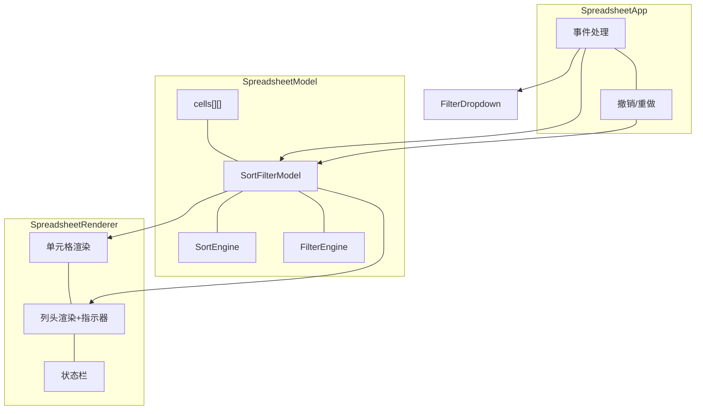

# 技术设计文档：排序与筛选

## 概述

为 Canvas Excel 实现排序与筛选功能。核心思路：通过**行索引映射（RowIndexMap）**实现视图层变换，不修改原始数据顺序。

设计决策：
1. **RowIndexMap 而非数据重排**：公式引用不受排序影响，撤销只需恢复映射
2. **先筛选后排序**：与 Excel 行为一致
3. **FilterDropdown 用 DOM，列头图标用 Canvas**：复杂交互用 DOM 更高效
4. **SortFilterModel 作为 SpreadsheetModel 子模块**：与 ChartModel 集成方式一致

新增模块：`SortFilterModel`、`SortEngine`、`FilterEngine`、`FilterDropdown`、`ColumnHeaderIndicator`。

## 架构



数据流：用户操作 → App 记录快照 → 更新 SortFilterModel → FilterEngine 筛选 → SortEngine 排序 → 生成 RowIndexMap → Renderer 按映射渲染。

## 组件与接口

文件组织：`src/sort-filter/` 下 `types.ts`、`sort-filter-model.ts`、`sort-engine.ts`、`filter-engine.ts`、`filter-dropdown.ts`、`column-header-indicator.ts`。

### SortFilterModel（`sort-filter-model.ts`）

```typescript
export class SortFilterModel {
  constructor(model: SpreadsheetModel);
  // 行索引映射
  getRowIndexMap(): readonly number[];
  getDataRowIndex(displayRow: number): number;
  getDisplayRowIndex(dataRow: number): number; // 隐藏行返回 -1
  isActive(): boolean;
  getVisibleRowCount(): number;
  getTotalRowCount(): number;
  // 排序
  setSortRules(rules: SortRule[]): void;
  addSortRule(rule: SortRule): void;
  removeSortRule(colIndex: number): void;
  clearSortRules(): void;
  getSortRules(): readonly SortRule[];
  hasActiveSort(): boolean;
  // 筛选
  setColumnFilter(colIndex: number, filter: ColumnFilter): void;
  removeColumnFilter(colIndex: number): void;
  clearAllFilters(): void;
  getColumnFilter(colIndex: number): ColumnFilter | undefined;
  getAllFilters(): ReadonlyMap<number, ColumnFilter>;
  hasActiveFilter(colIndex: number): boolean;
  hasActiveFilters(): boolean;
  // 快照
  getSnapshot(): SortFilterSnapshot;
  restoreSnapshot(snapshot: SortFilterSnapshot): void;
  // 重算
  recalculate(): void;
  getUniqueValues(colIndex: number): string[];
}
```

### SortEngine（`sort-engine.ts`，纯函数）

```typescript
export class SortEngine {
  static sort(rowIndices: number[], rules: SortRule[],
    cellGetter: (row: number, col: number) => Cell | null): number[];
  static compareCellValues(a: Cell | null, b: Cell | null, dataType: SortDataType): number;
  static inferColumnDataType(colIndex: number, rowIndices: number[],
    cellGetter: (row: number, col: number) => Cell | null): SortDataType;
}
```

### FilterEngine（`filter-engine.ts`，纯函数）

```typescript
export class FilterEngine {
  static filterRows(totalRows: number, filters: Map<number, ColumnFilter>,
    cellGetter: (row: number, col: number) => Cell | null): number[];
  static evaluateCondition(cellValue: string, rawValue: number | undefined,
    dataType: DataType | undefined, condition: FilterCriterion): boolean;
  static evaluateColumnFilter(cellValue: string, rawValue: number | undefined,
    dataType: DataType | undefined, filter: ColumnFilter): boolean;
  static getUniqueValues(colIndex: number, totalRows: number,
    cellGetter: (row: number, col: number) => Cell | null): string[];
  static inferFilterType(values: string[]): 'text' | 'number' | 'date';
}
```

### FilterDropdown（`filter-dropdown.ts`，DOM 组件）

```typescript
export class FilterDropdown {
  constructor();
  show(colIndex: number, anchorX: number, anchorY: number,
    uniqueValues: string[], currentFilter: ColumnFilter | undefined,
    onApply: (filter: ColumnFilter) => void, onClear: () => void,
    onSort: (direction: SortDirection) => void): void;
  hide(): void;
  isOpen(): boolean;
  destroy(): void;
}
```

### ColumnHeaderIndicator（`column-header-indicator.ts`，Canvas 绘制）

```typescript
export class ColumnHeaderIndicator {
  static renderFilterIcon(ctx: CanvasRenderingContext2D,
    x: number, y: number, width: number, height: number, isActive: boolean): void;
  static renderSortArrow(ctx: CanvasRenderingContext2D,
    x: number, y: number, width: number, height: number, direction: SortDirection): void;
  static hitTestFilterIcon(clickX: number, clickY: number,
    colX: number, colY: number, colWidth: number, headerHeight: number): boolean;
}
```

### 现有模块修改

- **SpreadsheetModel**：新增 `sortFilterModel` 属性、`getDisplayCell(displayRow, col)` 方法
- **SpreadsheetRenderer**：`renderCells()` 通过 RowIndexMap 遍历；`renderRowHeaders()` 显示实际数据行号；`renderColHeaders()` 渲染指示器图标；状态栏显示"显示 M / N 行"
- **SpreadsheetApp**：列头点击检测筛选图标；排序/筛选前记录快照；编辑通过映射到正确数据行
- **HistoryManager**：ActionType 新增 `'setSortFilter'`

## 数据模型

### 新增类型（`src/sort-filter/types.ts`）

```typescript
export type SortDirection = 'asc' | 'desc';
export type SortDataType = 'text' | 'number' | 'date' | 'auto';

export interface SortRule {
  colIndex: number;
  direction: SortDirection;
  dataType: SortDataType;
}

export type TextFilterOperator = 'contains' | 'notContains' | 'equals' | 'startsWith' | 'endsWith';
export type NumberFilterOperator = 'equals' | 'notEquals' | 'greaterThan' | 'greaterOrEqual' | 'lessThan' | 'lessOrEqual' | 'between';
export type DateFilterOperator = 'equals' | 'before' | 'after' | 'between';

export type FilterCriterion =
  | { type: 'text'; operator: TextFilterOperator; value: string }
  | { type: 'number'; operator: NumberFilterOperator; value: number; value2?: number }
  | { type: 'date'; operator: DateFilterOperator; value: number; value2?: number };

export type FilterLogic = 'and' | 'or';

export interface ColumnFilter {
  selectedValues?: Set<string>;
  criteria?: FilterCriterion[];
  logic?: FilterLogic;
}

export interface ColumnFilterSerialized {
  selectedValues?: string[];
  criteria?: FilterCriterion[];
  logic?: FilterLogic;
}

export interface SortFilterSnapshot {
  sortRules: SortRule[];
  filterConditions: Array<[number, ColumnFilterSerialized]>;
}
```

### 与现有结构的关系

- 通过 `Cell.dataType`、`Cell.rawValue`、`Cell.content` 进行排序比较和筛选匹配
- 复用 `DataTypeDetector` 的类型检测逻辑
- 渲染循环：`dataRow = sortFilterModel.getDataRowIndex(displayRow)` → `model.getCell(dataRow, col)`
- 行标题显示 `dataRow + 1`（非连续，提示隐藏行）

## 正确性属性

*属性是在系统所有有效执行中都应成立的特征或行为——对系统应做什么的形式化陈述。属性是人类可读规格说明与机器可验证正确性保证之间的桥梁。*

### Property 1: 恒等映射默认状态

*For any* SortFilterModel（行数 ≥ 0），当无排序规则且无筛选条件时，对所有 0 ≤ i < totalRows，getDataRowIndex(i) === i。

**Validates: Requirements 1.2**

### Property 2: 行索引映射往返一致性

*For any* 排序/筛选激活的 SortFilterModel，对所有可见显示行 d，getDisplayRowIndex(getDataRowIndex(d)) === d；对所有被隐藏的数据行 r，getDisplayRowIndex(r) === -1。

**Validates: Requirements 1.5**

### Property 3: 排序结果有序性

*For any* 数据集、列索引和排序方向，排序后相邻显示行在该列上的值满足排序方向的顺序关系，空单元格排在末尾。

**Validates: Requirements 2.1, 2.2, 2.4**

### Property 4: 比较函数传递性

*For any* 三个非空单元格值 a、b、c 和同一数据类型，若 compareCellValues(a,b) ≤ 0 且 compareCellValues(b,c) ≤ 0，则 compareCellValues(a,c) ≤ 0。

**Validates: Requirements 2.3**

### Property 5: 多列排序优先级

*For any* 数据集和多条排序规则，相邻显示行按规则列表顺序比较：第一条规则不等时按其排序，相等时按第二条，依此类推。

**Validates: Requirements 3.2**

### Property 6: 清除恢复恒等映射

*For any* SortFilterModel，无论之前应用了何种排序/筛选，清除全部后 RowIndexMap 恢复为恒等映射。

**Validates: Requirements 3.5, 6.5**

### Property 7: 唯一值提取完整性

*For any* 列数据，getUniqueValues 返回的集合与该列所有非空单元格内容的去重集合完全一致，且无重复。

**Validates: Requirements 4.2**

### Property 8: 值筛选正确性

*For any* 数据集和值筛选条件（选中值集合），筛选后每个可见行在该列的值属于选中集合或为空，每个被隐藏的非空行不属于选中集合。

**Validates: Requirements 4.3**

### Property 9: 筛选条件评估正确性

*For any* 单元格值和筛选条件（文本/数字/日期），evaluateCondition 的返回值与条件的数学/逻辑语义一致：文本 contains ↔ String.includes，数字 greaterThan ↔ >，日期 before ↔ 时间戳 <。

**Validates: Requirements 5.1, 5.2, 5.3**

### Property 10: 筛选类型推断正确性

*For any* 列值集合，若所有非空值可解析为数字则返回 'number'，可解析为日期则返回 'date'，否则返回 'text'。

**Validates: Requirements 5.5**

### Property 11: 同列多条件逻辑组合

*For any* 单元格值和多条件 ColumnFilter，logic 为 'and' 时结果等于所有条件的逻辑与，'or' 时等于逻辑或。

**Validates: Requirements 6.1**

### Property 12: 多列筛选 AND 组合

*For any* 数据集和多列筛选条件，filterRows 结果等于各列独立筛选结果的交集。

**Validates: Requirements 6.2, 6.3**

### Property 13: 先筛选后排序

*For any* 同时有排序和筛选的 SortFilterModel，recalculate() 结果等价于先筛选再排序：所有行满足筛选条件且按排序规则有序。

**Validates: Requirements 8.1**

### Property 14: 编辑后筛选一致性

*For any* 筛选状态下的数据集，修改某可见行使其不满足筛选条件后，recalculate() 应将该行移除。

**Validates: Requirements 8.5**

### Property 15: 快照往返一致性

*For any* SortFilterModel 状态，getSnapshot() → restoreSnapshot() 后排序规则、筛选条件和 RowIndexMap 与快照前完全一致。

**Validates: Requirements 9.1, 9.2, 9.3, 9.4**

## 错误处理

| 场景 | 处理方式 |
|------|---------|
| 空表格排序/筛选 | RowIndexMap 为空数组，不报错 |
| 排序列超出列范围 | 忽略该排序规则 |
| 筛选导致所有行隐藏 | RowIndexMap 为空，渲染器显示"无匹配结果" |
| 单元格内容为 undefined/null | 视为空字符串 |
| 混合数据类型排序 | auto 推断主要类型，无法解析的值视为文本排末尾 |
| getDataRowIndex/getDisplayRowIndex 越界 | 返回 -1 |
| between 条件 value > value2 | 自动交换 |
| 排序/筛选期间插入/删除行 | 清除排序筛选，恢复恒等映射 |
| 撤销快照引用已删除的列 | 跳过无效规则 |
| 大数据量排序 | Array.prototype.sort（TimSort），O(n log n) |
| 频繁筛选变更 | requestAnimationFrame 合并重算 |

## 测试策略

- 属性测试：**fast-check**，每个属性 ≥ 100 次迭代，标签 `Feature: sort-and-filter, Property {N}: {title}`
- 单元测试：**Vitest**
- 每个正确性属性由一个属性测试实现

| 属性 | 测试文件 |
|------|---------|
| Property 1, 2, 6, 13, 15 | sort-filter-model.pbt.test.ts |
| Property 3, 4, 5 | sort-engine.pbt.test.ts |
| Property 7, 8, 9, 10, 11, 12 | filter-engine.pbt.test.ts |
| Property 14 | sort-filter-integration.pbt.test.ts |

单元测试聚焦边界和集成：

| 测试文件 | 内容 |
|---------|------|
| sort-engine.test.ts | 空数据集、混合类型、空值排末尾 |
| filter-engine.test.ts | 各操作符示例、空值、between 边界 |
| sort-filter-model.test.ts | 规则增删、清除、快照序列化 |
| filter-dropdown.test.ts | DOM 创建销毁、搜索过滤 |
| column-header-indicator.test.ts | 图标命中检测 |

所有测试文件放在 `src/__tests__/` 下。
