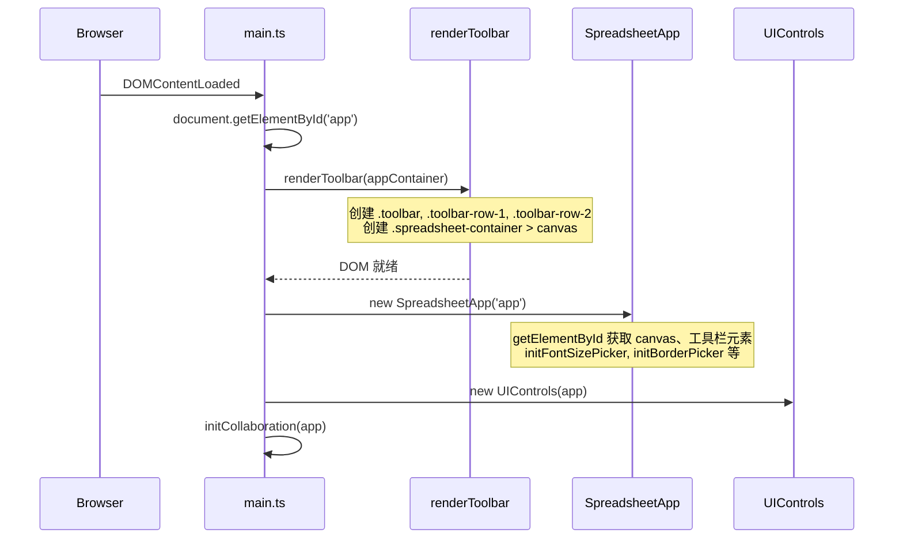

# Design Document: toolbar-ts-rendering

## Overview

将 `index.html` 中约 400 行工具栏 HTML 标签迁移到 TypeScript 动态渲染。迁移后 `index.html` 的 `<body>` 仅保留 `<div id="app"></div>` 和 `<script>` 标签，所有工具栏、Canvas 容器、Sheet 标签栏、状态栏和协同通知容器均由 TypeScript 在运行时动态创建。

核心设计决策：
1. 新增独立导出函数 `renderToolbar(container: HTMLElement): void`，在 `ui-controls.ts` 中实现，因为渲染必须在 `SpreadsheetApp` 实例化之前完成，而 `UIControls` 构造函数依赖 `app` 参数
2. `main.ts` 中调整初始化顺序：`renderToolbar` → `SpreadsheetApp` → `UIControls` → `initCollaboration`
3. 所有动态创建的 DOM 元素必须保持与原 `index.html` 完全一致的 id、class、data-*、title 属性和层级结构

## Architecture



### 关键设计决策

| 决策 | 选项 | 选择 | 理由 |
|------|------|------|------|
| 渲染函数位置 | UIControls 静态方法 vs 独立导出函数 | 独立导出函数 | 避免循环依赖，`renderToolbar` 不依赖 `SpreadsheetApp`，语义更清晰 |
| 渲染函数文件 | 新文件 vs ui-controls.ts | ui-controls.ts | 保持工具栏相关代码集中，减少文件数量 |
| DOM 创建方式 | innerHTML vs createElement | createElement | 类型安全，避免 XSS 风险，符合项目规范 |
| SVG 创建方式 | innerHTML 注入 | innerHTML 注入到容器元素 | SVG 的 namespace 要求使 createElement 方式过于冗长，innerHTML 是 SVG 的标准做法 |

## Components and Interfaces

### 新增导出函数

```typescript
// ui-controls.ts 中新增导出
/**
 * 在 SpreadsheetApp 实例化之前调用，动态创建所有工具栏 DOM 结构
 * @param container - #app 容器元素
 * @throws Error 如果 container 为 null
 */
export function renderToolbar(container: HTMLElement): void;
```

### 内部辅助函数（ui-controls.ts 模块内部）

```typescript
/** 创建工具栏第一行：撤销/重做、合并/拆分、颜色选择器、边框、字体、对齐等 */
function renderToolbarRow1(toolbar: HTMLElement): void;

/** 创建工具栏第二行：单元格地址、公式栏输入、确认按钮、扩展按钮 */
function renderToolbarRow2(toolbar: HTMLElement): void;

/** 创建 spreadsheet 容器和 canvas */
function renderSpreadsheetContainer(appContainer: HTMLElement): void;

/** 创建 Sheet 标签栏容器 */
function renderSheetTabBar(appContainer: HTMLElement): void;

/** 创建底部状态栏 */
function renderStatusBar(appContainer: HTMLElement): void;

/** 创建协同通知容器 */
function renderCollabNotifications(appContainer: HTMLElement): void;
```

### main.ts 修改

```typescript
// 修改前
document.addEventListener('DOMContentLoaded', () => {
  const app = new SpreadsheetApp('app');
  const uiControls = new UIControls(app);
  // ...
});

// 修改后
document.addEventListener('DOMContentLoaded', () => {
  const appContainer = document.getElementById('app');
  if (!appContainer) {
    throw new Error('找不到 #app 容器元素');
  }
  renderToolbar(appContainer);

  const app = new SpreadsheetApp('app');
  const uiControls = new UIControls(app);
  initCollaboration(app);
  // ...
});
```

### UIControls 类（无变更）

`UIControls` 类保持现有接口不变，仍然负责设置面板（主题切换、导入导出等）的创建和管理。`renderToolbar` 函数与 `UIControls` 类是同一模块中的独立导出，互不依赖。

## Data Models

本功能不涉及新的数据模型。所有操作都是 DOM 结构的创建，不涉及业务数据的变更。

### DOM 结构映射

渲染函数创建的 DOM 树结构与原 `index.html` 完全一致：

```
#app
├── .toolbar
│   ├── .toolbar-row.toolbar-row-1
│   │   └── .toolbar-group
│   │       ├── #undo-btn (disabled)
│   │       ├── #redo-btn (disabled)
│   │       ├── .separator
│   │       ├── #merge-cells
│   │       ├── #split-cells
│   │       ├── .font-color-picker > label[for=font-color] + input#font-color
│   │       ├── .bg-color-picker > label[for=bg-color] + input#bg-color
│   │       ├── .border-picker > #border-btn + #border-dropdown
│   │       ├── .font-family-picker > #font-family-btn + #font-family-dropdown
│   │       ├── .font-size-picker > #font-size-btn + #font-size-dropdown
│   │       ├── .number-format-picker > #number-format-btn + #number-format-dropdown
│   │       ├── #font-bold-btn
│   │       ├── #font-italic-btn
│   │       ├── #font-underline-btn
│   │       ├── #font-strikethrough-btn
│   │       ├── .horizontal-align-picker > #horizontal-align-btn + #horizontal-align-dropdown
│   │       ├── .vertical-align-picker > #vertical-align-btn + #vertical-align-dropdown
│   │       ├── #wrap-text-btn
│   │       ├── .separator
│   │       ├── #conditional-format-btn
│   │       ├── .separator
│   │       ├── #insert-chart-btn
│   │       ├── .sparkline-picker > #sparkline-btn + #sparkline-dropdown
│   │       ├── .freeze-picker > #freeze-btn + #freeze-dropdown
│   │       ├── .separator
│   │       ├── #format-painter-btn
│   │       ├── #script-editor-btn
│   │       └── .toolbar-right
│   │           ├── .status > #viewport-info
│   │           └── #collab-status
│   │               ├── #collab-connection > .collab-dot + #collab-connection-text
│   │               ├── #collab-users > svg + #collab-user-count + #collab-user-dropdown
│   │               └── #collab-sync > svg
│   └── .toolbar-row.toolbar-row-2
│       ├── .cell-info
│       │   ├── #selected-cell ("A1")
│       │   ├── #cell-content (input)
│       │   ├── #set-content (button)
│       │   └── #formula-error
│       └── .toolbar-group
│           ├── #hyperlink-btn
│           ├── #image-btn
│           ├── #pivot-table-btn
│           └── .separator
├── .spreadsheet-container
│   └── canvas#excel-canvas
├── #sheet-tab-bar.sheet-tab-bar
├── .status-bar
│   ├── .status-item > #memory-usage
│   └── .status-item > #collab-sync-status + #cell-count
└── #collab-notifications.collab-notifications
```


## Correctness Properties

*A property is a characteristic or behavior that should hold true across all valid executions of a system—essentially, a formal statement about what the system should do. Properties serve as the bridge between human-readable specifications and machine-verifiable correctness guarantees.*

### Property 1: DOM 属性保真性

*For any* expected DOM element in the toolbar specification (identified by its expected id), the dynamically rendered element should exist in the document and possess the correct `id`、`className`、`data-*` attributes、and `title` attribute matching the original HTML specification.

**Validates: Requirements 5.1, 5.2, 5.3, 5.4, 6.2**

### Property 2: DOM 层级保真性

*For any* expected parent-child relationship in the toolbar DOM tree specification, the dynamically rendered child element's `parentElement` should match the expected parent element (identified by selector or id).

**Validates: Requirements 5.6, 2.1, 3.1, 4.1**

## Error Handling

| 场景 | 处理方式 |
|------|----------|
| `#app` 容器不存在 | `renderToolbar` 抛出 `Error('找不到 #app 容器元素')`，阻止后续初始化 |
| DOM 创建过程中异常 | 异常自然冒泡，由调用方（main.ts）的 try-catch 或浏览器错误处理机制捕获 |
| 重复调用 `renderToolbar` | 不做特殊处理（设计上只调用一次），重复调用会导致 DOM 重复创建 |

## Testing Strategy

### 单元测试（Unit Tests）

使用 Vitest + jsdom 环境进行 DOM 单元测试：

1. **renderToolbar 基本结构测试**：调用 renderToolbar 后验证 `.toolbar`、`.toolbar-row-1`、`.toolbar-row-2`、`.spreadsheet-container`、`#sheet-tab-bar`、`.status-bar`、`#collab-notifications` 存在
2. **撤销/重做按钮测试**：验证 `#undo-btn` 和 `#redo-btn` 存在、disabled 属性为 true、包含 SVG 和文本
3. **颜色选择器测试**：验证 `#font-color` 默认值为 `#333333`，`#bg-color` 默认值为 `#ffffff`，label 的 `for` 属性正确关联
4. **边框选择器测试**：验证 8 个边框位置选项的 `data-position` 值、4 个线型选项的 `data-style` 值
5. **字体样式按钮测试**：验证四个按钮的 id、class、title 属性
6. **对齐选择器默认状态测试**：验证水平对齐左对齐为 active，垂直对齐居中为 active
7. **错误处理测试**：传入 null 容器时应抛出异常
8. **公式栏区域测试**：验证 `.cell-info` 存在且包含 `#selected-cell`（文本 "A1"）、`#cell-content`（input）、`#set-content`（button）
9. **状态栏测试**：验证 `#memory-usage`、`#collab-sync-status`、`#cell-count` 存在且默认文本正确

### 属性测试（Property-Based Tests）

使用 fast-check 进行属性测试，每个属性测试至少运行 100 次迭代：

1. **Property 1 测试**：从预定义的元素规格列表中随机选取元素，验证其 id、class、data-*、title 属性与规格一致
   - Tag: `Feature: toolbar-ts-rendering, Property 1: DOM 属性保真性`

2. **Property 2 测试**：从预定义的父子关系列表中随机选取，验证子元素的 parentElement 匹配预期父元素
   - Tag: `Feature: toolbar-ts-rendering, Property 2: DOM 层级保真性`

### 测试配置

- 测试框架：Vitest（项目已有配置）
- 属性测试库：fast-check
- DOM 环境：jsdom（Vitest 内置支持）
- 每个属性测试最少 100 次迭代
- 每个属性测试必须通过注释引用设计文档中的属性编号
